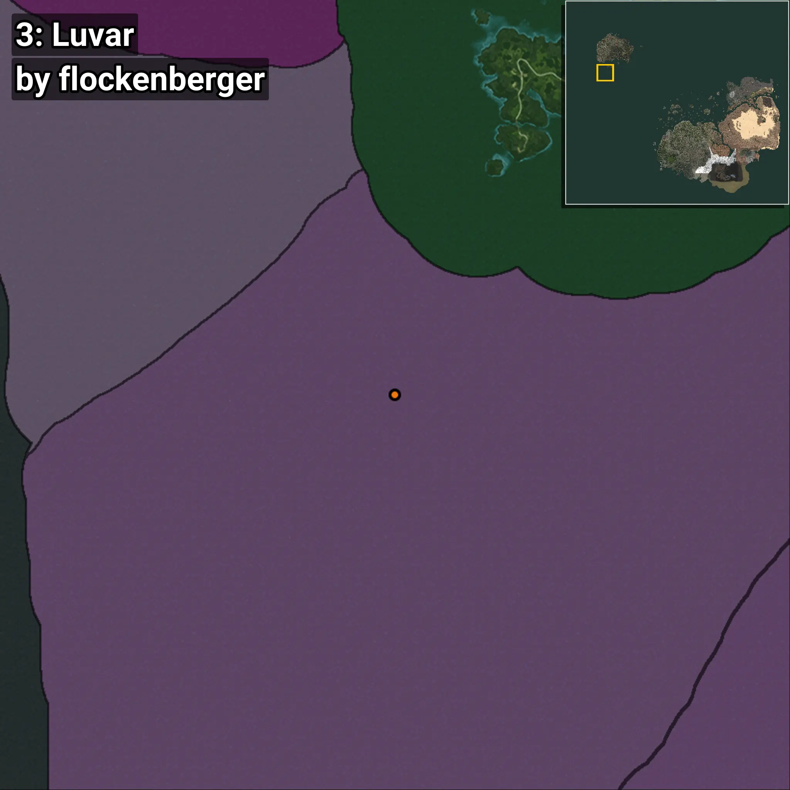

# Luvar
```xml
<!--
    Puntos de pesca para: Luvar
    Creado por: flockenberger
-->
<WorldmapBookMark>
    <BookMark BookMarkName="0: Luvar" PosX="-1394637.2" PosY="-7453.5225" PosZ="945050.0" />
    <BookMark BookMarkName="1: Luvar" PosX="-1358752.0" PosY="-7622.0" PosZ="948026.0" />
    <BookMark BookMarkName="2: Luvar" PosX="-747966.0" PosY="-7614.0" PosZ="266734.0" />
    <BookMark BookMarkName="3: Luvar" PosX="-1426508.2" PosY="-7620.55" PosZ="925430.06" />
    <BookMark BookMarkName="4: Luvar" PosX="-72567.88" PosY="-8056.3906" PosZ="599223.75" />
</WorldmapBookMark>
```

## ⚠️ Advertencia:
Los puntos de pesca se generan según la __**posición de tu personaje**__ — __no__ donde cae el flotador.  
En el océano especialmente, la dirección en la que lances la caña puede colocar tu flotador en una **zona de pesca diferente**, lo que puede resultar en capturar el pez incorrecto.  
Presta atención a las vistas previas que muestran la ubicación en relación a las zonas marcadas.

- Para verificar la posición de tu flotador puedes usar la guía [AQUÍ](https://flockenberger.github.io/bdo-fish-position/)
- O ver la guía [AQUÍ](https://youtu.be/t-VXcRoNojk)

## Vistas Previas
      