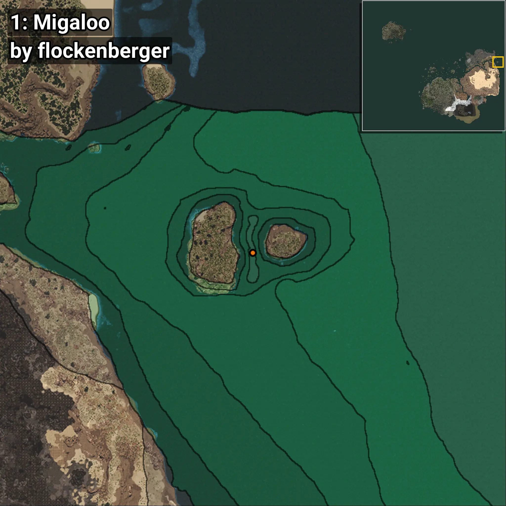
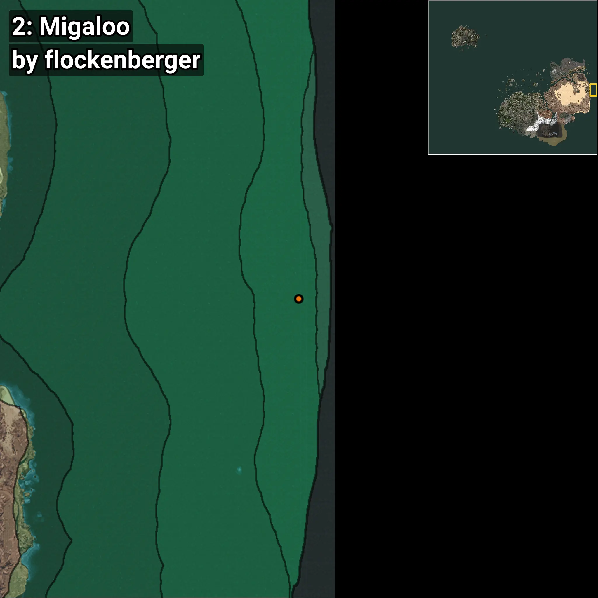
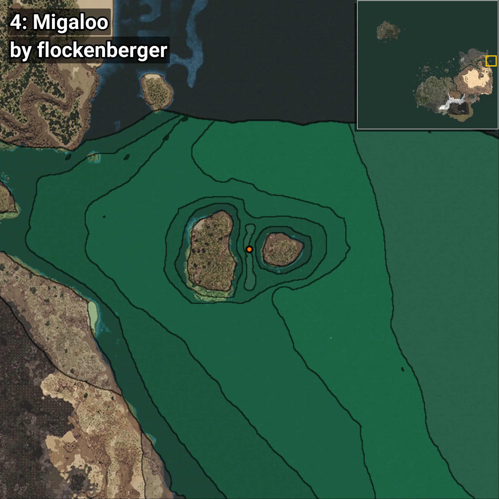

# Migaloo
```xml
<!--
    Puntos de pesca para: Migaloo
    Creado por: flockenberger
-->
<WorldmapBookMark>
    <BookMark BookMarkName="0: Migaloo" PosX="1264951.0" PosY="-7930.0" PosZ="544334.0" />
    <BookMark BookMarkName="1: Migaloo" PosX="1264506.0" PosY="-7500.0" PosZ="547207.0" />
    <BookMark BookMarkName="2: Migaloo" PosX="1418589.0" PosY="-7643.0" PosZ="204968.0" />
    <BookMark BookMarkName="3: Migaloo" PosX="1263905.0" PosY="-7653.0" PosZ="548175.0" />
    <BookMark BookMarkName="4: Migaloo" PosX="1264234.0" PosY="-7897.0" PosZ="552753.0" />
</WorldmapBookMark>
```

## ⚠️ Advertencia:
Los puntos de pesca se generan según la __**posición de tu personaje**__ — __no__ donde cae el flotador.  
En el océano especialmente, la dirección en la que lances la caña puede colocar tu flotador en una **zona de pesca diferente**, lo que puede resultar en capturar el pez incorrecto.  
Presta atención a las vistas previas que muestran la ubicación en relación a las zonas marcadas.

- Para verificar la posición de tu flotador puedes usar la guía [AQUÍ](https://flockenberger.github.io/bdo-fish-position/)
- O ver la guía [AQUÍ](https://youtu.be/t-VXcRoNojk)

## Vistas Previas
      