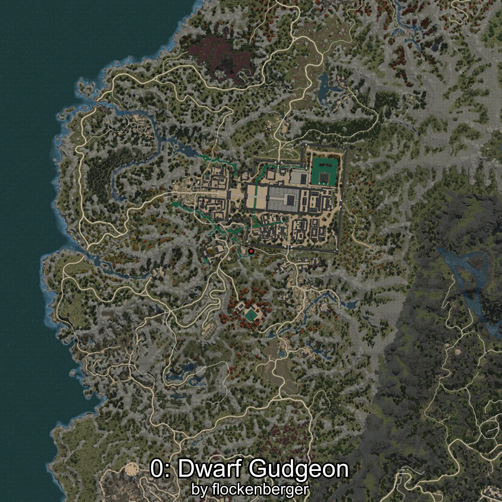
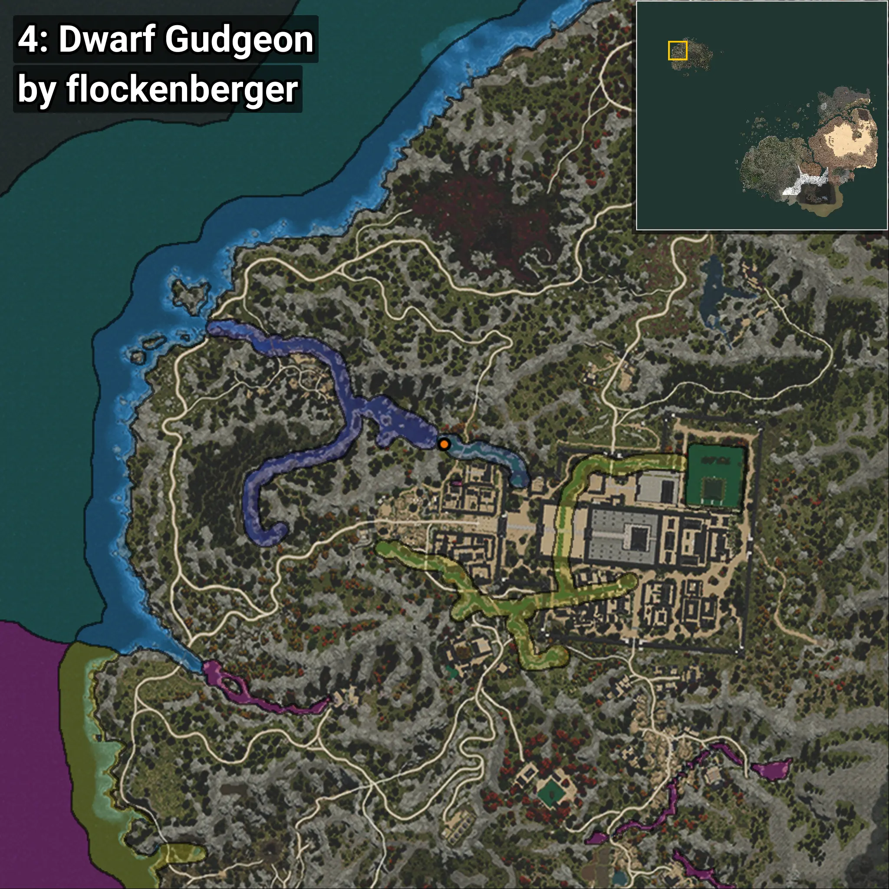

# Abbottina
```xml
<!--
    Puntos de pesca para: Abbottina
    Creado por: flockenberger
-->
<WorldmapBookMark>
    <BookMark BookMarkName="0: Abbottina" PosX="-1490071.0" PosY="11067.0" PosZ="1330880.0" />
    <BookMark BookMarkName="1: Abbottina" PosX="-1489230.0" PosY="10977.0" PosZ="1331794.0" />
    <BookMark BookMarkName="2: Abbottina" PosX="-1487759.0" PosY="11180.0" PosZ="1332470.0" />
    <BookMark BookMarkName="3: Abbottina" PosX="-1487798.0" PosY="11180.0" PosZ="1332422.0" />
    <BookMark BookMarkName="4: Abbottina" PosX="-1471710.5" PosY="12566.211" PosZ="1359364.8" />
</WorldmapBookMark>
```

## ⚠️ Advertencia:
Los puntos de pesca se generan según la __**posición de tu personaje**__ — __no__ donde cae el flotador.  
En el océano especialmente, la dirección en la que lances la caña puede colocar tu flotador en una **zona de pesca diferente**, lo que puede resultar en capturar el pez incorrecto.  
Presta atención a las vistas previas que muestran la ubicación en relación a las zonas marcadas.

- Para verificar la posición de tu flotador puedes usar la guía [AQUÍ](https://flockenberger.github.io/bdo-fish-position/)
- O ver la guía [AQUÍ](https://youtu.be/t-VXcRoNojk)

## Vistas Previas
      