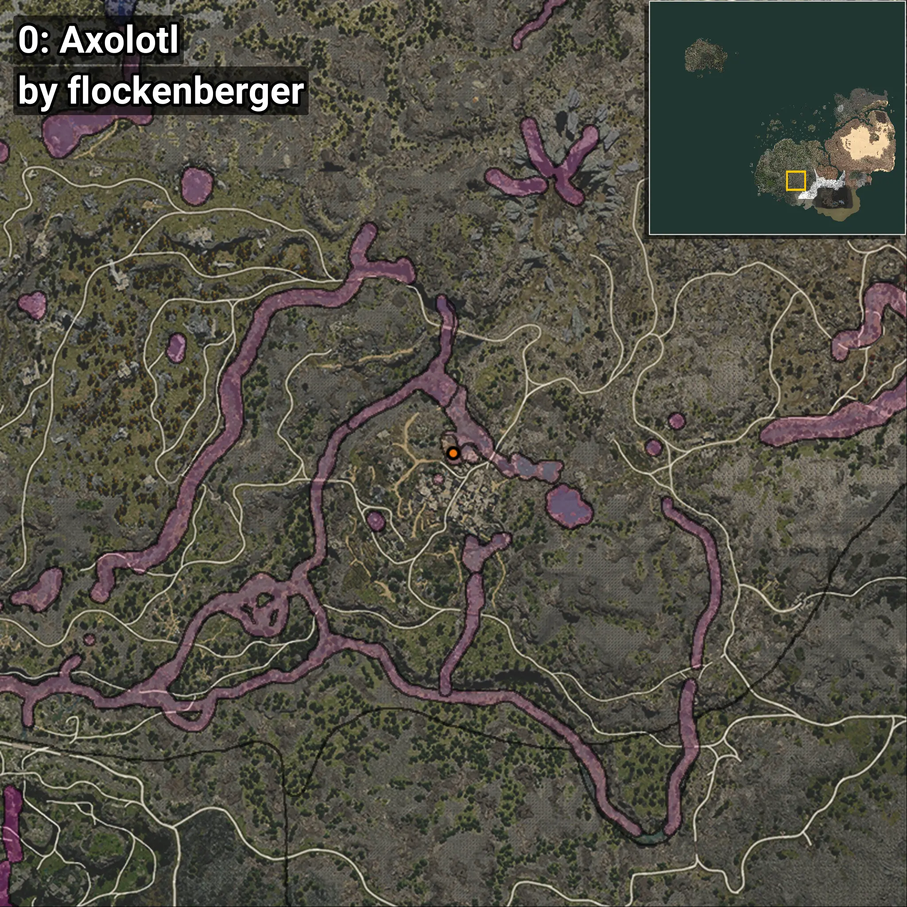
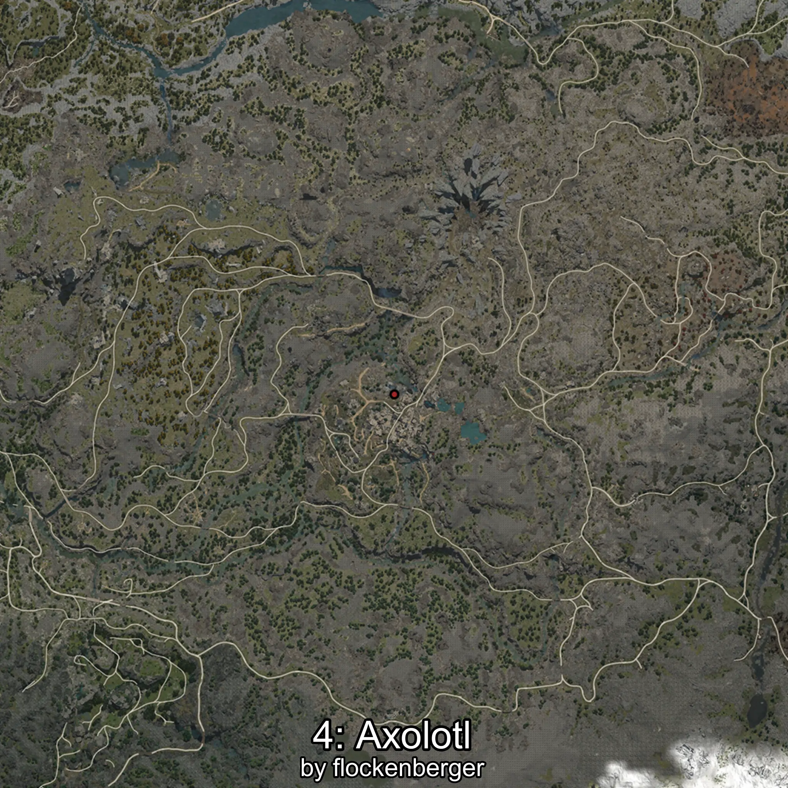
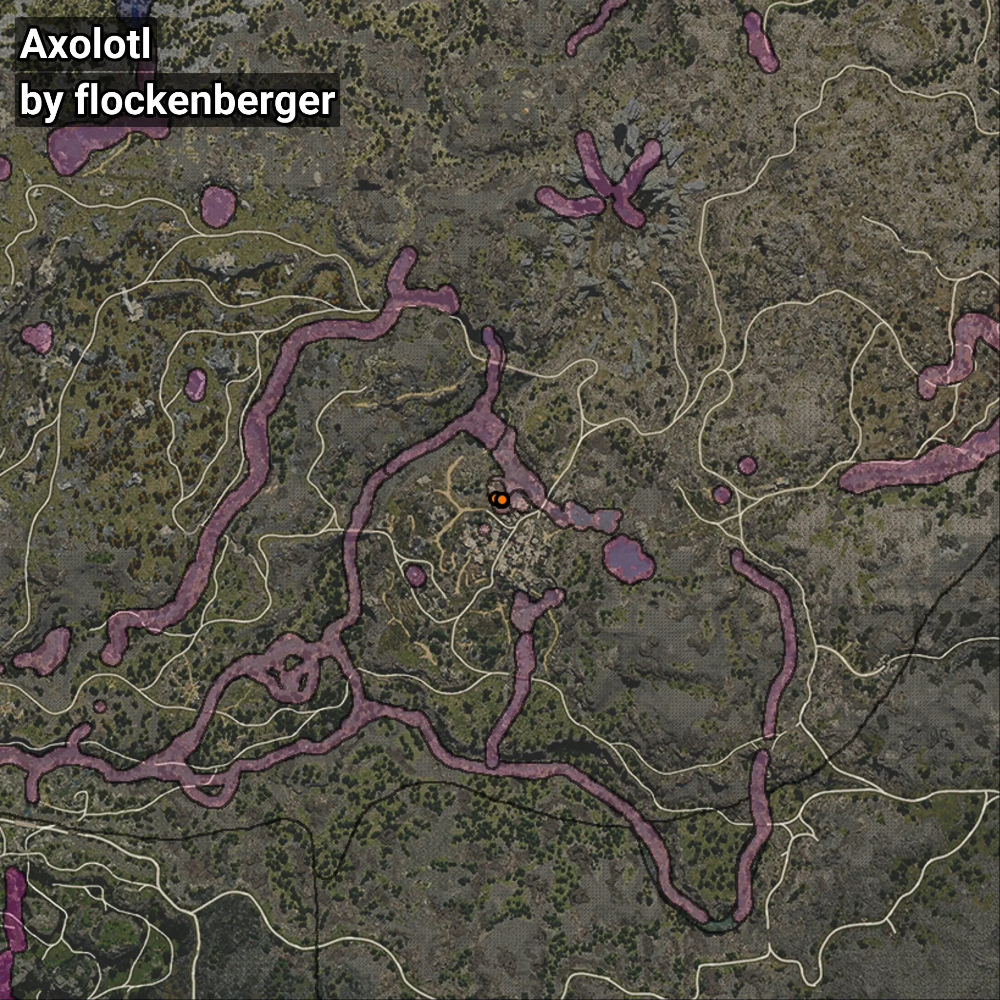

# Ajolote
```xml
<!--
    Puntos de pesca para: Ajolote
    Creado por: flockenberger
-->
<WorldmapBookMark>
    <BookMark BookMarkName="0: Ajolote" PosX="-50650.0" PosY="20042.0" PosZ="-396672.0" />
    <BookMark BookMarkName="1: Ajolote" PosX="-50557.0" PosY="20049.0" PosZ="-396718.0" />
    <BookMark BookMarkName="2: Ajolote" PosX="-51828.223" PosY="19916.752" PosZ="-396234.88" />
    <BookMark BookMarkName="3: Ajolote" PosX="-50554.0" PosY="20048.0" PosZ="-396753.0" />
    <BookMark BookMarkName="4: Ajolote" PosX="-50554.0" PosY="19937.0" PosZ="-396420.0" />
</WorldmapBookMark>
```

## ⚠️ Advertencia:
Los puntos de pesca se generan según la __**posición de tu personaje**__ — __no__ donde cae el flotador.  
En el océano especialmente, la dirección en la que lances la caña puede colocar tu flotador en una **zona de pesca diferente**, lo que puede resultar en capturar el pez incorrecto.  
Presta atención a las vistas previas que muestran la ubicación en relación a las zonas marcadas.

- Para verificar la posición de tu flotador puedes usar la guía [AQUÍ](https://flockenberger.github.io/bdo-fish-position/)
- O ver la guía [AQUÍ](https://youtu.be/t-VXcRoNojk)

## Vistas Previas
      