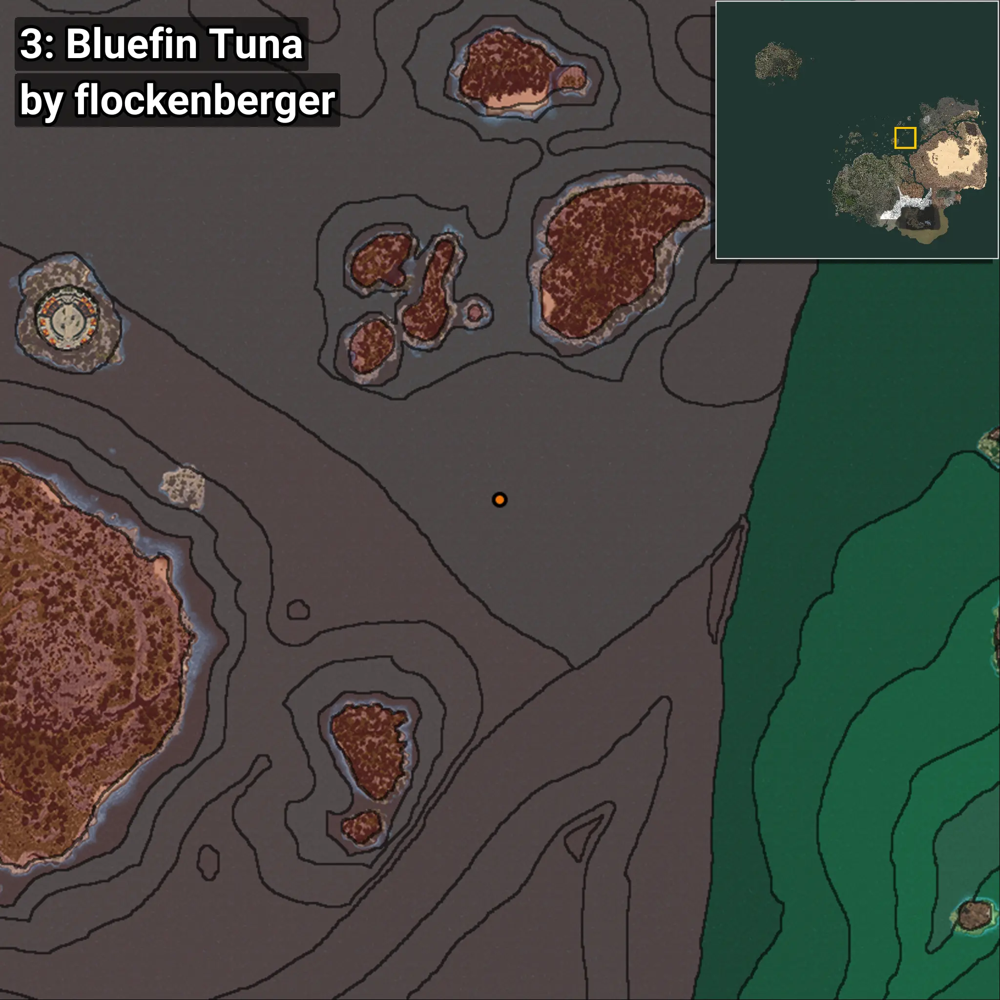
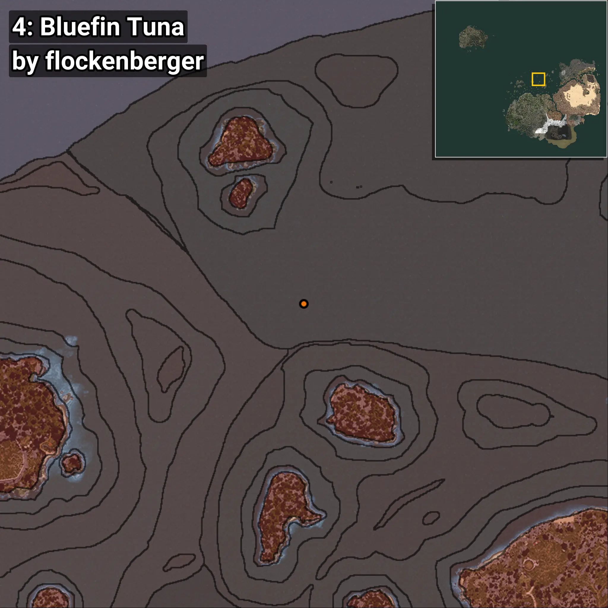

# Albacora
```xml
<!--
    Puntos de pesca para: Albacora
    Creado por: flockenberger
-->
<WorldmapBookMark>
    <BookMark BookMarkName="0: Albacora" PosX="-909832.0" PosY="-8019.0" PosZ="1287398.0" />
    <BookMark BookMarkName="1: Albacora" PosX="-896988.0" PosY="-7842.0" PosZ="1280111.0" />
    <BookMark BookMarkName="2: Albacora" PosX="277950.0" PosY="-8064.0" PosZ="347548.0" />
    <BookMark BookMarkName="3: Albacora" PosX="290531.97" PosY="-7828.8237" PosZ="359478.28" />
    <BookMark BookMarkName="4: Albacora" PosX="46712.0" PosY="-8004.0" PosZ="452079.0" />
</WorldmapBookMark>
```

## ⚠️ Advertencia:
Los puntos de pesca se generan según la __**posición de tu personaje**__ — __no__ donde cae el flotador.  
En el océano especialmente, la dirección en la que lances la caña puede colocar tu flotador en una **zona de pesca diferente**, lo que puede resultar en capturar el pez incorrecto.  
Presta atención a las vistas previas que muestran la ubicación en relación a las zonas marcadas.

- Para verificar la posición de tu flotador puedes usar la guía [AQUÍ](https://flockenberger.github.io/bdo-fish-position/)
- O ver la guía [AQUÍ](https://youtu.be/t-VXcRoNojk)

## Vistas Previas
      