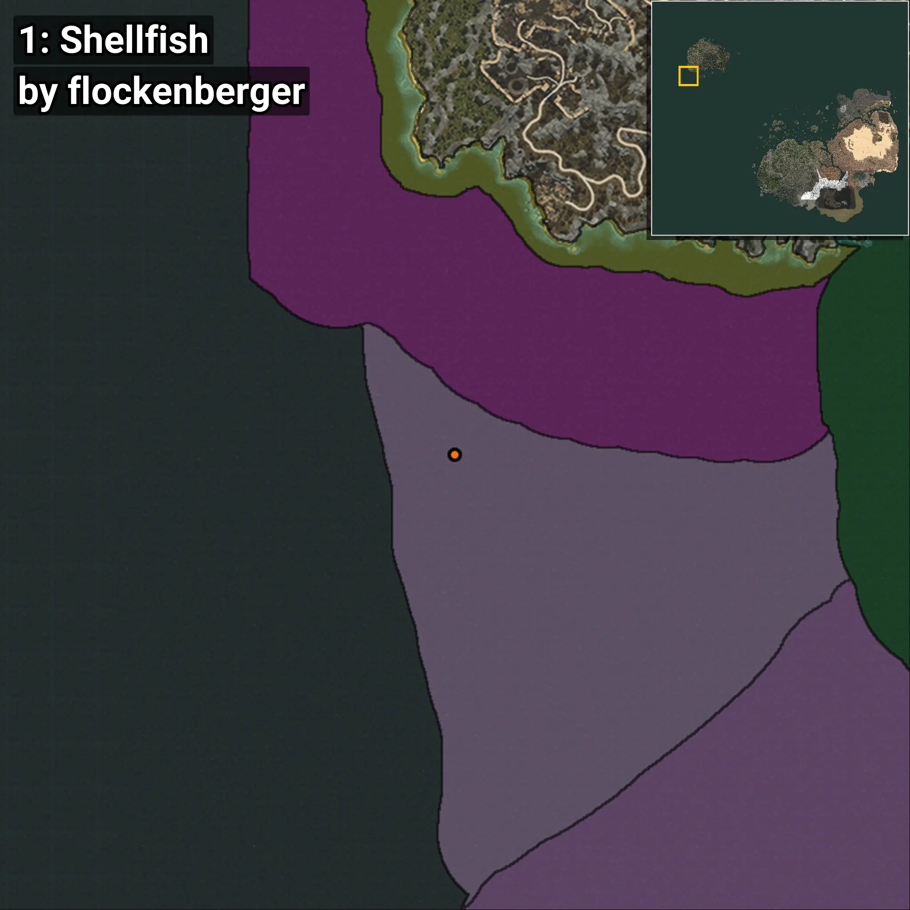
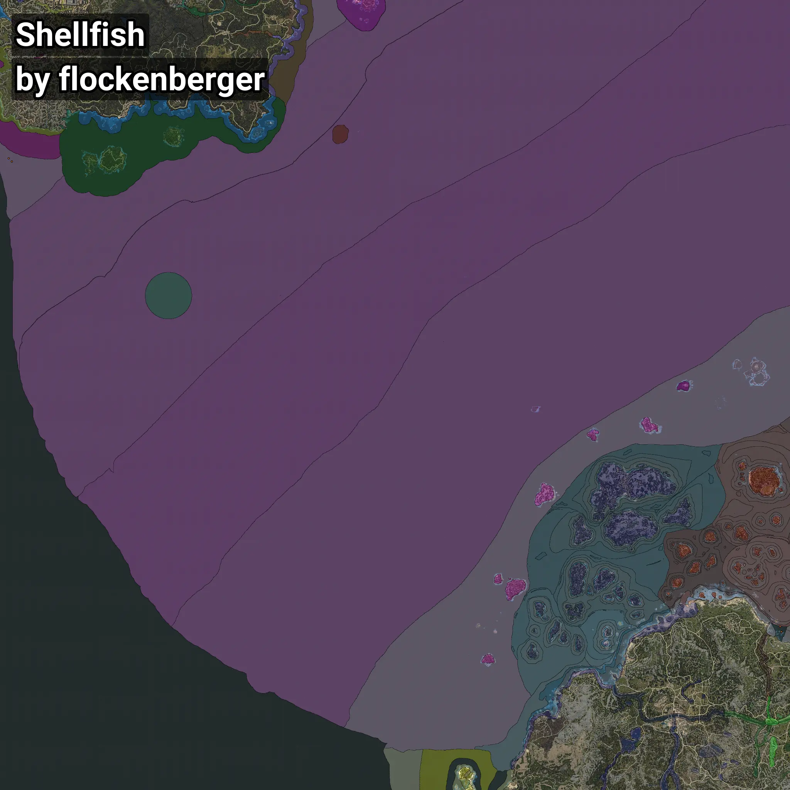

# Almeja
```xml
<!--
    Puntos de pesca para: Almeja
    Creado por: flockenberger
-->
<WorldmapBookMark>
    <BookMark BookMarkName="0: Almeja" PosX="-1537406.0" PosY="-7642.0" PosZ="1023143.0" />
    <BookMark BookMarkName="1: Almeja" PosX="-1543685.0" PosY="-7919.171" PosZ="1029717.0" />
    <BookMark BookMarkName="2: Almeja" PosX="-46327.0" PosY="-8174.0" PosZ="112202.0" />
    <BookMark BookMarkName="3: Almeja" PosX="-46344.523" PosY="-8160.7314" PosZ="112183.68" />
    <BookMark BookMarkName="4: Almeja" PosX="-48525.0" PosY="-7907.0" PosZ="122030.0" />
</WorldmapBookMark>
```

## ⚠️ Advertencia:
Los puntos de pesca se generan según la __**posición de tu personaje**__ — __no__ donde cae el flotador.  
En el océano especialmente, la dirección en la que lances la caña puede colocar tu flotador en una **zona de pesca diferente**, lo que puede resultar en capturar el pez incorrecto.  
Presta atención a las vistas previas que muestran la ubicación en relación a las zonas marcadas.

- Para verificar la posición de tu flotador puedes usar la guía [AQUÍ](https://flockenberger.github.io/bdo-fish-position/)
- O ver la guía [AQUÍ](https://youtu.be/t-VXcRoNojk)

## Vistas Previas
      