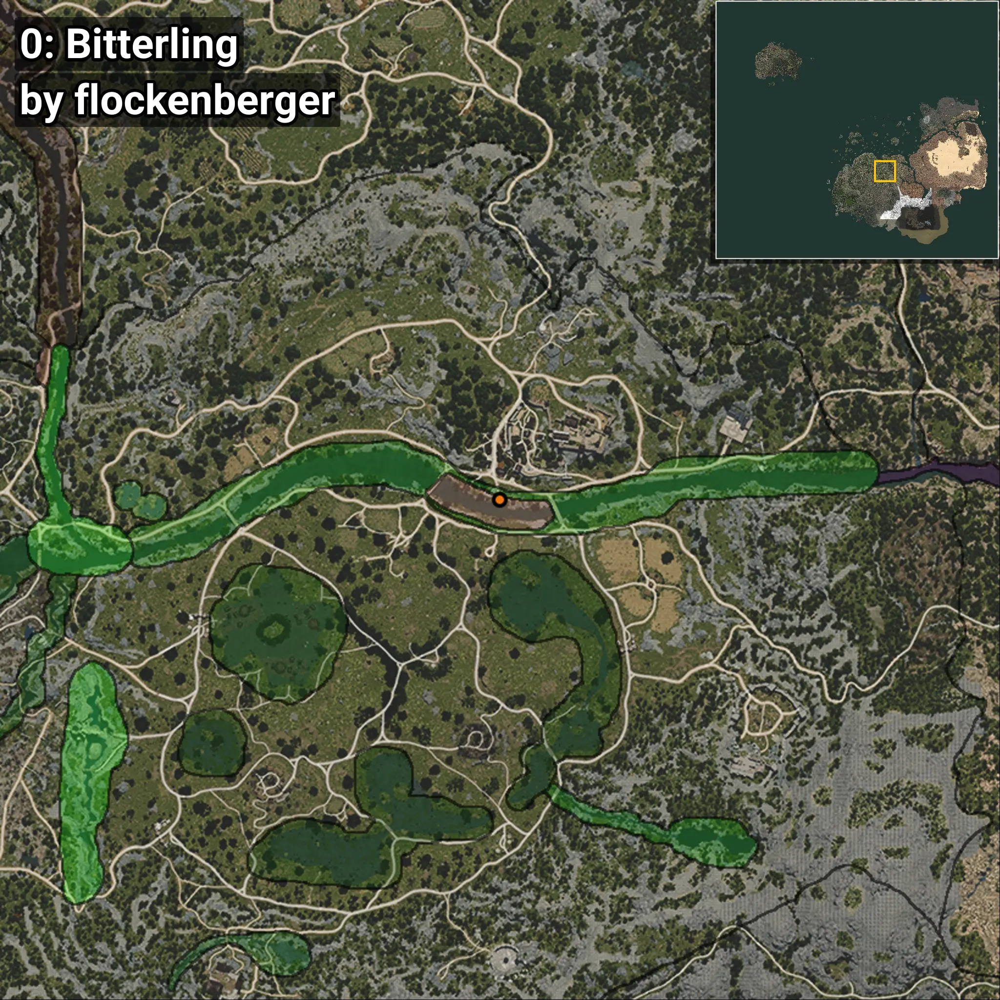

# Amarguillo
```xml
<!--
    Puntos de pesca para: Amarguillo
    Creado por: flockenberger
-->
<WorldmapBookMark>
    <BookMark BookMarkName="0: Amarguillo" PosX="38828.0" PosY="-3986.0" PosZ="-50719.0" />
    <BookMark BookMarkName="1: Amarguillo" PosX="38909.0" PosY="-3977.0" PosZ="-50735.0" />
    <BookMark BookMarkName="2: Amarguillo" PosX="37659.0" PosY="-3816.0" PosZ="-50855.0" />
    <BookMark BookMarkName="3: Amarguillo" PosX="37640.0" PosY="-3816.0" PosZ="-50865.0" />
    <BookMark BookMarkName="4: Amarguillo" PosX="39532.0" PosY="-3975.0" PosZ="-51059.0" />
</WorldmapBookMark>
```

## ⚠️ Advertencia:
Los puntos de pesca se generan según la __**posición de tu personaje**__ — __no__ donde cae el flotador.  
En el océano especialmente, la dirección en la que lances la caña puede colocar tu flotador en una **zona de pesca diferente**, lo que puede resultar en capturar el pez incorrecto.  
Presta atención a las vistas previas que muestran la ubicación en relación a las zonas marcadas.

- Para verificar la posición de tu flotador puedes usar la guía [AQUÍ](https://flockenberger.github.io/bdo-fish-position/)
- O ver la guía [AQUÍ](https://youtu.be/t-VXcRoNojk)

## Vistas Previas
      