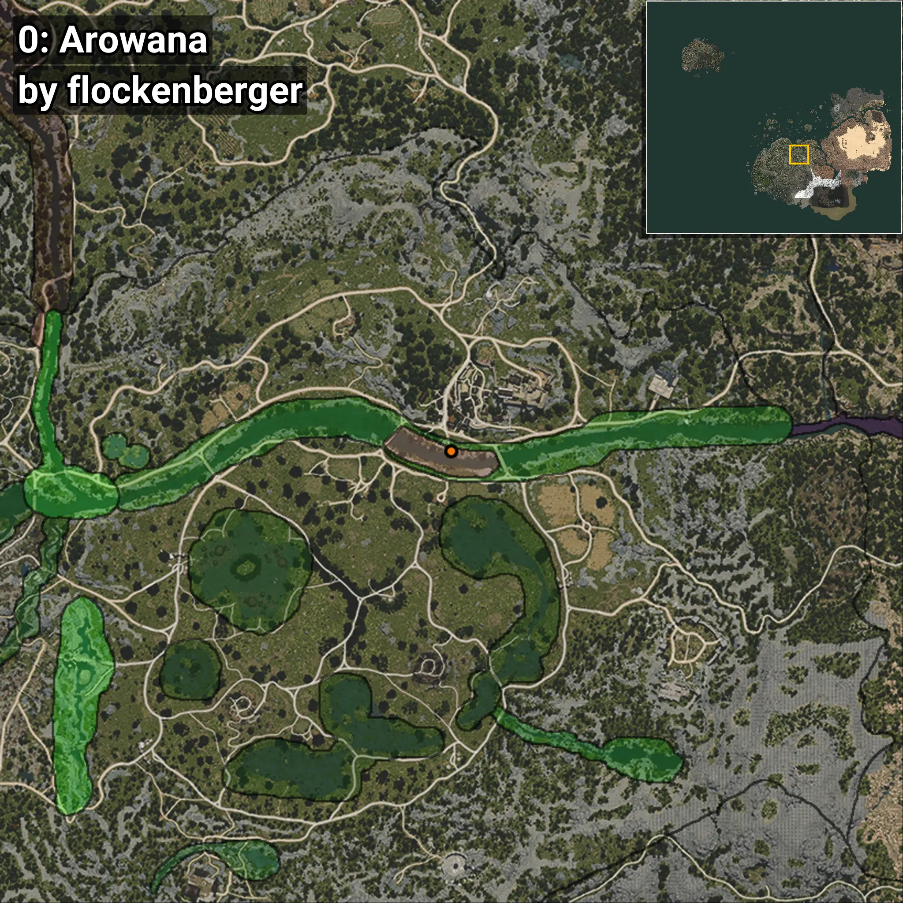
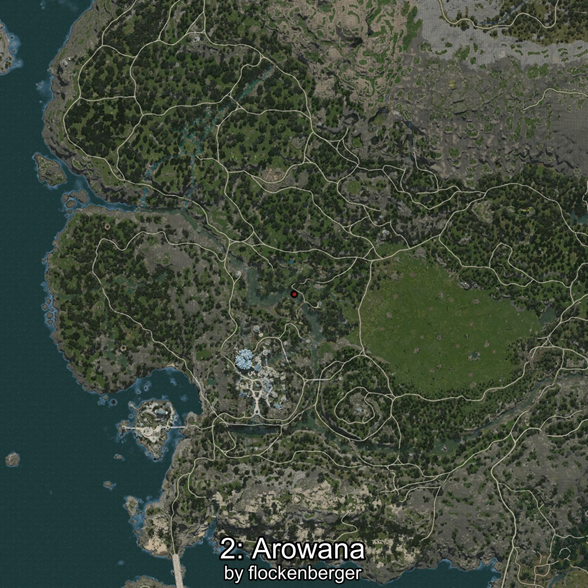
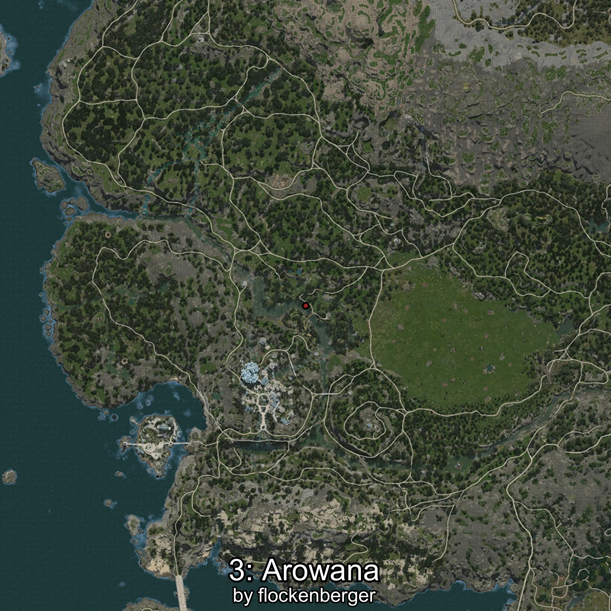
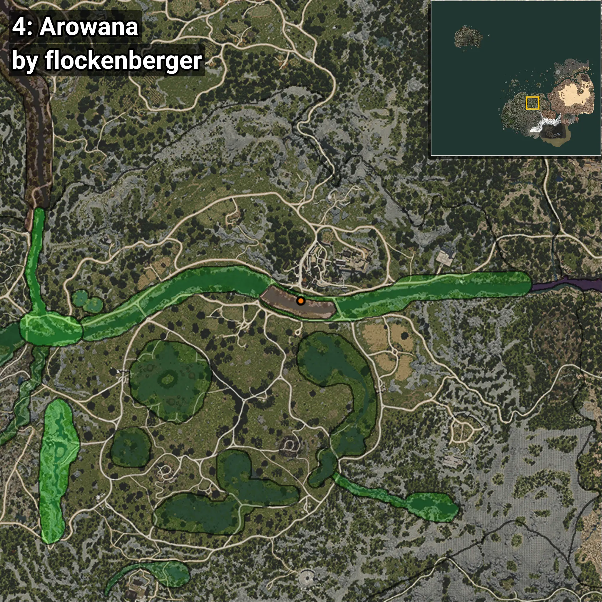
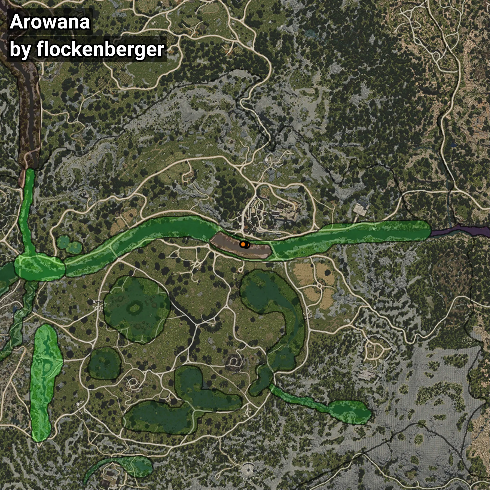

# Arowana
```xml
<!--
    Puntos de pesca para: Arowana
    Creado por: flockenberger
-->
<WorldmapBookMark>
    <BookMark BookMarkName="0: Arowana" PosX="39139.125" PosY="-4078.7185" PosZ="-51164.07" />
    <BookMark BookMarkName="1: Arowana" PosX="39224.0" PosY="-4056.0" PosZ="-51140.0" />
    <BookMark BookMarkName="2: Arowana" PosX="38128.0" PosY="-3991.0" PosZ="-50608.0" />
    <BookMark BookMarkName="3: Arowana" PosX="38169.0" PosY="-4011.0" PosZ="-50709.0" />
    <BookMark BookMarkName="4: Arowana" PosX="37364.0" PosY="-3816.0" PosZ="-50763.0" />
</WorldmapBookMark>
```

## ⚠️ Advertencia:
Los puntos de pesca se generan según la __**posición de tu personaje**__ — __no__ donde cae el flotador.  
En el océano especialmente, la dirección en la que lances la caña puede colocar tu flotador en una **zona de pesca diferente**, lo que puede resultar en capturar el pez incorrecto.  
Presta atención a las vistas previas que muestran la ubicación en relación a las zonas marcadas.

- Para verificar la posición de tu flotador puedes usar la guía [AQUÍ](https://flockenberger.github.io/bdo-fish-position/)
- O ver la guía [AQUÍ](https://youtu.be/t-VXcRoNojk)

## Vistas Previas
      