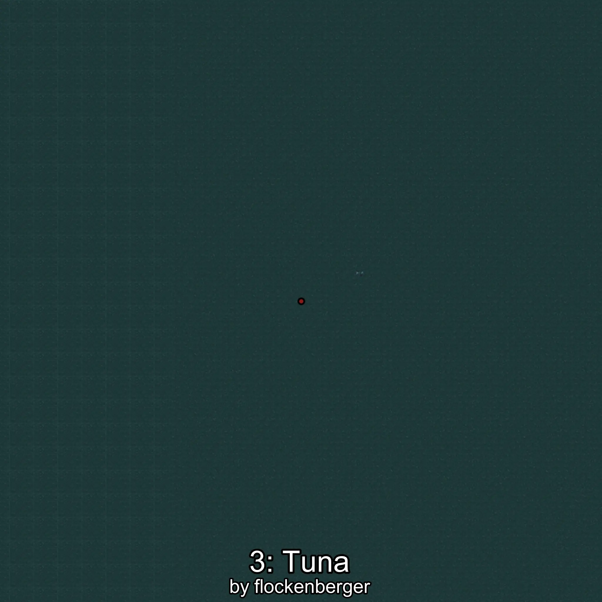

# Atún
```xml
<!--
    Puntos de pesca para: Atún
    Creado por: flockenberger
-->
<WorldmapBookMark>
    <BookMark BookMarkName="0: Atún" PosX="70981.0" PosY="-7499.0" PosZ="294074.0" />
    <BookMark BookMarkName="1: Atún" PosX="70098.0" PosY="-7646.0" PosZ="304982.0" />
    <BookMark BookMarkName="2: Atún" PosX="168599.08" PosY="-7654.796" PosZ="214810.42" />
    <BookMark BookMarkName="3: Atún" PosX="173322.0" PosY="-7911.0" PosZ="214564.0" />
    <BookMark BookMarkName="4: Atún" PosX="-106170.0" PosY="-7952.0" PosZ="627252.0" />
</WorldmapBookMark>
```

## ⚠️ Advertencia:
Los puntos de pesca se generan según la __**posición de tu personaje**__ — __no__ donde cae el flotador.  
En el océano especialmente, la dirección en la que lances la caña puede colocar tu flotador en una **zona de pesca diferente**, lo que puede resultar en capturar el pez incorrecto.  
Presta atención a las vistas previas que muestran la ubicación en relación a las zonas marcadas.

- Para verificar la posición de tu flotador puedes usar la guía [AQUÍ](https://flockenberger.github.io/bdo-fish-position/)
- O ver la guía [AQUÍ](https://youtu.be/t-VXcRoNojk)

## Vistas Previas
      