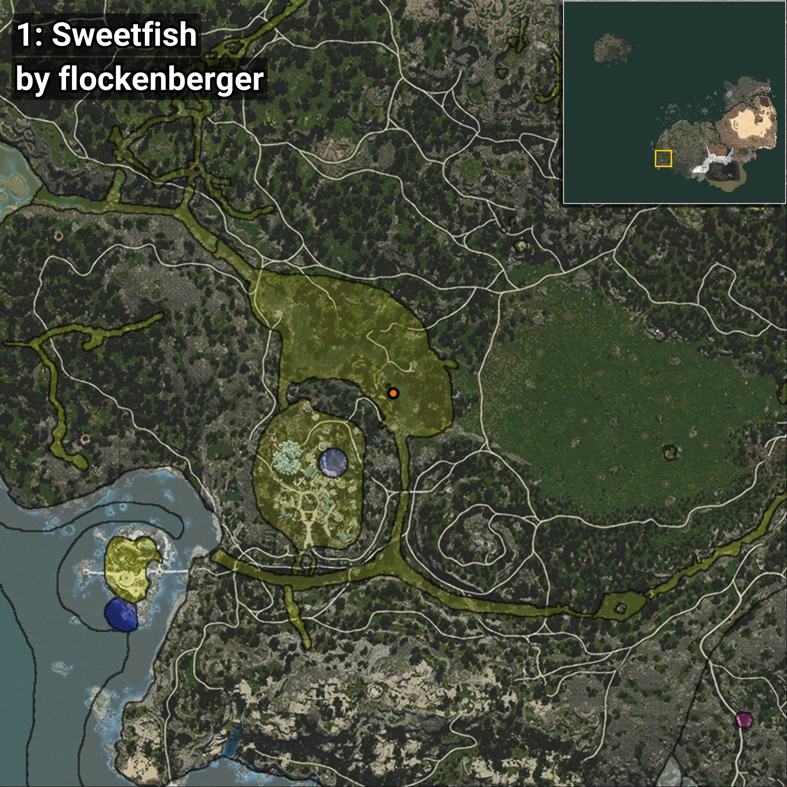
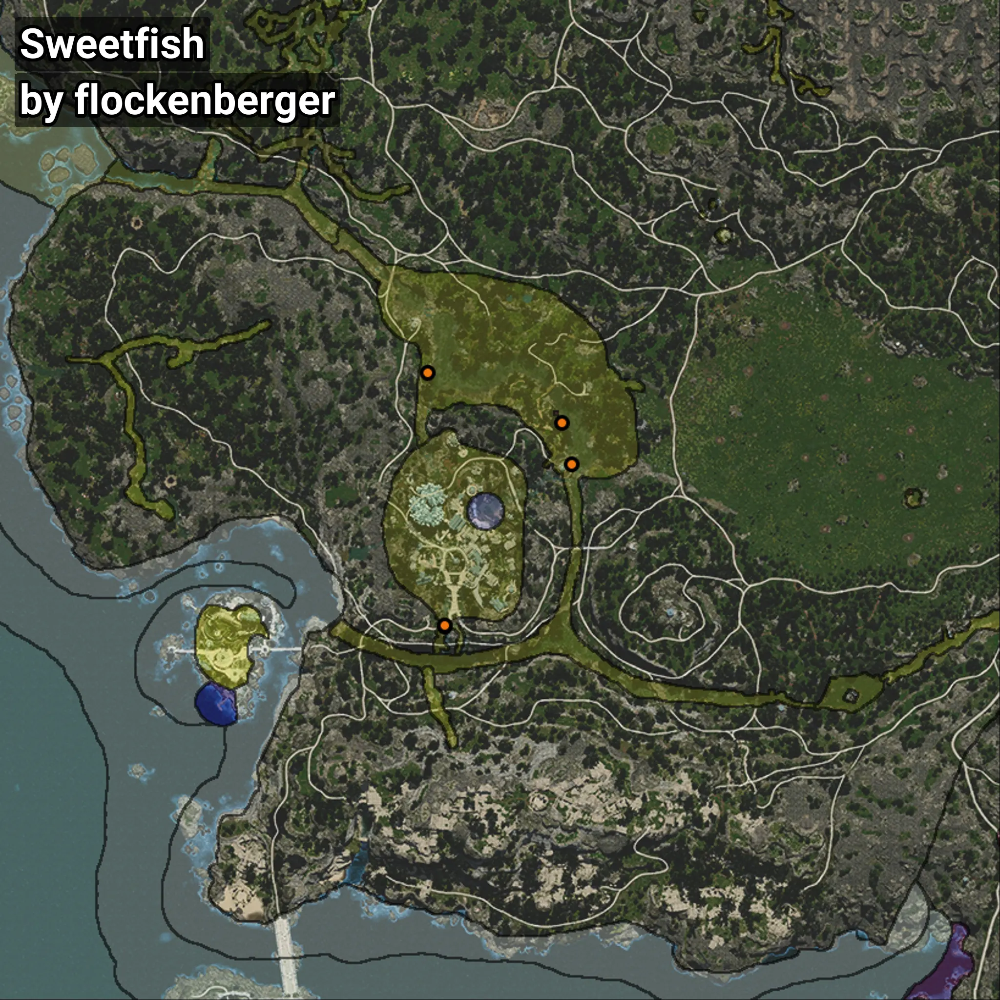

# Ayu
```xml
<!--
    Puntos de pesca para: Ayu
    Creado por: flockenberger
-->
<WorldmapBookMark>
    <BookMark BookMarkName="0: Ayu" PosX="-476276.4" PosY="-4742.2925" PosZ="-435016.9" />
    <BookMark BookMarkName="1: Ayu" PosX="-478574.0" PosY="-4935.0" PosZ="-424930.0" />
    <BookMark BookMarkName="2: Ayu" PosX="-507637.56" PosY="5605.631" PosZ="-475132.97" />
    <BookMark BookMarkName="3: Ayu" PosX="-507678.8" PosY="6574.045" PosZ="-474659.2" />
    <BookMark BookMarkName="4: Ayu" PosX="-511711.0" PosY="-4795.0" PosZ="-412479.0" />
</WorldmapBookMark>
```

## ⚠️ Advertencia:
Los puntos de pesca se generan según la __**posición de tu personaje**__ — __no__ donde cae el flotador.  
En el océano especialmente, la dirección en la que lances la caña puede colocar tu flotador en una **zona de pesca diferente**, lo que puede resultar en capturar el pez incorrecto.  
Presta atención a las vistas previas que muestran la ubicación en relación a las zonas marcadas.

- Para verificar la posición de tu flotador puedes usar la guía [AQUÍ](https://flockenberger.github.io/bdo-fish-position/)
- O ver la guía [AQUÍ](https://youtu.be/t-VXcRoNojk)

## Vistas Previas
      