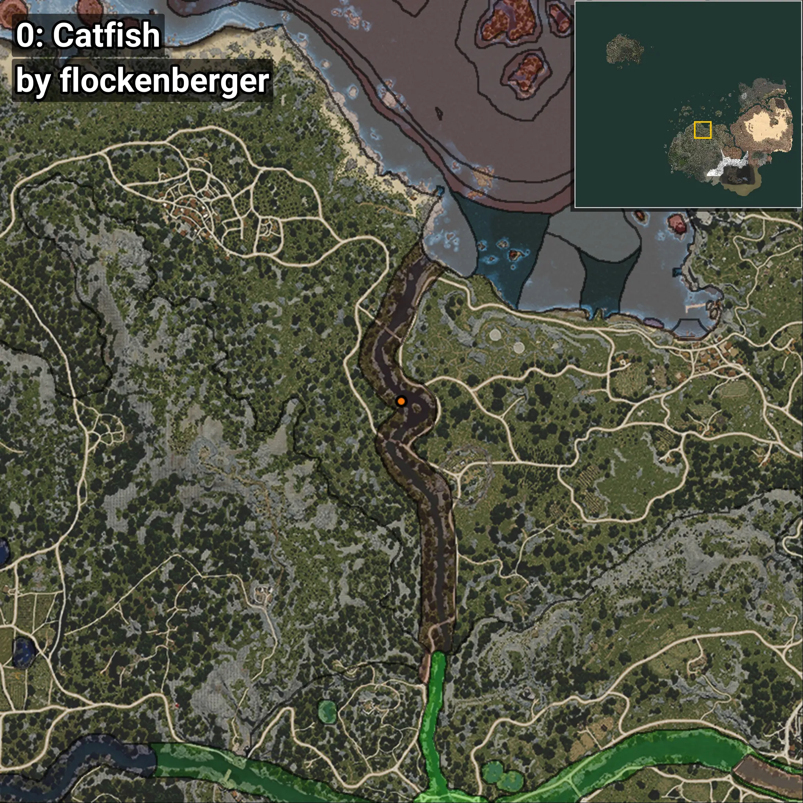
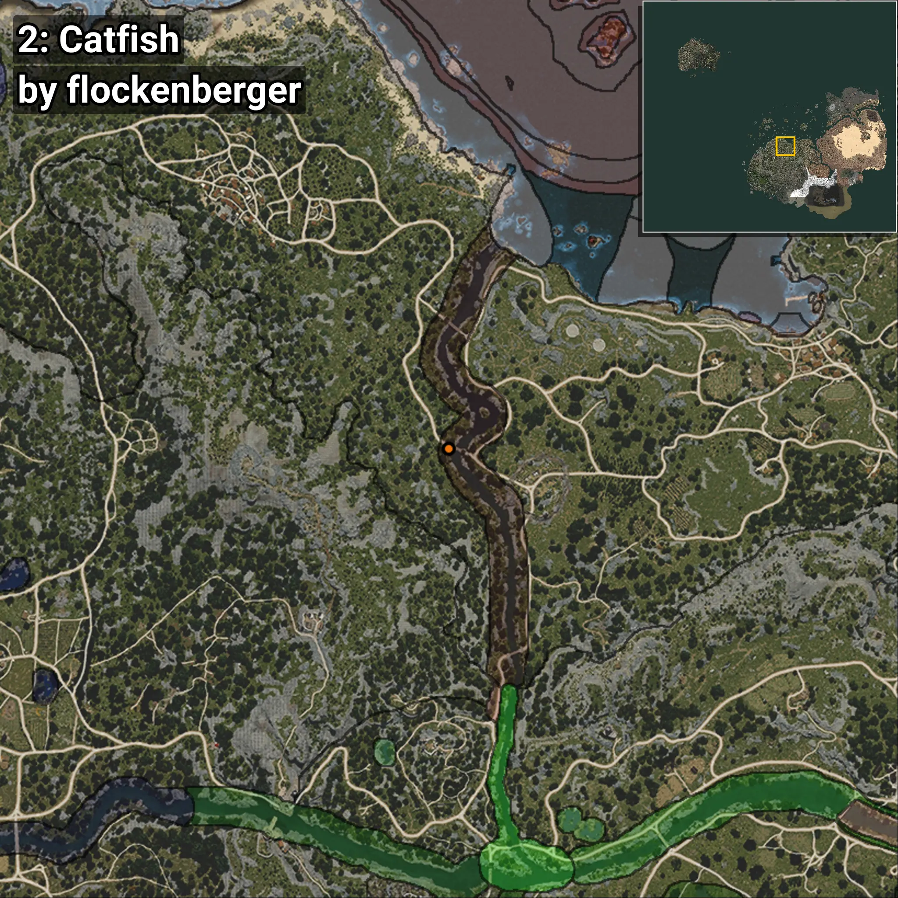

# Bagre
```xml
<!--
    Puntos de pesca para: Bagre
    Creado por: flockenberger
-->
<WorldmapBookMark>
    <BookMark BookMarkName="0: Bagre" PosX="-81233.0" PosY="-4582.0" PosZ="64290.0" />
    <BookMark BookMarkName="1: Bagre" PosX="-78332.0" PosY="-4281.0" PosZ="63616.0" />
    <BookMark BookMarkName="2: Bagre" PosX="-86294.0" PosY="-4698.0" PosZ="52171.0" />
    <BookMark BookMarkName="3: Bagre" PosX="-86395.0" PosY="-4684.0" PosZ="52147.0" />
    <BookMark BookMarkName="4: Bagre" PosX="-74055.0" PosY="-4449.0" PosZ="37952.0" />
</WorldmapBookMark>
```

## ⚠️ Advertencia:
Los puntos de pesca se generan según la __**posición de tu personaje**__ — __no__ donde cae el flotador.  
En el océano especialmente, la dirección en la que lances la caña puede colocar tu flotador en una **zona de pesca diferente**, lo que puede resultar en capturar el pez incorrecto.  
Presta atención a las vistas previas que muestran la ubicación en relación a las zonas marcadas.

- Para verificar la posición de tu flotador puedes usar la guía [AQUÍ](https://flockenberger.github.io/bdo-fish-position/)
- O ver la guía [AQUÍ](https://youtu.be/t-VXcRoNojk)

## Vistas Previas
      