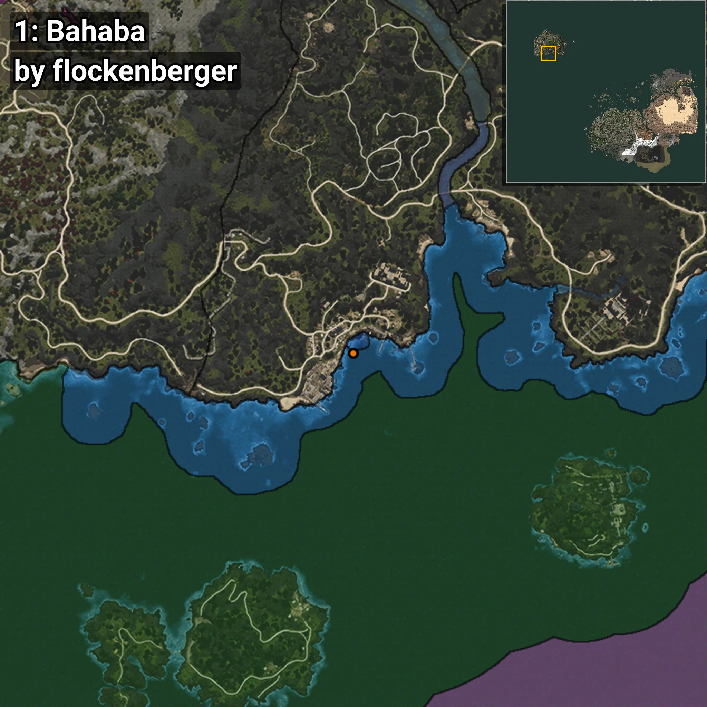
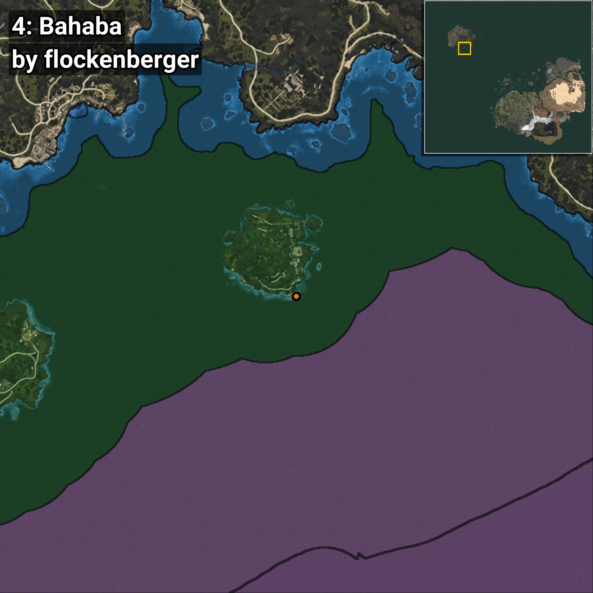
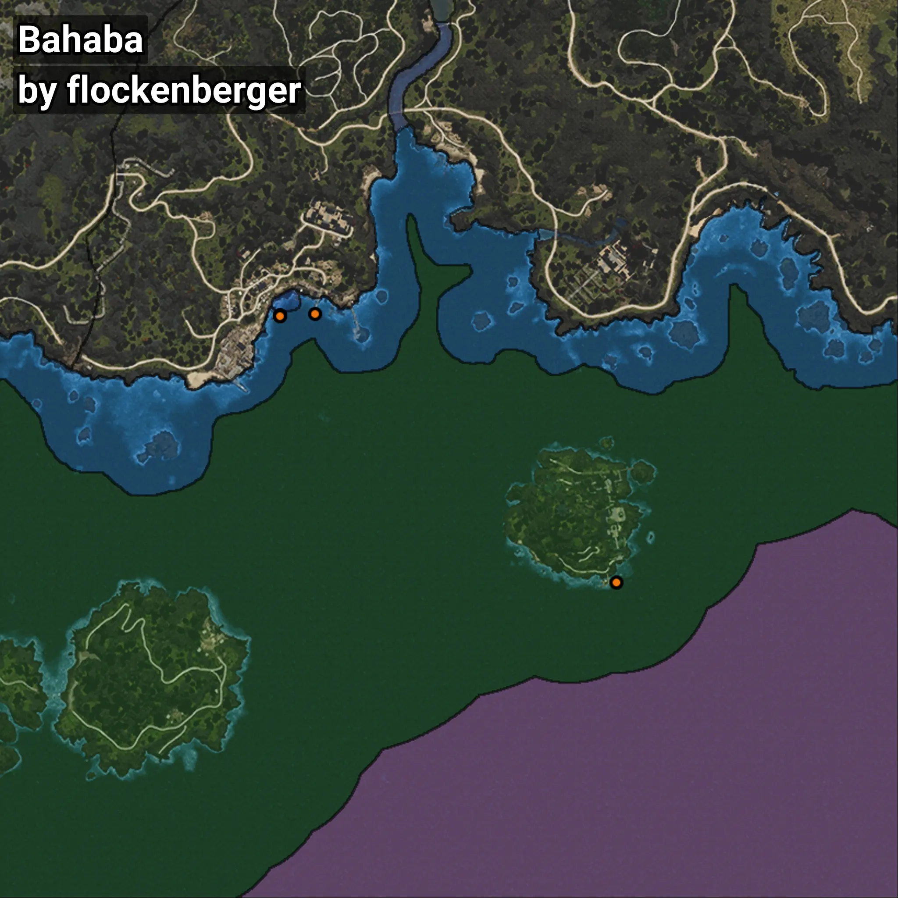

# Bahaba
```xml
<!--
    Puntos de pesca para: Bahaba
    Creado por: flockenberger
-->
<WorldmapBookMark>
    <BookMark BookMarkName="0: Bahaba" PosX="-1306424.0" PosY="-8135.0" PosZ="1126401.0" />
    <BookMark BookMarkName="1: Bahaba" PosX="-1306468.0" PosY="-8126.0" PosZ="1126370.0" />
    <BookMark BookMarkName="2: Bahaba" PosX="-1296859.0" PosY="-7887.0" PosZ="1126847.0" />
    <BookMark BookMarkName="3: Bahaba" PosX="-1306470.1" PosY="-8126.0186" PosZ="1126350.5" />
    <BookMark BookMarkName="4: Bahaba" PosX="-1213993.0" PosY="-7759.0" PosZ="1053136.0" />
</WorldmapBookMark>
```

## ⚠️ Advertencia:
Los puntos de pesca se generan según la __**posición de tu personaje**__ — __no__ donde cae el flotador.  
En el océano especialmente, la dirección en la que lances la caña puede colocar tu flotador en una **zona de pesca diferente**, lo que puede resultar en capturar el pez incorrecto.  
Presta atención a las vistas previas que muestran la ubicación en relación a las zonas marcadas.

- Para verificar la posición de tu flotador puedes usar la guía [AQUÍ](https://flockenberger.github.io/bdo-fish-position/)
- O ver la guía [AQUÍ](https://youtu.be/t-VXcRoNojk)

## Vistas Previas
      