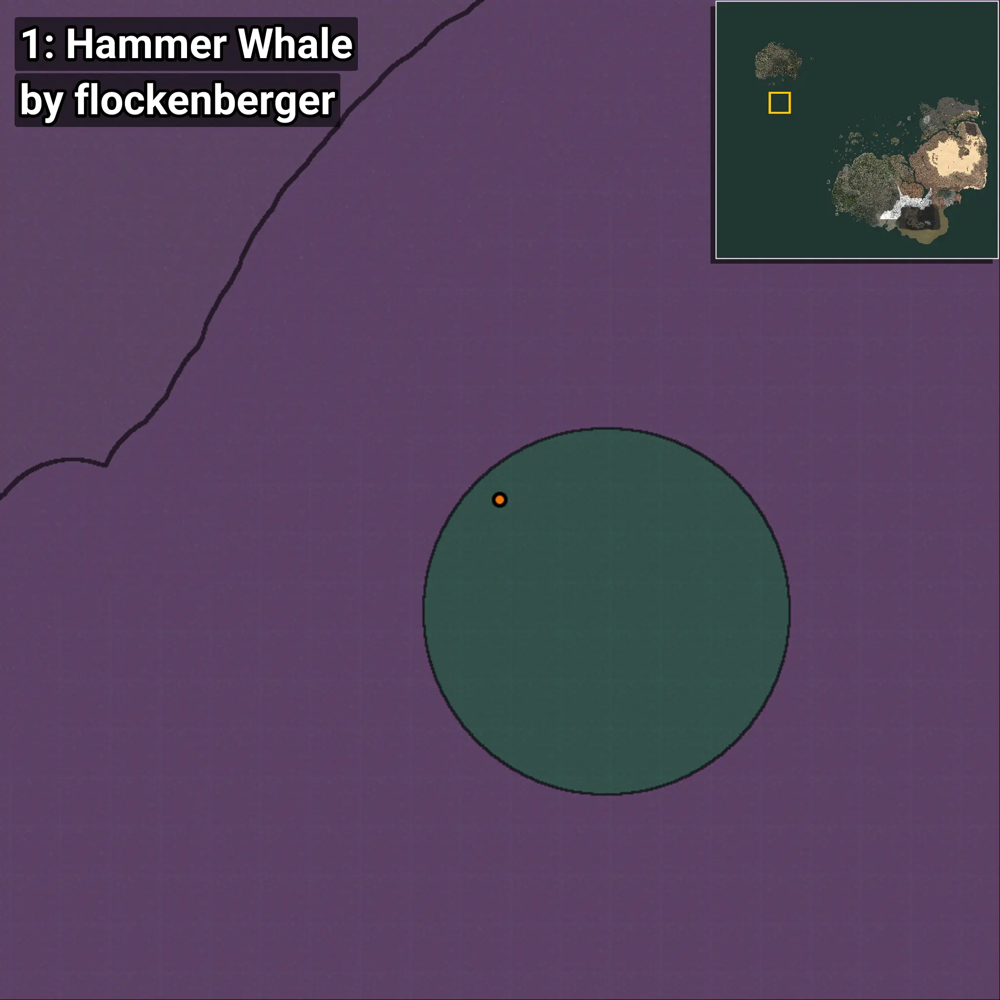
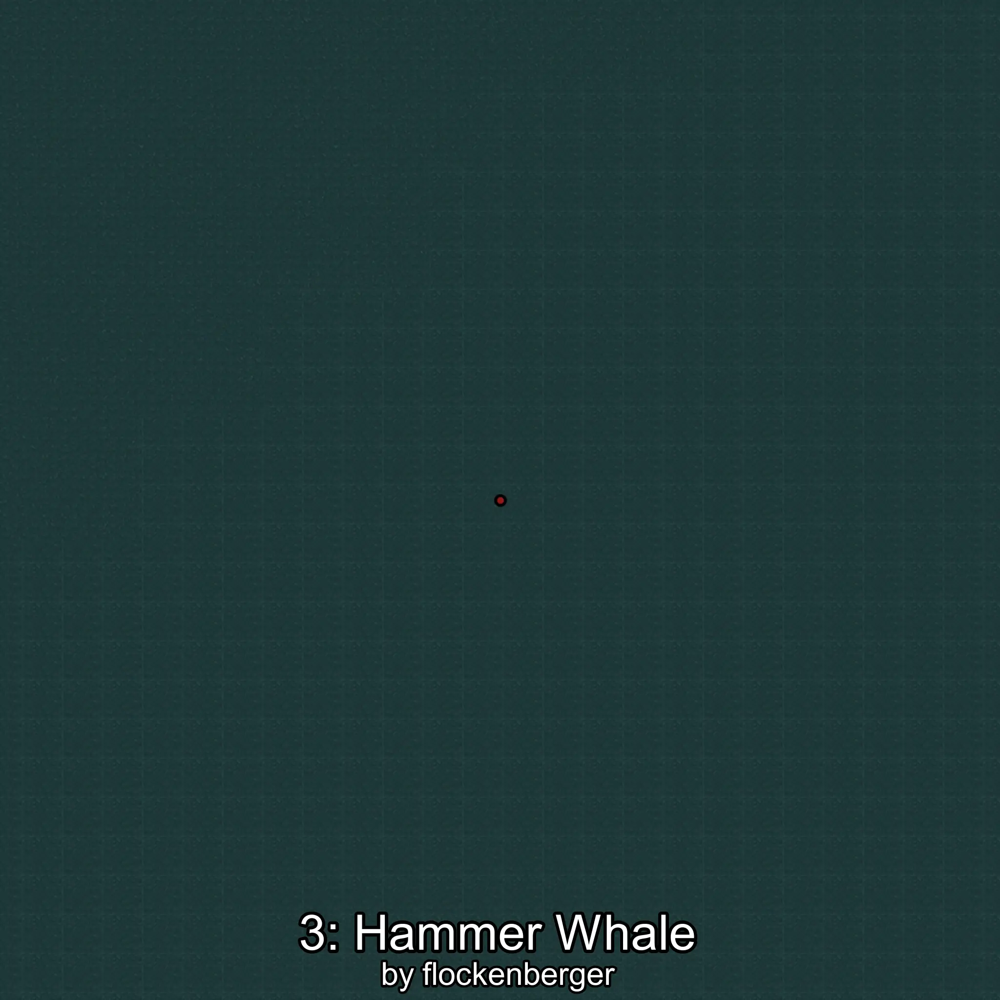
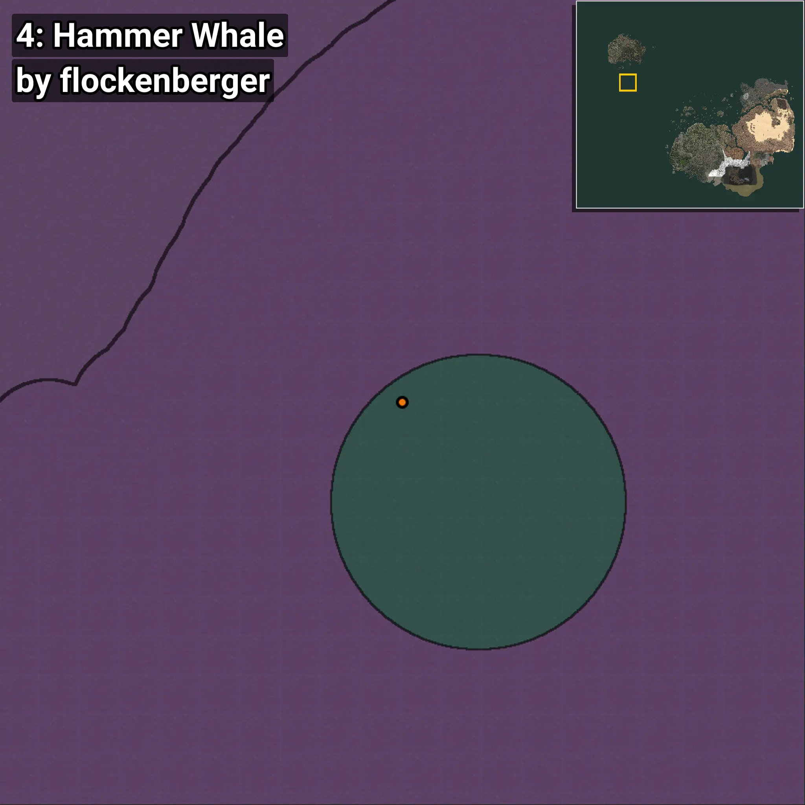

# Berardius
```xml
<!--
    Puntos de pesca para: Berardius
    Creado por: flockenberger
-->
<WorldmapBookMark>
    <BookMark BookMarkName="0: Berardius" PosX="-1262844.0" PosY="-7595.0" PosZ="790012.0" />
    <BookMark BookMarkName="1: Berardius" PosX="-1260189.0" PosY="-7905.0" PosZ="790998.0" />
    <BookMark BookMarkName="2: Berardius" PosX="-1264416.0" PosY="-7350.0" PosZ="737479.0" />
    <BookMark BookMarkName="3: Berardius" PosX="-1264996.0" PosY="-7915.0" PosZ="738968.0" />
    <BookMark BookMarkName="4: Berardius" PosX="-1257292.0" PosY="-7111.0" PosZ="793985.0" />
</WorldmapBookMark>
```

## ⚠️ Advertencia:
Los puntos de pesca se generan según la __**posición de tu personaje**__ — __no__ donde cae el flotador.  
En el océano especialmente, la dirección en la que lances la caña puede colocar tu flotador en una **zona de pesca diferente**, lo que puede resultar en capturar el pez incorrecto.  
Presta atención a las vistas previas que muestran la ubicación en relación a las zonas marcadas.

- Para verificar la posición de tu flotador puedes usar la guía [AQUÍ](https://flockenberger.github.io/bdo-fish-position/)
- O ver la guía [AQUÍ](https://youtu.be/t-VXcRoNojk)

## Vistas Previas
      