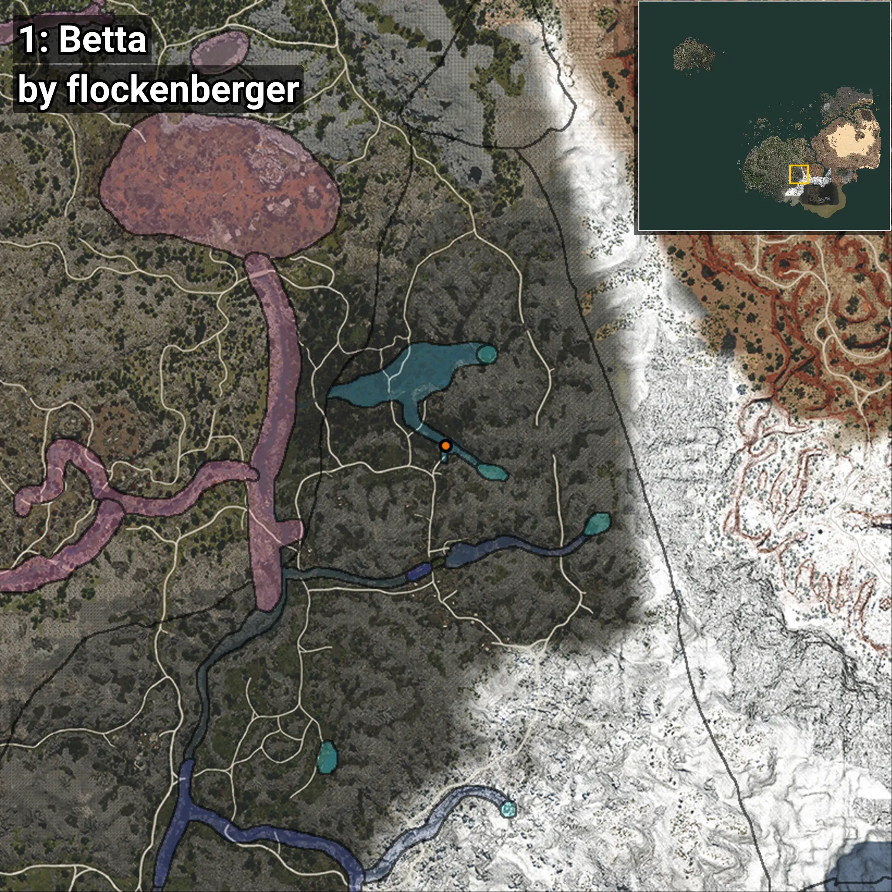
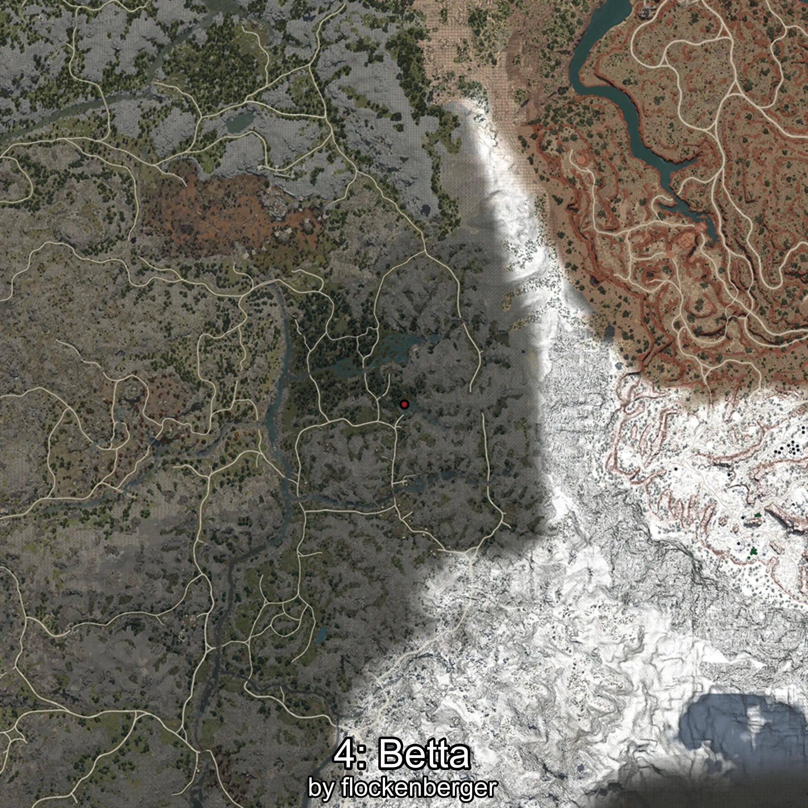

# Betta
```xml
<!--
    Puntos de pesca para: Betta
    Creado por: flockenberger
-->
<WorldmapBookMark>
    <BookMark BookMarkName="0: Betta" PosX="171486.0" PosY="14031.0" PosZ="-351920.0" />
    <BookMark BookMarkName="1: Betta" PosX="171442.0" PosY="13997.431" PosZ="-352122.7" />
    <BookMark BookMarkName="2: Betta" PosX="170012.89" PosY="13783.148" PosZ="-353720.22" />
    <BookMark BookMarkName="3: Betta" PosX="171587.0" PosY="13904.0" PosZ="-351422.0" />
    <BookMark BookMarkName="4: Betta" PosX="162812.27" PosY="11575.388" PosZ="-335833.6" />
</WorldmapBookMark>
```

## ⚠️ Advertencia:
Los puntos de pesca se generan según la __**posición de tu personaje**__ — __no__ donde cae el flotador.  
En el océano especialmente, la dirección en la que lances la caña puede colocar tu flotador en una **zona de pesca diferente**, lo que puede resultar en capturar el pez incorrecto.  
Presta atención a las vistas previas que muestran la ubicación en relación a las zonas marcadas.

- Para verificar la posición de tu flotador puedes usar la guía [AQUÍ](https://flockenberger.github.io/bdo-fish-position/)
- O ver la guía [AQUÍ](https://youtu.be/t-VXcRoNojk)

## Vistas Previas
      