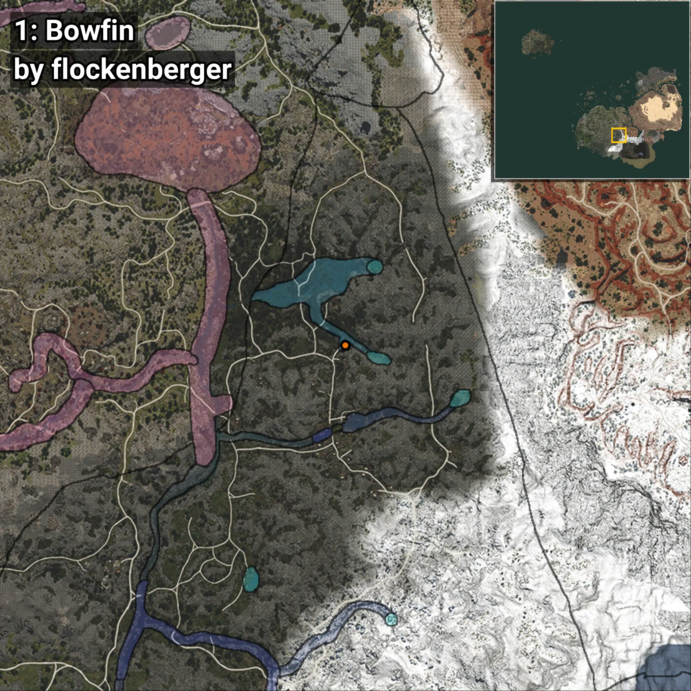
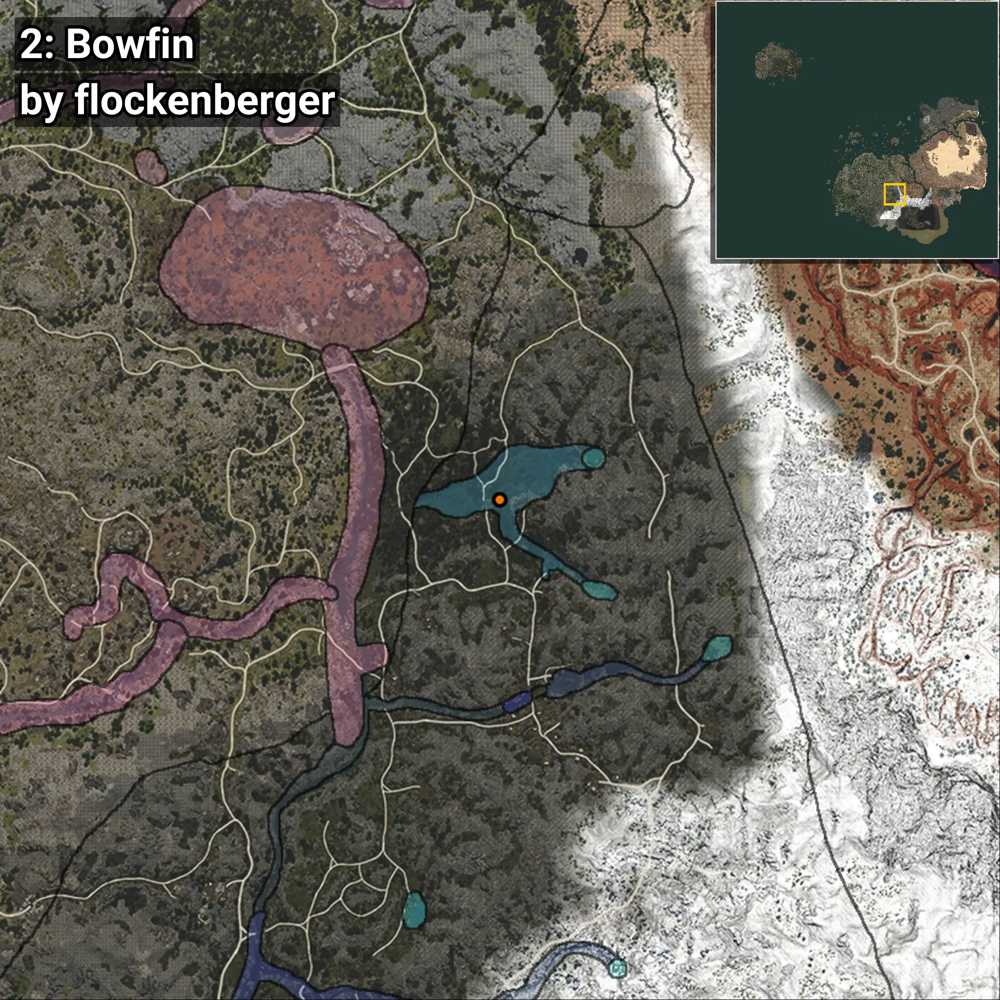

# Bowfin
Creado por **flockenberger**

## ⚠️ Advertencia:
Los puntos de pesca se generan según la __**posición de tu personaje**__ — __no__ donde cae el flotador.  
En el océano especialmente, la dirección en la que lances la caña puede colocar tu flotador en una **zona de pesca diferente**, lo que puede resultar en capturar el pez incorrecto.  
Esto solo ocurre en raros casos — cuando la posición está justo en el **borde de una zona** y lanzas hacia el lado “equivocado”.

- Para verificar la posición puedes usar la guía [AQUÍ](https://flockenberger.github.io/bdo-fish-position/)
- O ver la guía [AQUÍ](https://youtu.be/t-VXcRoNojk)

## Waypoints
```xml
<!--
    Puntos de pesca para: Bowfin
    Creado por: flockenberger
-->
<WorldmapBookMark>
    <BookMark BookMarkName="0: Bowfin" PosX="174137.0" PosY="13817.23" PosZ="-353034.0" />
    <BookMark BookMarkName="1: Bowfin" PosX="173249.0" PosY="13785.0" PosZ="-352087.0" />
    <BookMark BookMarkName="2: Bowfin" PosX="165946.0" PosY="11545.0" PosZ="-328937.0" />
    <BookMark BookMarkName="3: Bowfin" PosX="173063.0" PosY="11532.0" PosZ="-329196.0" />
    <BookMark BookMarkName="4: Bowfin" PosX="173200.0" PosY="13747.0" PosZ="-351525.0" />
</WorldmapBookMark>
```

     