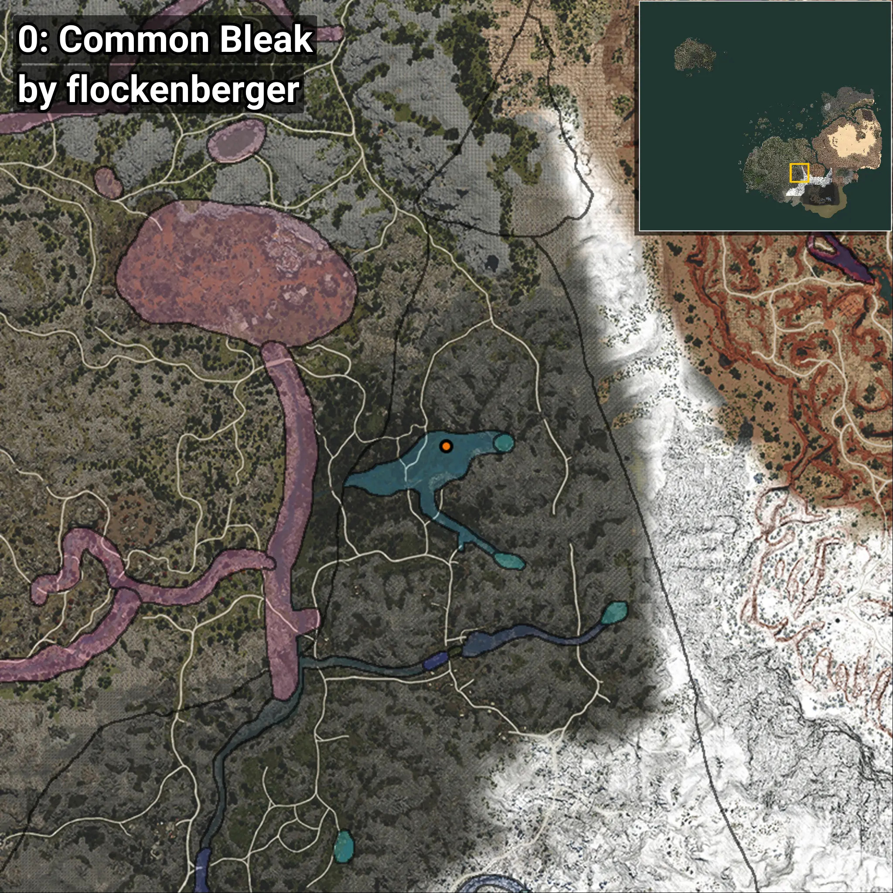
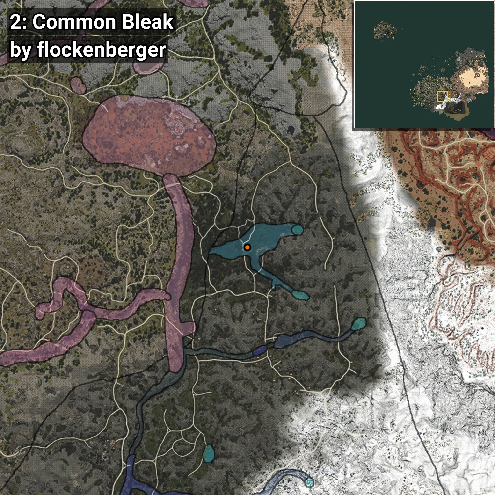

# Breca
```xml
<!--
    Puntos de pesca para: Breca
    Creado por: flockenberger
-->
<WorldmapBookMark>
    <BookMark BookMarkName="0: Breca" PosX="166938.02" PosY="11536.641" PosZ="-327736.22" />
    <BookMark BookMarkName="1: Breca" PosX="168326.0" PosY="11528.0" PosZ="-331418.0" />
    <BookMark BookMarkName="2: Breca" PosX="158113.08" PosY="11702.79" PosZ="-335737.3" />
    <BookMark BookMarkName="3: Breca" PosX="158178.0" PosY="11704.0" PosZ="-335677.0" />
    <BookMark BookMarkName="4: Breca" PosX="170103.12" PosY="13770.581" PosZ="-353744.78" />
</WorldmapBookMark>
```

## ⚠️ Advertencia:
Los puntos de pesca se generan según la __**posición de tu personaje**__ — __no__ donde cae el flotador.  
En el océano especialmente, la dirección en la que lances la caña puede colocar tu flotador en una **zona de pesca diferente**, lo que puede resultar en capturar el pez incorrecto.  
Presta atención a las vistas previas que muestran la ubicación en relación a las zonas marcadas.

- Para verificar la posición de tu flotador puedes usar la guía [AQUÍ](https://flockenberger.github.io/bdo-fish-position/)
- O ver la guía [AQUÍ](https://youtu.be/t-VXcRoNojk)

## Vistas Previas
      