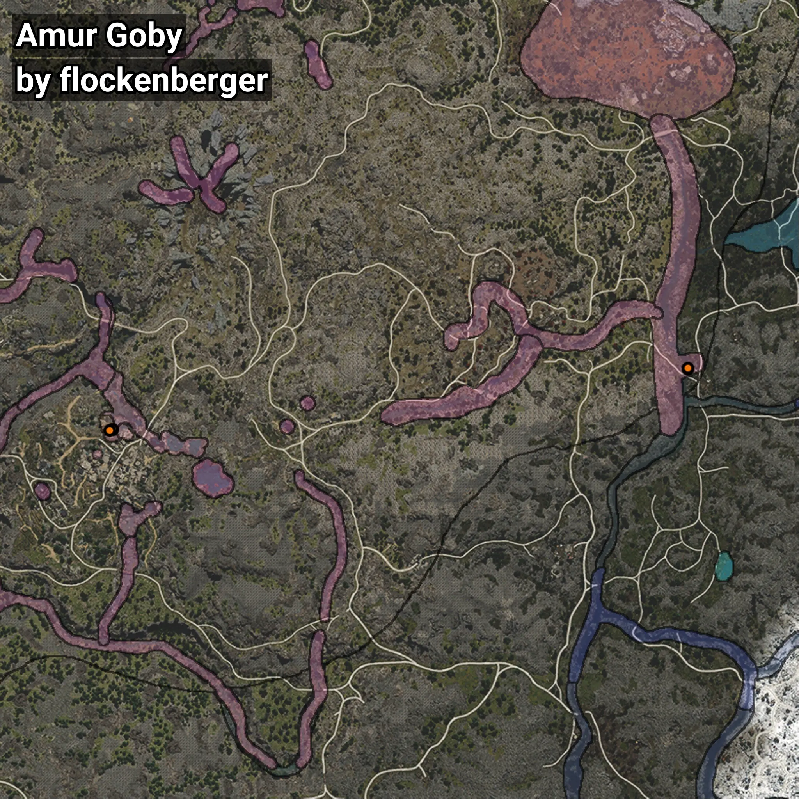

# Brunneus
```xml
<!--
    Puntos de pesca para: Brunneus
    Creado por: flockenberger
-->
<WorldmapBookMark>
    <BookMark BookMarkName="0: Brunneus" PosX="127426.0" PosY="12491.0" PosZ="-377476.0" />
    <BookMark BookMarkName="1: Brunneus" PosX="127574.0" PosY="12475.0" PosZ="-377307.0" />
    <BookMark BookMarkName="2: Brunneus" PosX="-50074.0" PosY="19853.0" PosZ="-396300.0" />
    <BookMark BookMarkName="3: Brunneus" PosX="-50039.53" PosY="19853.166" PosZ="-396270.56" />
    <BookMark BookMarkName="4: Brunneus" PosX="-51146.0" PosY="20058.0" PosZ="-396585.0" />
</WorldmapBookMark>
```

## ⚠️ Advertencia:
Los puntos de pesca se generan según la __**posición de tu personaje**__ — __no__ donde cae el flotador.  
En el océano especialmente, la dirección en la que lances la caña puede colocar tu flotador en una **zona de pesca diferente**, lo que puede resultar en capturar el pez incorrecto.  
Presta atención a las vistas previas que muestran la ubicación en relación a las zonas marcadas.

- Para verificar la posición de tu flotador puedes usar la guía [AQUÍ](https://flockenberger.github.io/bdo-fish-position/)
- O ver la guía [AQUÍ](https://youtu.be/t-VXcRoNojk)

## Vistas Previas
      