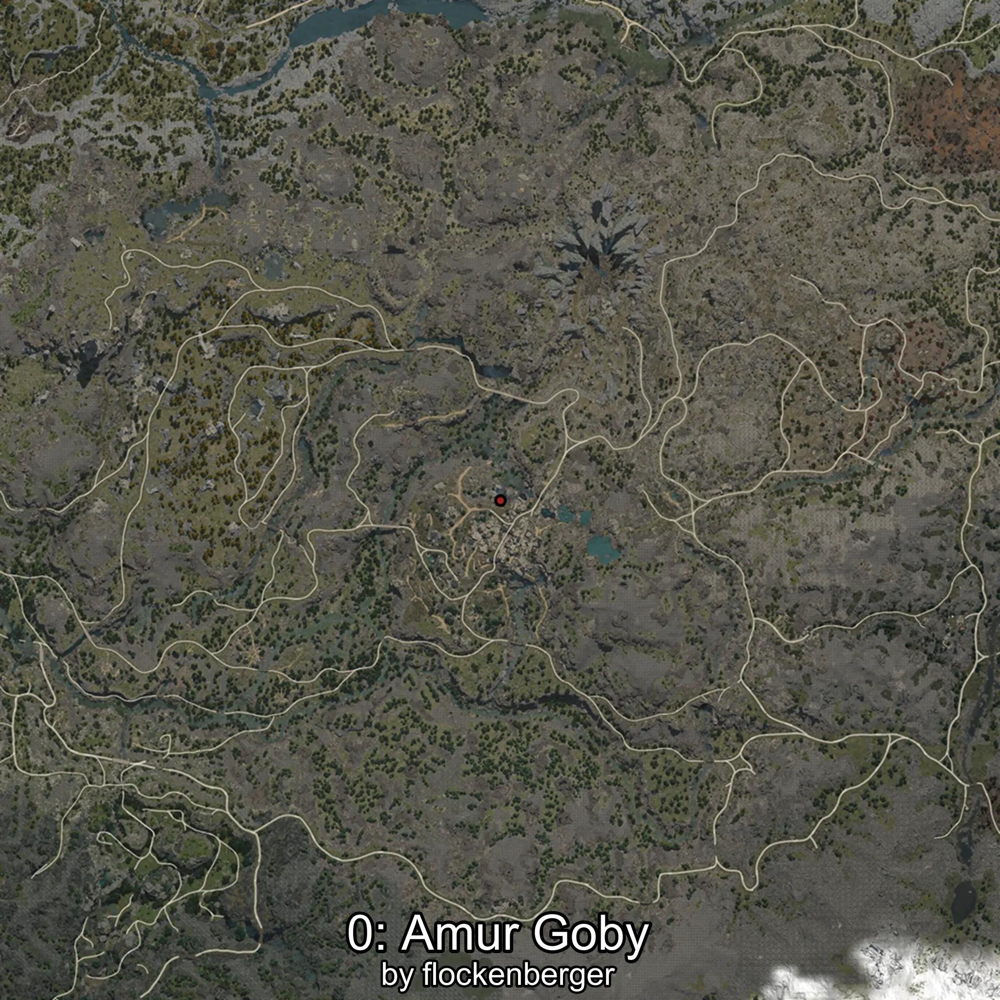
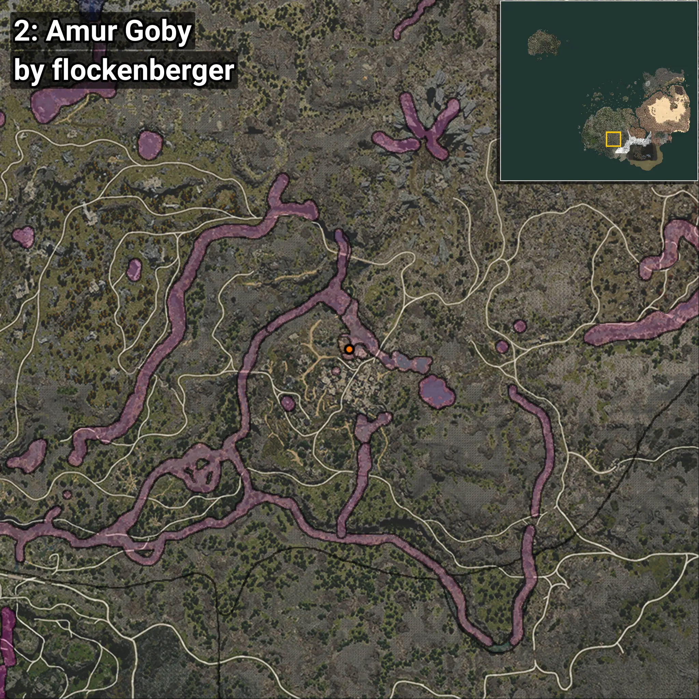
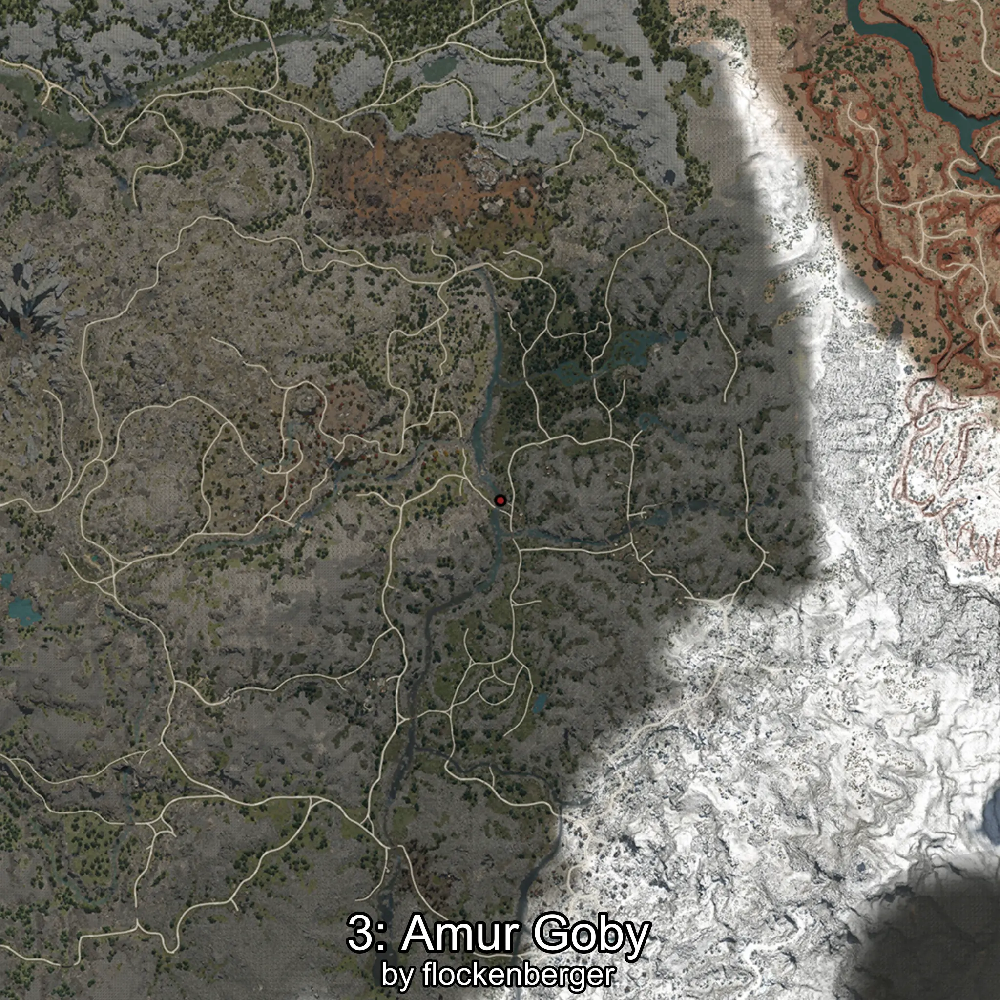
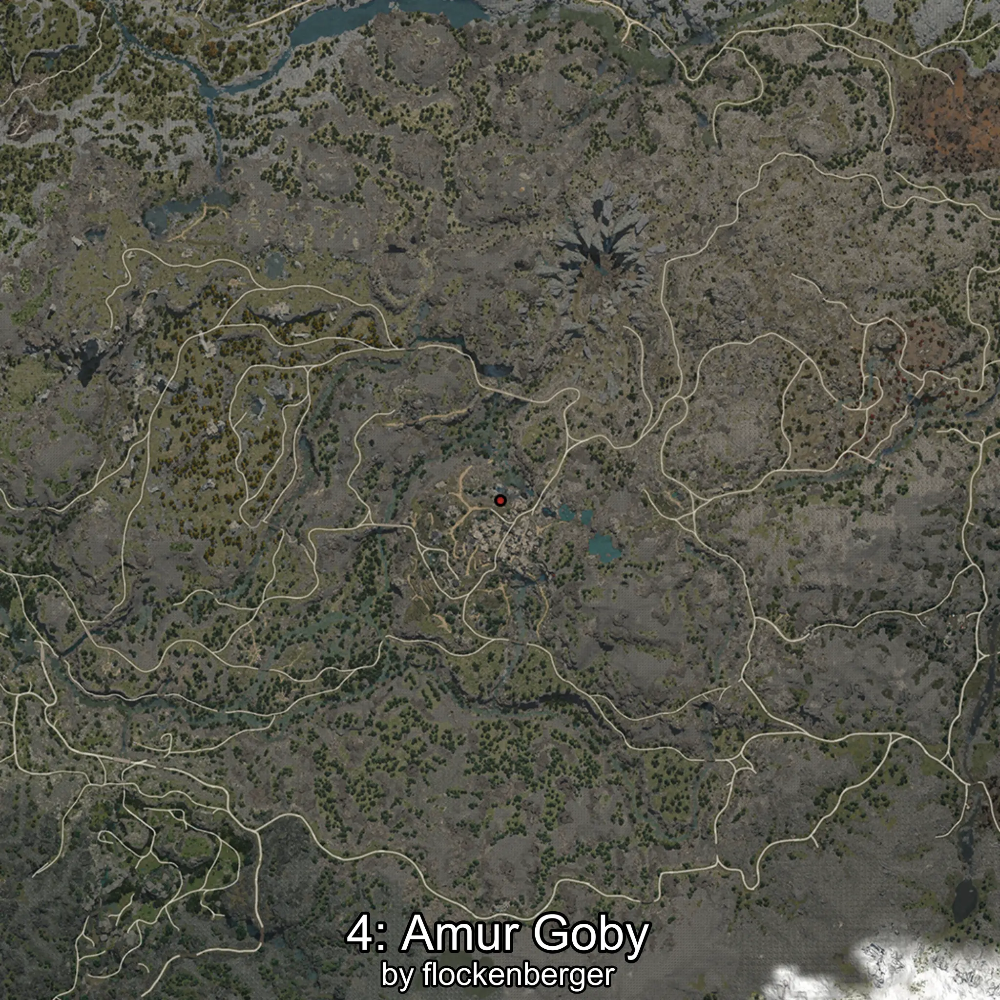

# Brunneus
Creado por **flockenberger**

## ⚠️ Advertencia:
Los puntos de pesca se generan según la __**posición de tu personaje**__ — __no__ donde cae el flotador.  
En el océano especialmente, la dirección en la que lances la caña puede colocar tu flotador en una **zona de pesca diferente**, lo que puede resultar en capturar el pez incorrecto.  
Esto solo ocurre en raros casos — cuando la posición está justo en el **borde de una zona** y lanzas hacia el lado “equivocado”.

- Para verificar la posición puedes usar la guía [AQUÍ](https://flockenberger.github.io/bdo-fish-position/)
- O ver la guía [AQUÍ](https://youtu.be/t-VXcRoNojk)

## Waypoints
```xml
<!--
    Puntos de pesca para: Brunneus
    Creado por: flockenberger
-->
<WorldmapBookMark>
    <BookMark BookMarkName="0: Brunneus" PosX="-51177.85" PosY="19746.416" PosZ="-396255.75" />
    <BookMark BookMarkName="1: Brunneus" PosX="-50059.0" PosY="19853.0" PosZ="-396206.0" />
    <BookMark BookMarkName="2: Brunneus" PosX="-51496.0" PosY="19828.0" PosZ="-396197.0" />
    <BookMark BookMarkName="3: Brunneus" PosX="127623.0" PosY="12475.0" PosZ="-377059.0" />
    <BookMark BookMarkName="4: Brunneus" PosX="-51214.0" PosY="20058.0" PosZ="-396627.0" />
</WorldmapBookMark>
```

     