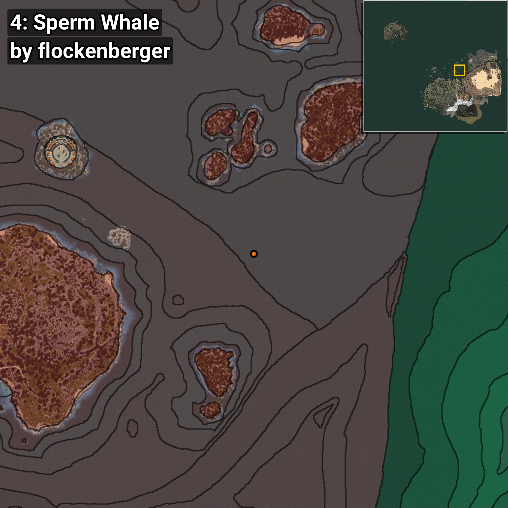
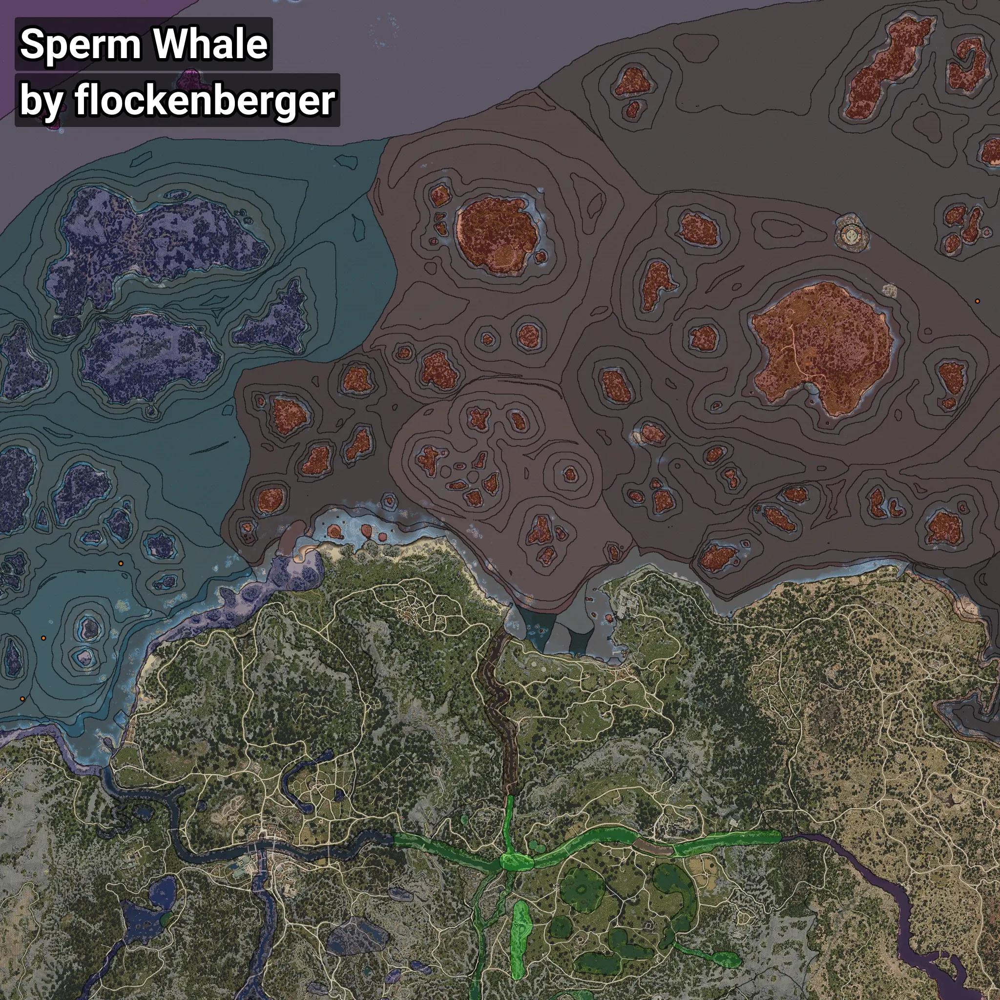

# Cachalote
```xml
<!--
    Puntos de pesca para: Cachalote
    Creado por: flockenberger
-->
<WorldmapBookMark>
    <BookMark BookMarkName="0: Cachalote" PosX="-417048.0" PosY="-8117.0" PosZ="104068.0" />
    <BookMark BookMarkName="1: Cachalote" PosX="-432763.0" PosY="-7730.0" PosZ="58736.0" />
    <BookMark BookMarkName="2: Cachalote" PosX="-359538.0" PosY="-8169.0" PosZ="159728.0" />
    <BookMark BookMarkName="3: Cachalote" PosX="-359545.94" PosY="-7916.9907" PosZ="159407.69" />
    <BookMark BookMarkName="4: Cachalote" PosX="277640.75" PosY="-7774.7666" PosZ="354784.0" />
</WorldmapBookMark>
```

## ⚠️ Advertencia:
Los puntos de pesca se generan según la __**posición de tu personaje**__ — __no__ donde cae el flotador.  
En el océano especialmente, la dirección en la que lances la caña puede colocar tu flotador en una **zona de pesca diferente**, lo que puede resultar en capturar el pez incorrecto.  
Presta atención a las vistas previas que muestran la ubicación en relación a las zonas marcadas.

- Para verificar la posición de tu flotador puedes usar la guía [AQUÍ](https://flockenberger.github.io/bdo-fish-position/)
- O ver la guía [AQUÍ](https://youtu.be/t-VXcRoNojk)

## Vistas Previas
      