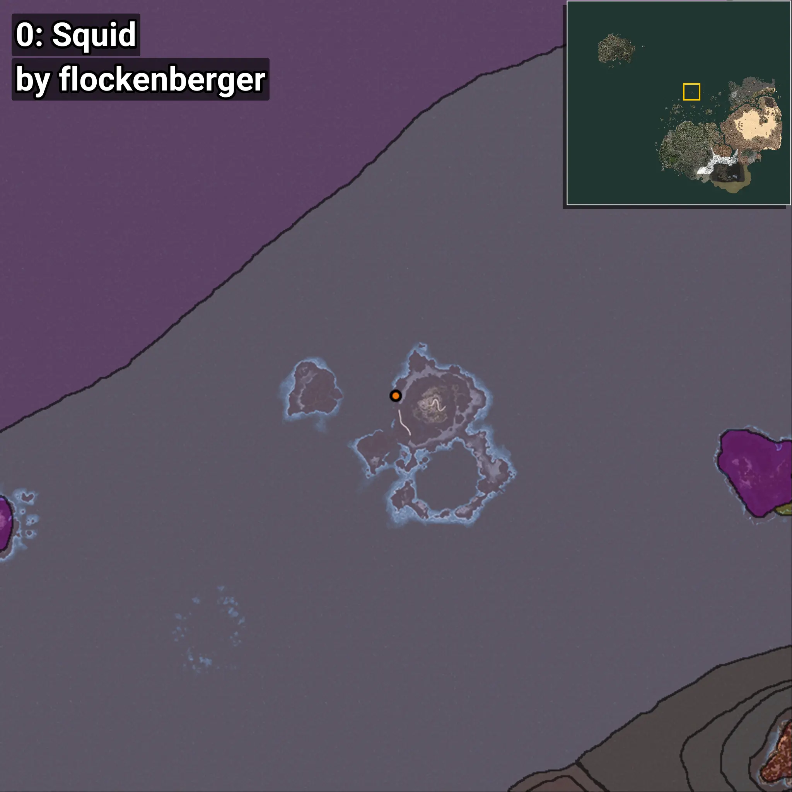
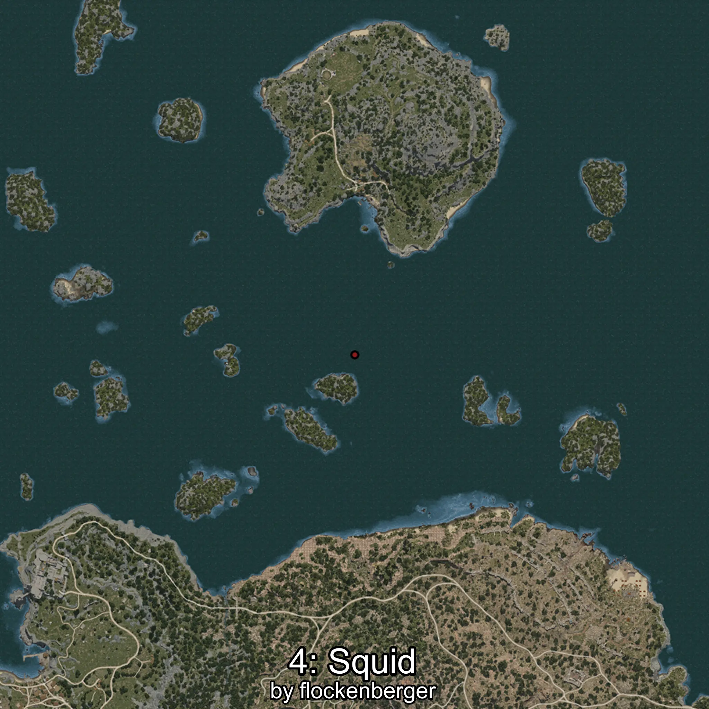

# Calamar
Creado por **flockenberger**

## ⚠️ Advertencia:
Los puntos de pesca se generan según la __**posición de tu personaje**__ — __no__ donde cae el flotador.  
En el océano especialmente, la dirección en la que lances la caña puede colocar tu flotador en una **zona de pesca diferente**, lo que puede resultar en capturar el pez incorrecto.  
Esto solo ocurre en raros casos — cuando la posición está justo en el **borde de una zona** y lanzas hacia el lado “equivocado”.

- Para verificar la posición puedes usar la guía [AQUÍ](https://flockenberger.github.io/bdo-fish-position/)
- O ver la guía [AQUÍ](https://youtu.be/t-VXcRoNojk)

## Waypoints
```xml
<!--
    Puntos de pesca para: Calamar
    Creado por: flockenberger
-->
<WorldmapBookMark>
    <BookMark BookMarkName="0: Calamar" PosX="151357.0" PosY="-7845.0" PosZ="291492.0" />
    <BookMark BookMarkName="1: Calamar" PosX="-105456.32" PosY="-7770.208" PosZ="633819.75" />
    <BookMark BookMarkName="2: Calamar" PosX="-106897.13" PosY="-8162.9336" PosZ="632805.06" />
    <BookMark BookMarkName="3: Calamar" PosX="-1158356.0" PosY="-7660.0" PosZ="903614.0" />
    <BookMark BookMarkName="4: Calamar" PosX="150394.61" PosY="-7669.682" PosZ="224549.9" />
</WorldmapBookMark>
```

     