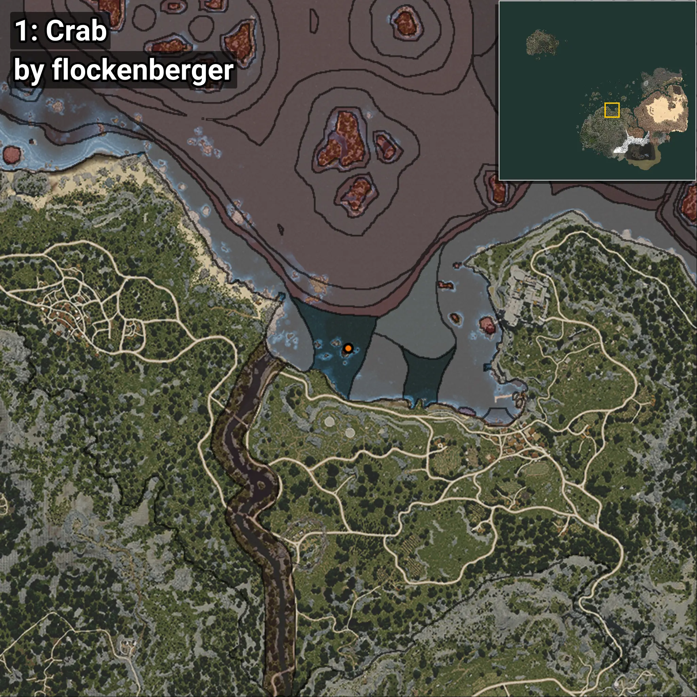
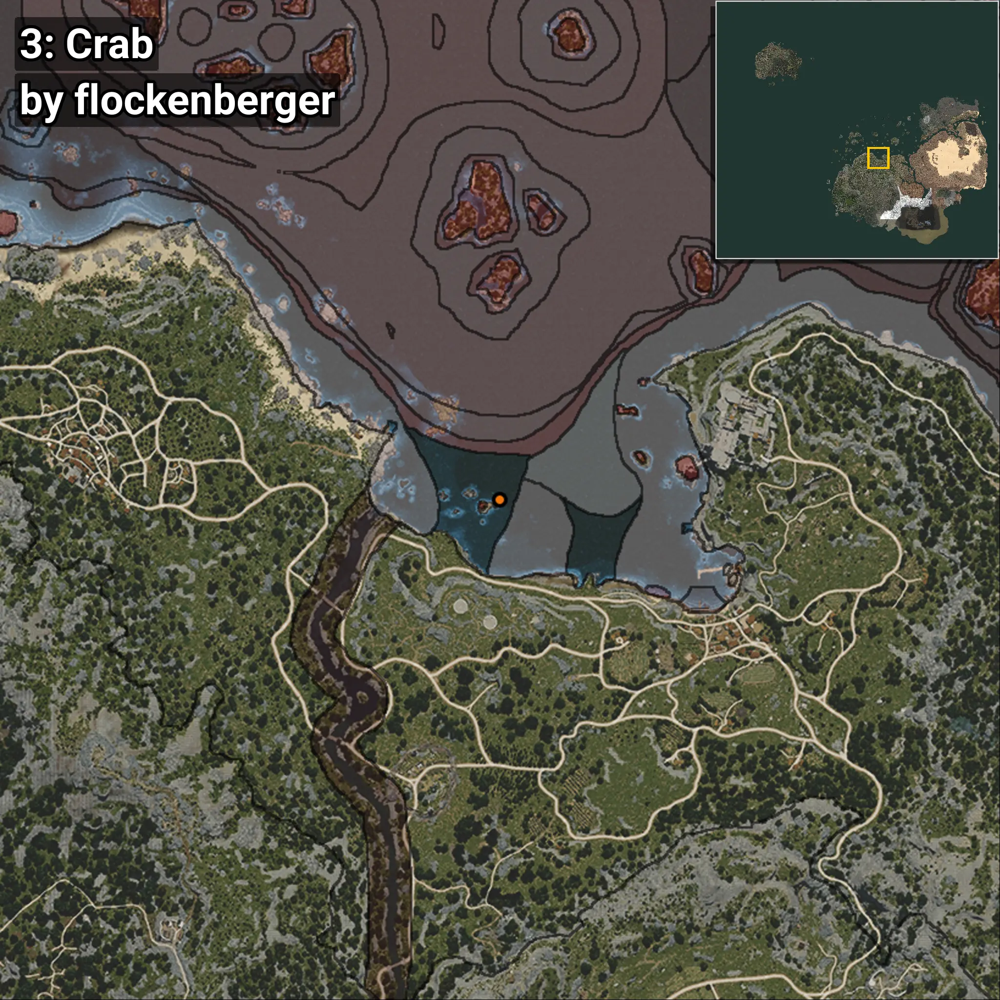

# Cangrejo
Creado por **flockenberger**

## ⚠️ Advertencia:
Los puntos de pesca se generan según la __**posición de tu personaje**__ — __no__ donde cae el flotador.  
En el océano especialmente, la dirección en la que lances la caña puede colocar tu flotador en una **zona de pesca diferente**, lo que puede resultar en capturar el pez incorrecto.  
Esto solo ocurre en raros casos — cuando la posición está justo en el **borde de una zona** y lanzas hacia el lado “equivocado”.

- Para verificar la posición puedes usar la guía [AQUÍ](https://flockenberger.github.io/bdo-fish-position/)
- O ver la guía [AQUÍ](https://youtu.be/t-VXcRoNojk)

## Waypoints
```xml
<!--
    Puntos de pesca para: Cangrejo
    Creado por: flockenberger
-->
<WorldmapBookMark>
    <BookMark BookMarkName="0: Cangrejo" PosX="-51050.0" PosY="-8073.0" PosZ="98710.0" />
    <BookMark BookMarkName="1: Cangrejo" PosX="-46968.0" PosY="-8302.0" PosZ="111535.0" />
    <BookMark BookMarkName="2: Cangrejo" PosX="-47167.0" PosY="-8047.0" PosZ="111163.0" />
    <BookMark BookMarkName="3: Cangrejo" PosX="-52282.0" PosY="-7970.0" PosZ="98816.0" />
    <BookMark BookMarkName="4: Cangrejo" PosX="-50652.0" PosY="-8226.0" PosZ="97593.0" />
</WorldmapBookMark>
```

     