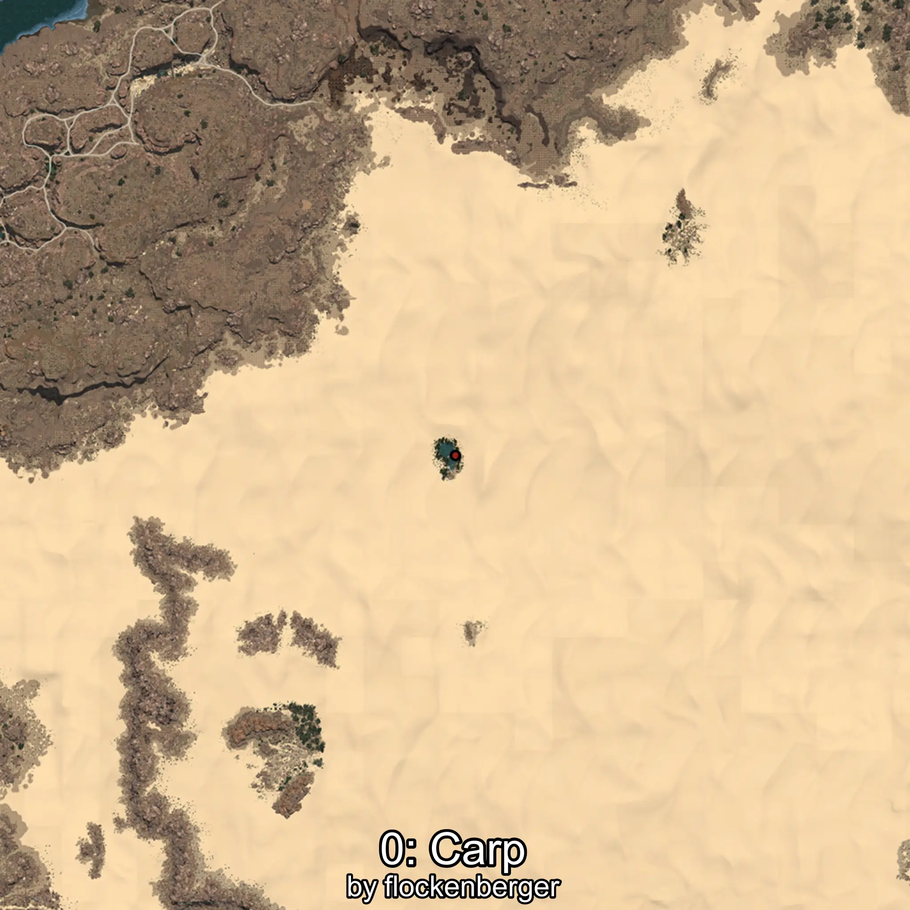
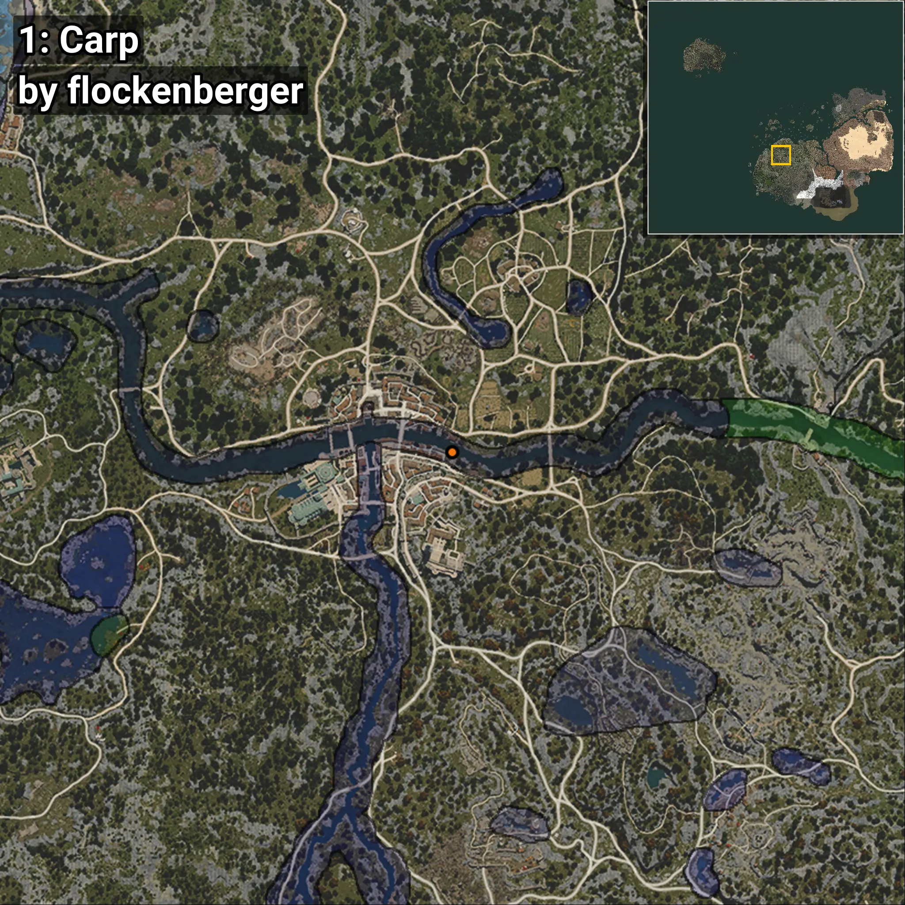
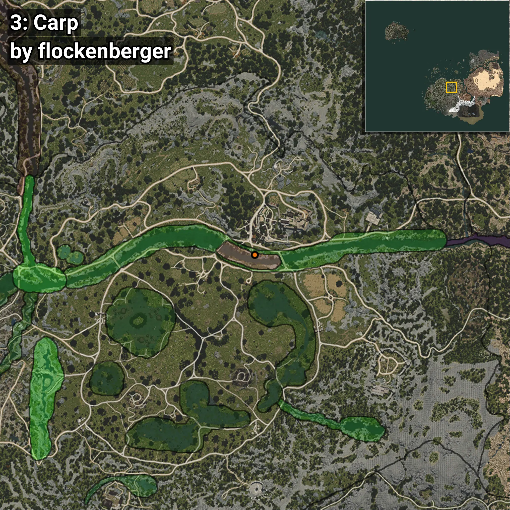

# Carpa
Creado por **flockenberger**

## ⚠️ Advertencia:
Los puntos de pesca se generan según la __**posición de tu personaje**__ — __no__ donde cae el flotador.  
En el océano especialmente, la dirección en la que lances la caña puede colocar tu flotador en una **zona de pesca diferente**, lo que puede resultar en capturar el pez incorrecto.  
Esto solo ocurre en raros casos — cuando la posición está justo en el **borde de una zona** y lanzas hacia el lado “equivocado”.

- Para verificar la posición puedes usar la guía [AQUÍ](https://flockenberger.github.io/bdo-fish-position/)
- O ver la guía [AQUÍ](https://youtu.be/t-VXcRoNojk)

## Waypoints
```xml
<!--
    Puntos de pesca para: Carpa
    Creado por: flockenberger
-->
<WorldmapBookMark>
    <BookMark BookMarkName="0: Carpa" PosX="735033.0" PosY="3242.0" PosZ="201991.0" />
    <BookMark BookMarkName="1: Carpa" PosX="38466.0" PosY="-4026.0" PosZ="-50875.0" />
    <BookMark BookMarkName="2: Carpa" PosX="37036.0" PosY="-3816.0" PosZ="-50769.0" />
    <BookMark BookMarkName="3: Carpa" PosX="1028608.0" PosY="10435.0" PosZ="181603.0" />
    <BookMark BookMarkName="4: Carpa" PosX="1030878.0" PosY="10523.0" PosZ="187597.0" />
</WorldmapBookMark>
```

     