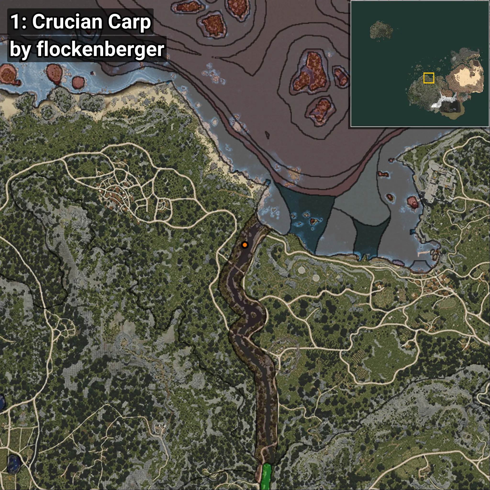
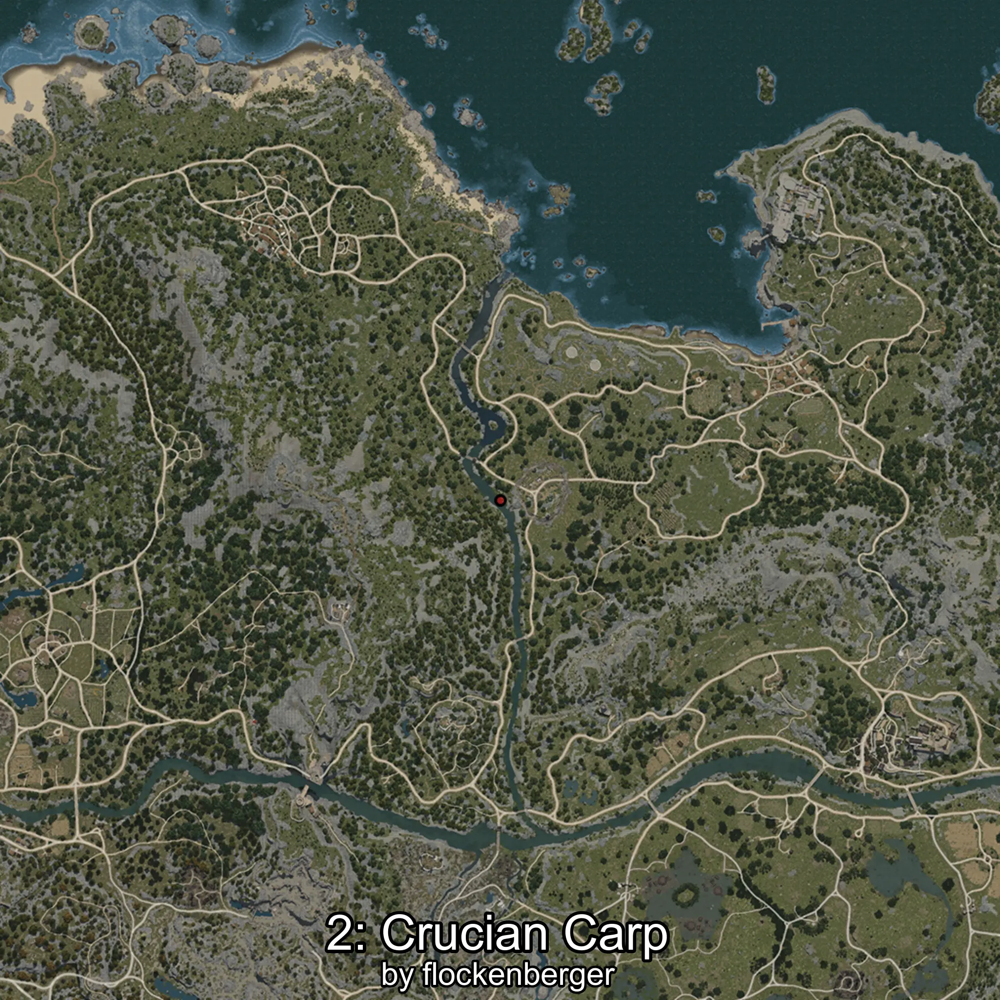
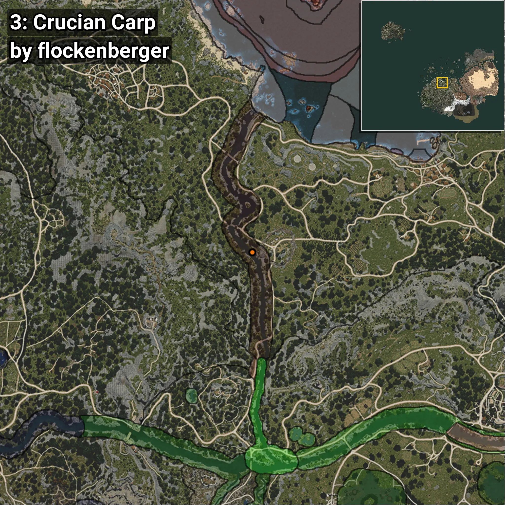
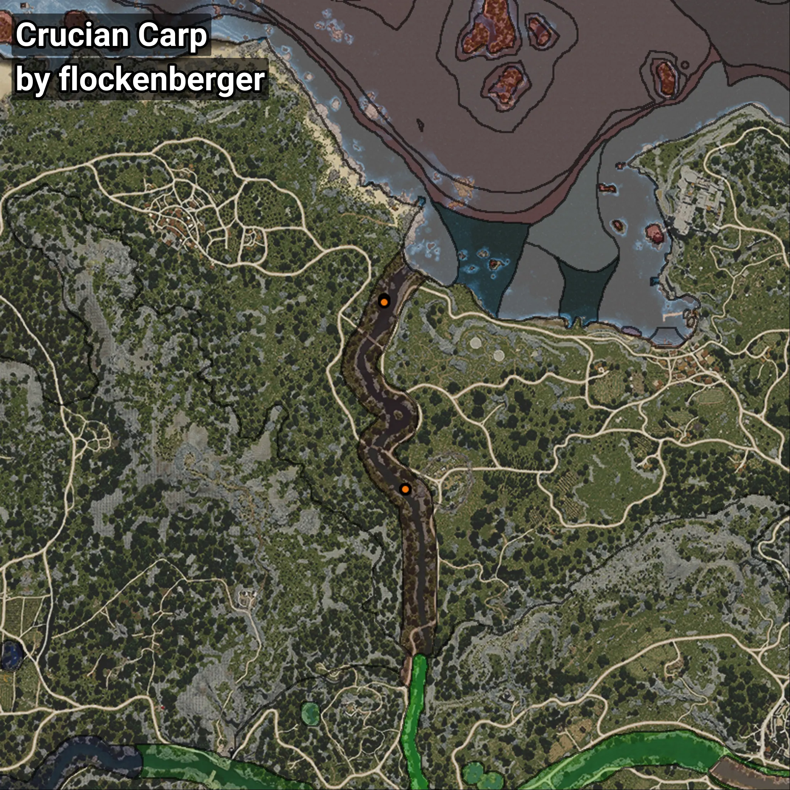

# Carpín
```xml
<!--
    Puntos de pesca para: Carpín
    Creado por: flockenberger
-->
<WorldmapBookMark>
    <BookMark BookMarkName="0: Carpín" PosX="-80778.0" PosY="-5022.0" PosZ="98397.0" />
    <BookMark BookMarkName="1: Carpín" PosX="-80925.82" PosY="-5198.5635" PosZ="97407.8" />
    <BookMark BookMarkName="2: Carpín" PosX="-74188.0" PosY="-4383.0" PosZ="38964.0" />
    <BookMark BookMarkName="3: Carpín" PosX="-74221.46" PosY="-4383.0547" PosZ="38974.254" />
    <BookMark BookMarkName="4: Carpín" PosX="-74189.0" PosY="-4383.0" PosZ="39011.0" />
</WorldmapBookMark>
```

## ⚠️ Advertencia:
Los puntos de pesca se generan según la __**posición de tu personaje**__ — __no__ donde cae el flotador.  
En el océano especialmente, la dirección en la que lances la caña puede colocar tu flotador en una **zona de pesca diferente**, lo que puede resultar en capturar el pez incorrecto.  
Presta atención a las vistas previas que muestran la ubicación en relación a las zonas marcadas.

- Para verificar la posición de tu flotador puedes usar la guía [AQUÍ](https://flockenberger.github.io/bdo-fish-position/)
- O ver la guía [AQUÍ](https://youtu.be/t-VXcRoNojk)

## Vistas Previas
      