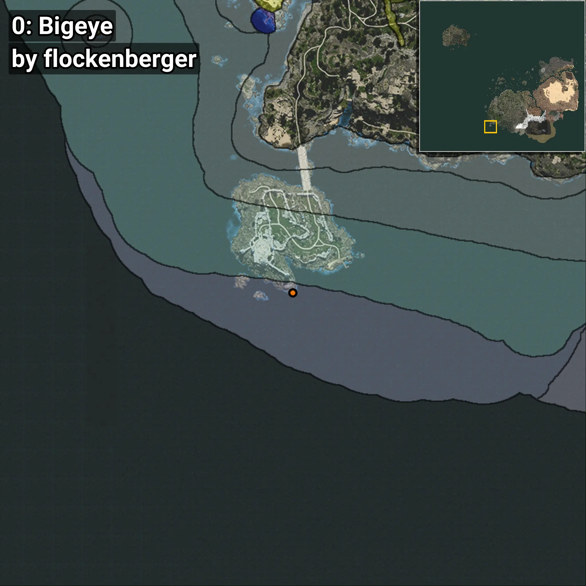
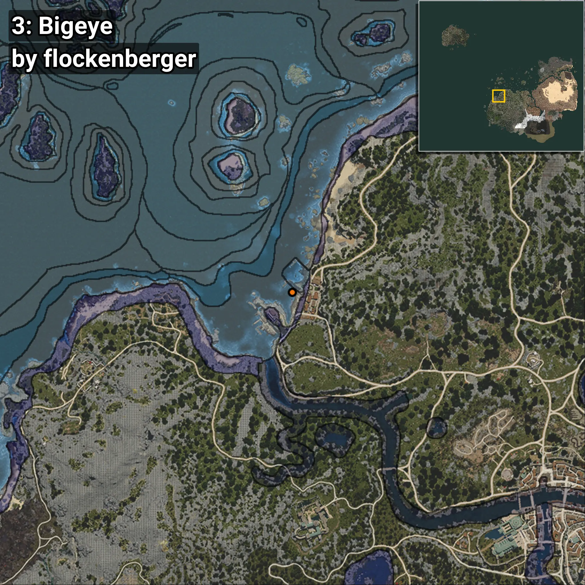
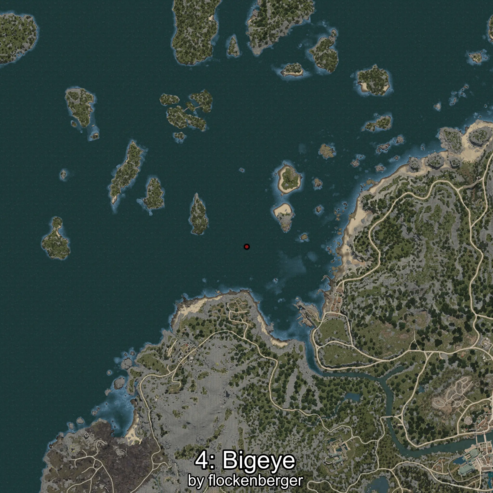

# Catalufa
```xml
<!--
    Puntos de pesca para: Catalufa
    Creado por: flockenberger
-->
<WorldmapBookMark>
    <BookMark BookMarkName="0: Catalufa" PosX="-551611.0" PosY="-8069.0" PosZ="-608692.0" />
    <BookMark BookMarkName="1: Catalufa" PosX="-551240.5" PosY="-8121.248" PosZ="-608394.9" />
    <BookMark BookMarkName="2: Catalufa" PosX="-361354.0" PosY="-7959.0" PosZ="38479.0" />
    <BookMark BookMarkName="3: Catalufa" PosX="-360705.0" PosY="-8051.0" PosZ="36191.0" />
    <BookMark BookMarkName="4: Catalufa" PosX="-275292.0" PosY="-7683.0" PosZ="271841.0" />
</WorldmapBookMark>
```

## ⚠️ Advertencia:
Los puntos de pesca se generan según la __**posición de tu personaje**__ — __no__ donde cae el flotador.  
En el océano especialmente, la dirección en la que lances la caña puede colocar tu flotador en una **zona de pesca diferente**, lo que puede resultar en capturar el pez incorrecto.  
Presta atención a las vistas previas que muestran la ubicación en relación a las zonas marcadas.

- Para verificar la posición de tu flotador puedes usar la guía [AQUÍ](https://flockenberger.github.io/bdo-fish-position/)
- O ver la guía [AQUÍ](https://youtu.be/t-VXcRoNojk)

## Vistas Previas
      