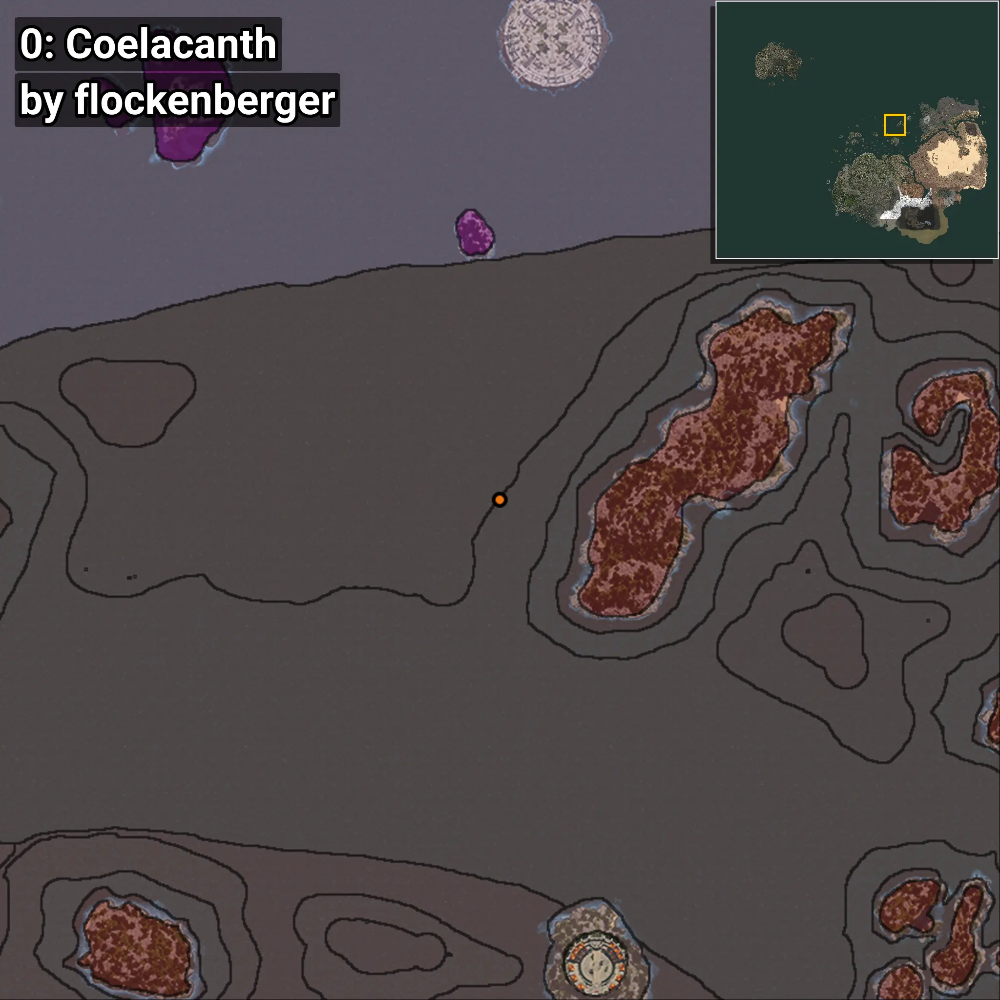
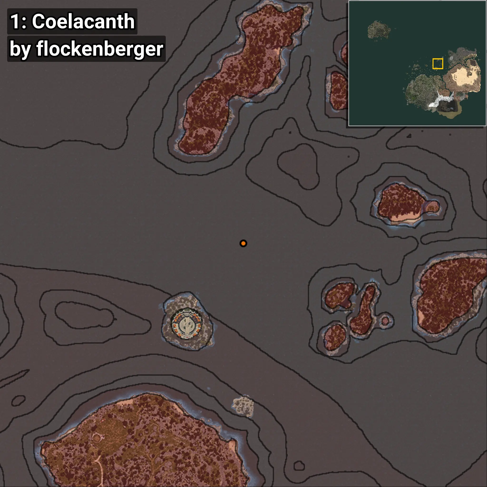

# Celacantos
```xml
<!--
    Puntos de pesca para: Celacantos
    Creado por: flockenberger
-->
<WorldmapBookMark>
    <BookMark BookMarkName="0: Celacantos" PosX="160195.66" PosY="-8208.0" PosZ="518814.22" />
    <BookMark BookMarkName="1: Celacantos" PosX="212336.0" PosY="-7859.0" PosZ="444867.0" />
    <BookMark BookMarkName="2: Celacantos" PosX="-546.0" PosY="-8157.0" PosZ="87213.0" />
    <BookMark BookMarkName="3: Celacantos" PosX="-436.24734" PosY="-8194.665" PosZ="87299.81" />
    <BookMark BookMarkName="4: Celacantos" PosX="-4553.0" PosY="-8296.0" PosZ="88701.0" />
</WorldmapBookMark>
```

## ⚠️ Advertencia:
Los puntos de pesca se generan según la __**posición de tu personaje**__ — __no__ donde cae el flotador.  
En el océano especialmente, la dirección en la que lances la caña puede colocar tu flotador en una **zona de pesca diferente**, lo que puede resultar en capturar el pez incorrecto.  
Presta atención a las vistas previas que muestran la ubicación en relación a las zonas marcadas.

- Para verificar la posición de tu flotador puedes usar la guía [AQUÍ](https://flockenberger.github.io/bdo-fish-position/)
- O ver la guía [AQUÍ](https://youtu.be/t-VXcRoNojk)

## Vistas Previas
      