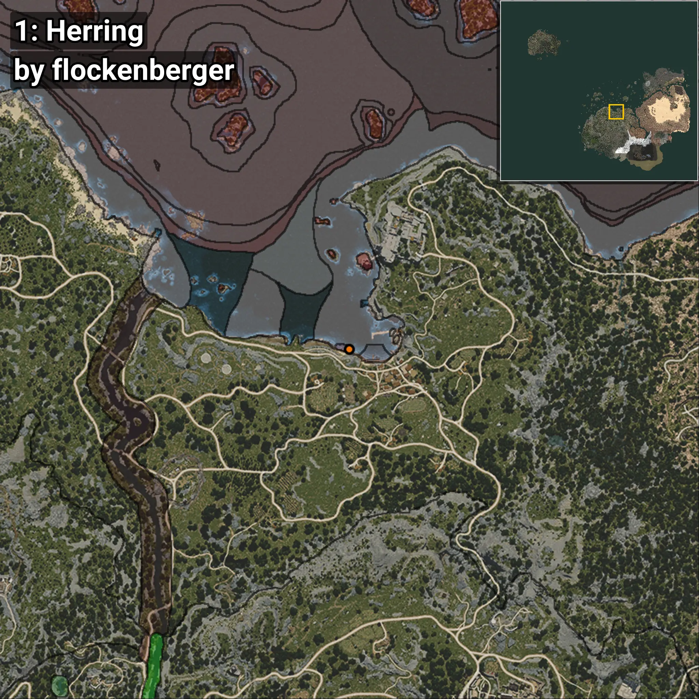
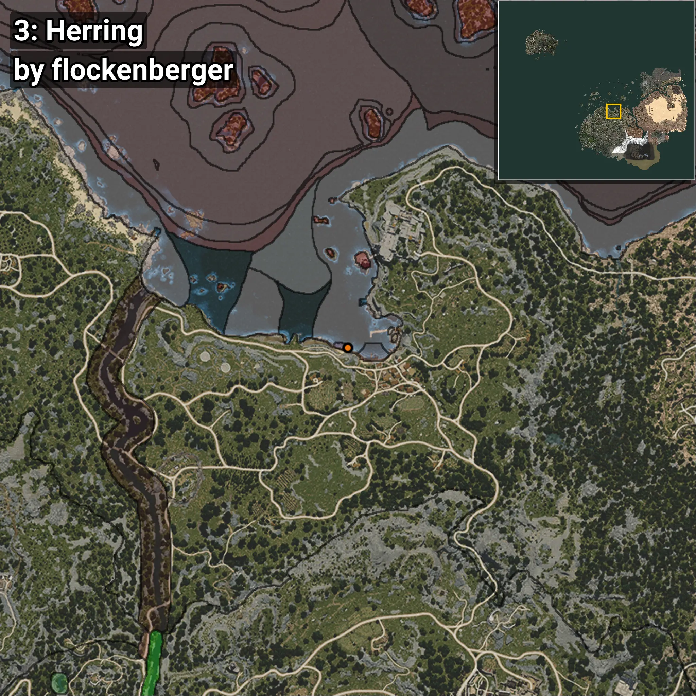
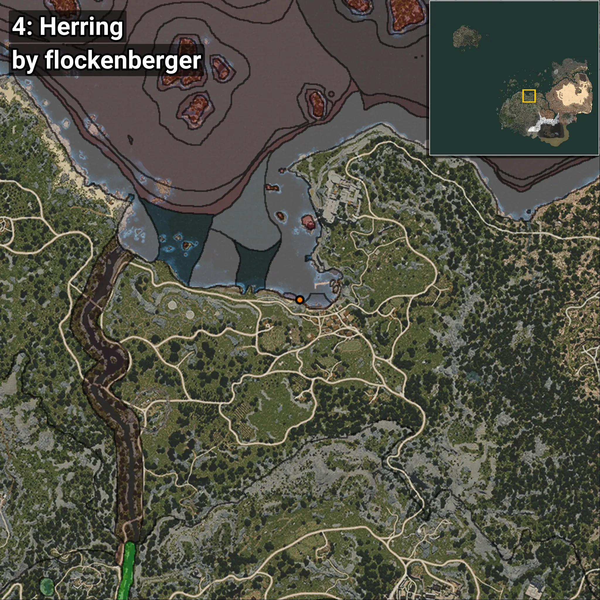

# Clupea
```xml
<!--
    Puntos de pesca para: Clupea
    Creado por: flockenberger
-->
<WorldmapBookMark>
    <BookMark BookMarkName="0: Clupea" PosX="-1652.8433" PosY="-8184.597" PosZ="87784.69" />
    <BookMark BookMarkName="1: Clupea" PosX="-1717.0" PosY="-8206.0" PosZ="87863.0" />
    <BookMark BookMarkName="2: Clupea" PosX="-4630.0" PosY="-8294.0" PosZ="88708.0" />
    <BookMark BookMarkName="3: Clupea" PosX="-1764.961" PosY="-8194.429" PosZ="87834.39" />
    <BookMark BookMarkName="4: Clupea" PosX="52.0" PosY="-8142.0" PosZ="87011.0" />
</WorldmapBookMark>
```

## ⚠️ Advertencia:
Los puntos de pesca se generan según la __**posición de tu personaje**__ — __no__ donde cae el flotador.  
En el océano especialmente, la dirección en la que lances la caña puede colocar tu flotador en una **zona de pesca diferente**, lo que puede resultar en capturar el pez incorrecto.  
Presta atención a las vistas previas que muestran la ubicación en relación a las zonas marcadas.

- Para verificar la posición de tu flotador puedes usar la guía [AQUÍ](https://flockenberger.github.io/bdo-fish-position/)
- O ver la guía [AQUÍ](https://youtu.be/t-VXcRoNojk)

## Vistas Previas
      