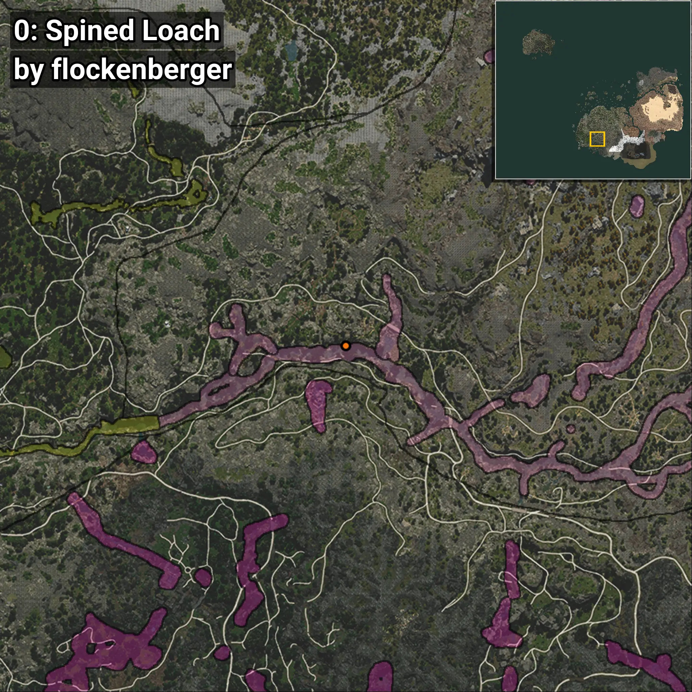
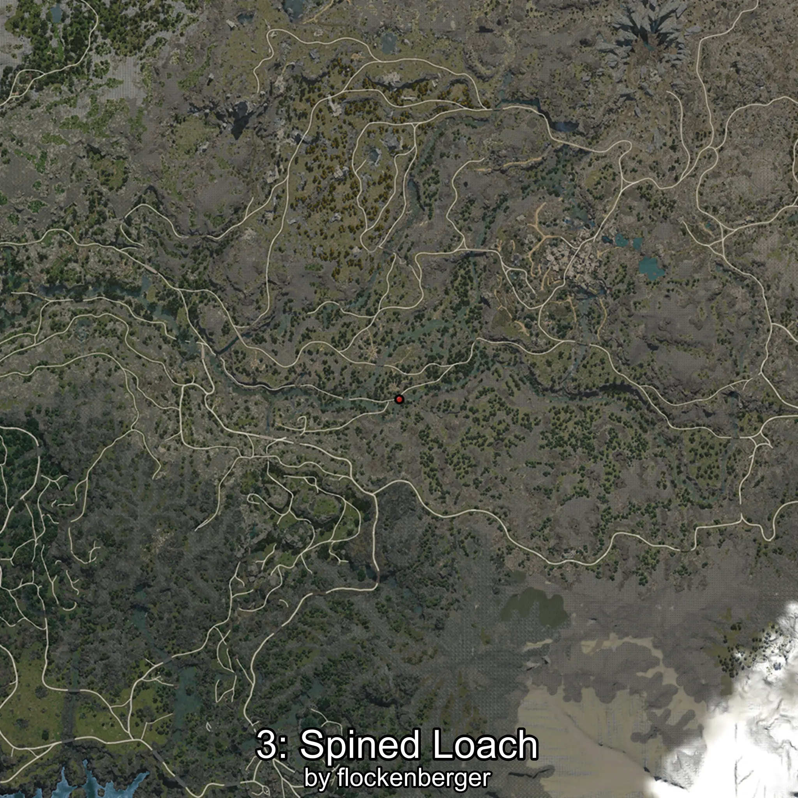
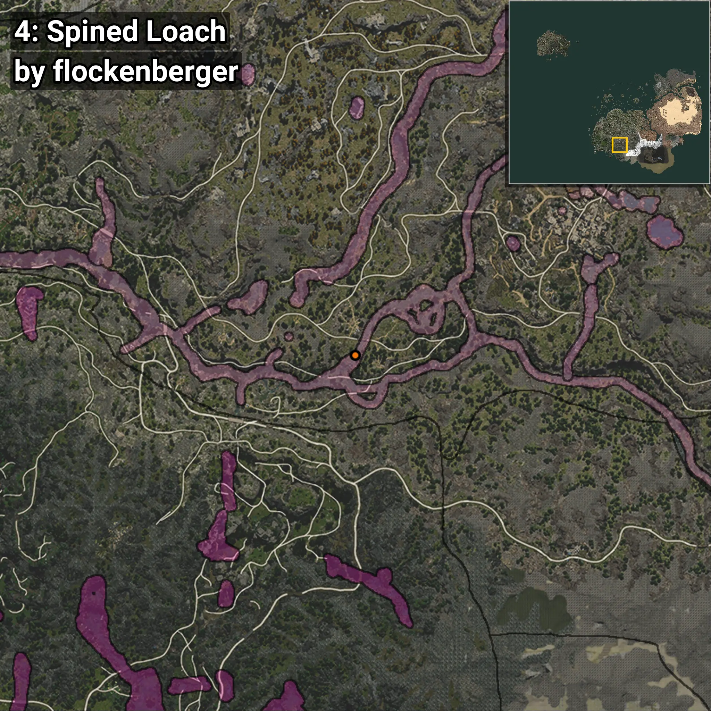

# Cobitis
Creado por **flockenberger**

## ⚠️ Advertencia:
Los puntos de pesca se generan según la __**posición de tu personaje**__ — __no__ donde cae el flotador.  
En el océano especialmente, la dirección en la que lances la caña puede colocar tu flotador en una **zona de pesca diferente**, lo que puede resultar en capturar el pez incorrecto.  
Esto solo ocurre en raros casos — cuando la posición está justo en el **borde de una zona** y lanzas hacia el lado “equivocado”.

- Para verificar la posición puedes usar la guía [AQUÍ](https://flockenberger.github.io/bdo-fish-position/)
- O ver la guía [AQUÍ](https://youtu.be/t-VXcRoNojk)

## Waypoints
```xml
<!--
    Puntos de pesca para: Cobitis
    Creado por: flockenberger
-->
<WorldmapBookMark>
    <BookMark BookMarkName="0: Cobitis" PosX="-198831.0" PosY="6021.0" PosZ="-443569.0" />
    <BookMark BookMarkName="1: Cobitis" PosX="-86634.0" PosY="9567.0" PosZ="-397804.0" />
    <BookMark BookMarkName="2: Cobitis" PosX="-201184.06" PosY="5856.207" PosZ="-439239.84" />
    <BookMark BookMarkName="3: Cobitis" PosX="-116673.0" PosY="5678.0" PosZ="-461748.0" />
    <BookMark BookMarkName="4: Cobitis" PosX="-86518.875" PosY="9823.631" PosZ="-403363.44" />
</WorldmapBookMark>
```

     