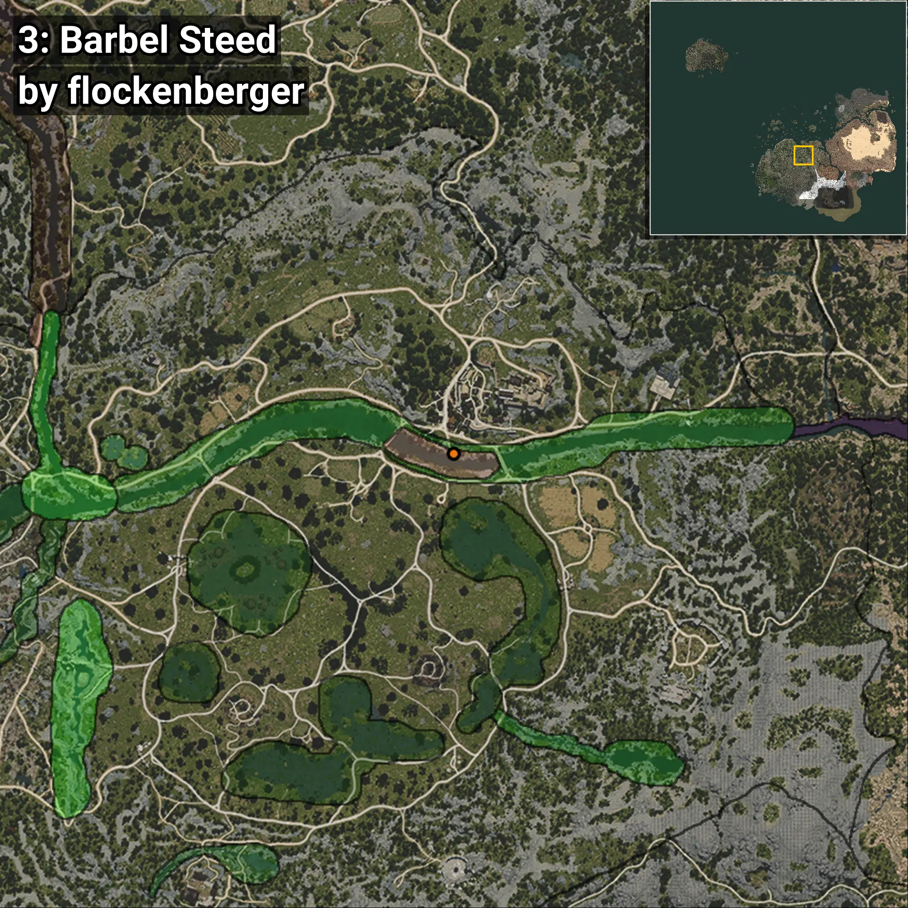
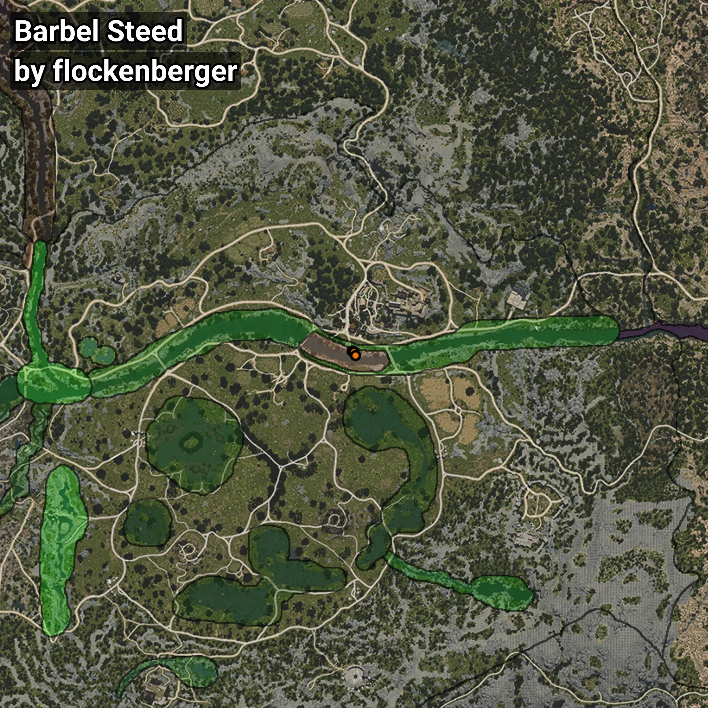

# Corcel
```xml
<!--
    Puntos de pesca para: Corcel
    Creado por: flockenberger
-->
<WorldmapBookMark>
    <BookMark BookMarkName="0: Corcel" PosX="39675.496" PosY="-4006.8276" PosZ="-51265.715" />
    <BookMark BookMarkName="1: Corcel" PosX="39630.0" PosY="-4003.0" PosZ="-51205.0" />
    <BookMark BookMarkName="2: Corcel" PosX="38856.188" PosY="-4038.8665" PosZ="-50947.42" />
    <BookMark BookMarkName="3: Corcel" PosX="39607.145" PosY="-4018.8267" PosZ="-51217.836" />
    <BookMark BookMarkName="4: Corcel" PosX="40254.0" PosY="-3827.0" PosZ="-52429.0" />
</WorldmapBookMark>
```

## ⚠️ Advertencia:
Los puntos de pesca se generan según la __**posición de tu personaje**__ — __no__ donde cae el flotador.  
En el océano especialmente, la dirección en la que lances la caña puede colocar tu flotador en una **zona de pesca diferente**, lo que puede resultar en capturar el pez incorrecto.  
Presta atención a las vistas previas que muestran la ubicación en relación a las zonas marcadas.

- Para verificar la posición de tu flotador puedes usar la guía [AQUÍ](https://flockenberger.github.io/bdo-fish-position/)
- O ver la guía [AQUÍ](https://youtu.be/t-VXcRoNojk)

## Vistas Previas
      