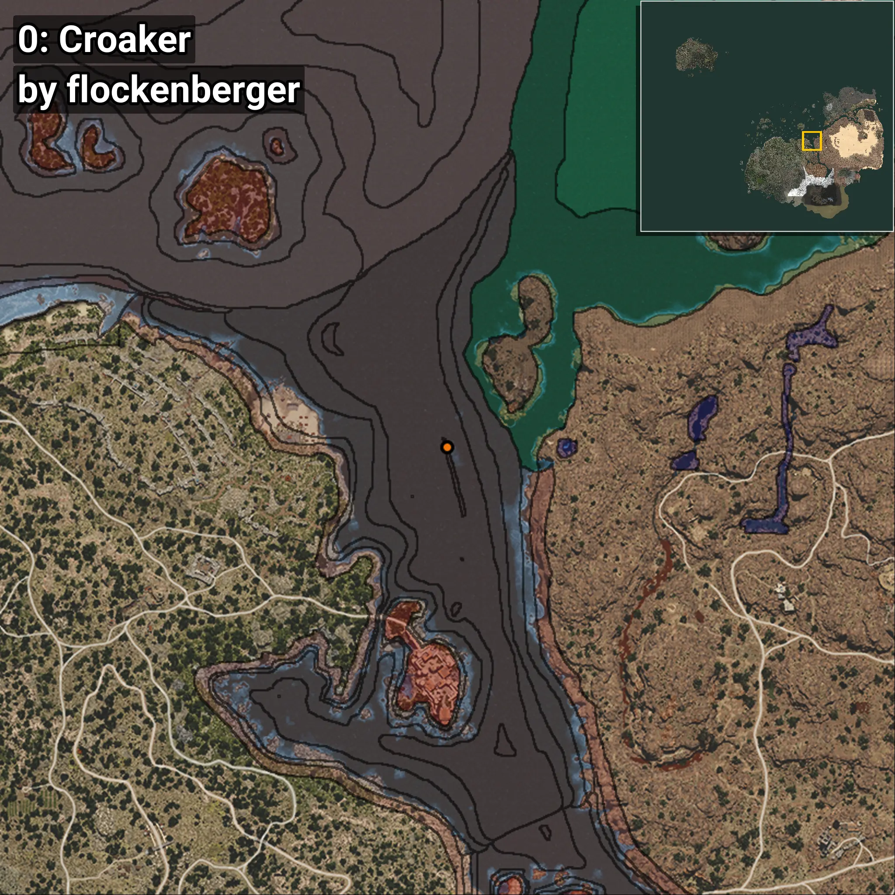
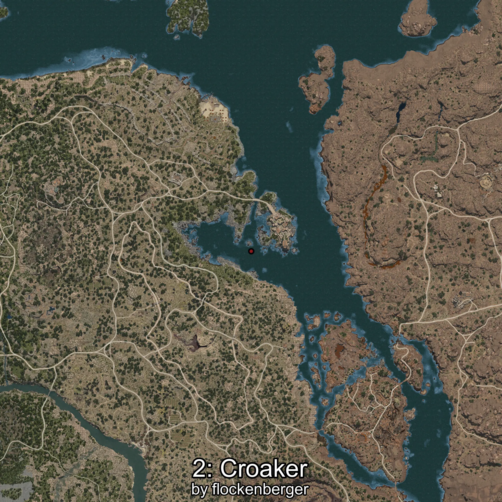
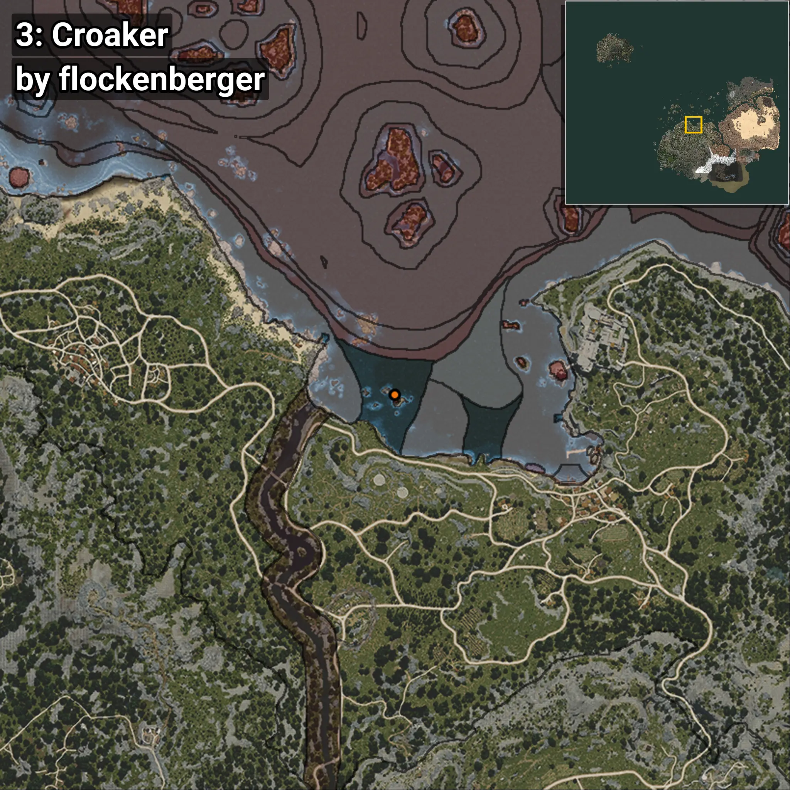
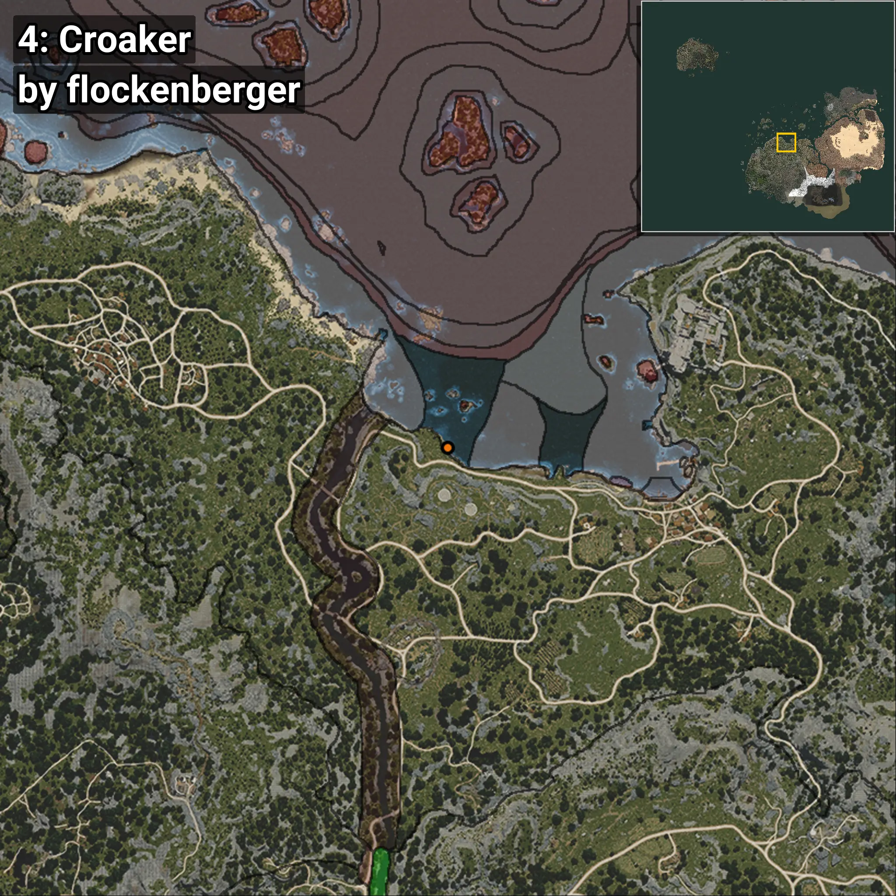
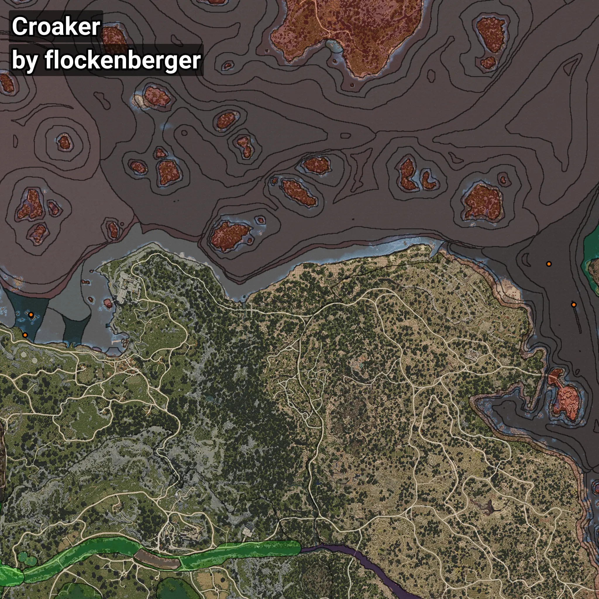

# Corvina
```xml
<!--
    Puntos de pesca para: Corvina
    Creado por: flockenberger
-->
<WorldmapBookMark>
    <BookMark BookMarkName="0: Corvina" PosX="313268.0" PosY="-7917.0" PosZ="117846.0" />
    <BookMark BookMarkName="1: Corvina" PosX="296712.0" PosY="-8169.0" PosZ="145135.0" />
    <BookMark BookMarkName="2: Corvina" PosX="-47326.0" PosY="-8005.0" PosZ="111040.0" />
    <BookMark BookMarkName="3: Corvina" PosX="-47470.0" PosY="-8012.0" PosZ="111196.0" />
    <BookMark BookMarkName="4: Corvina" PosX="-51248.78" PosY="-7335.531" PosZ="97821.055" />
</WorldmapBookMark>
```

## ⚠️ Advertencia:
Los puntos de pesca se generan según la __**posición de tu personaje**__ — __no__ donde cae el flotador.  
En el océano especialmente, la dirección en la que lances la caña puede colocar tu flotador en una **zona de pesca diferente**, lo que puede resultar en capturar el pez incorrecto.  
Presta atención a las vistas previas que muestran la ubicación en relación a las zonas marcadas.

- Para verificar la posición de tu flotador puedes usar la guía [AQUÍ](https://flockenberger.github.io/bdo-fish-position/)
- O ver la guía [AQUÍ](https://youtu.be/t-VXcRoNojk)

## Vistas Previas
      