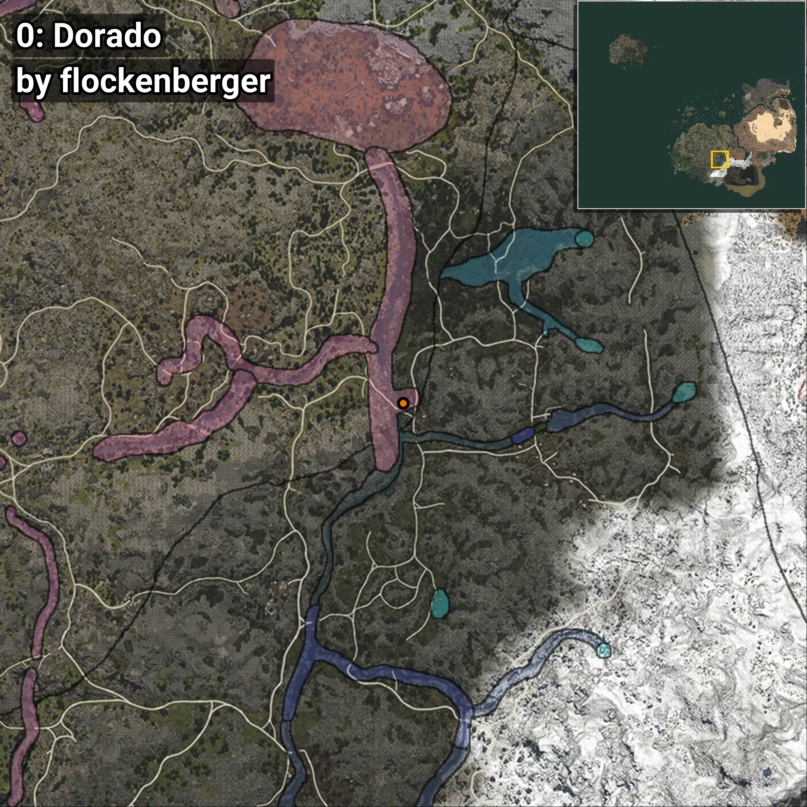
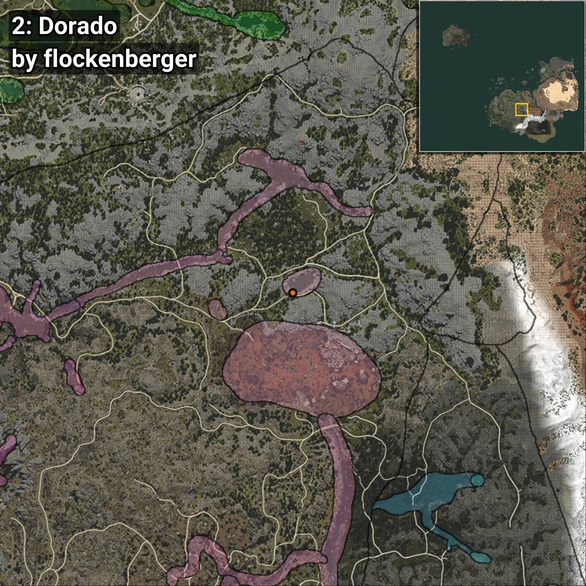
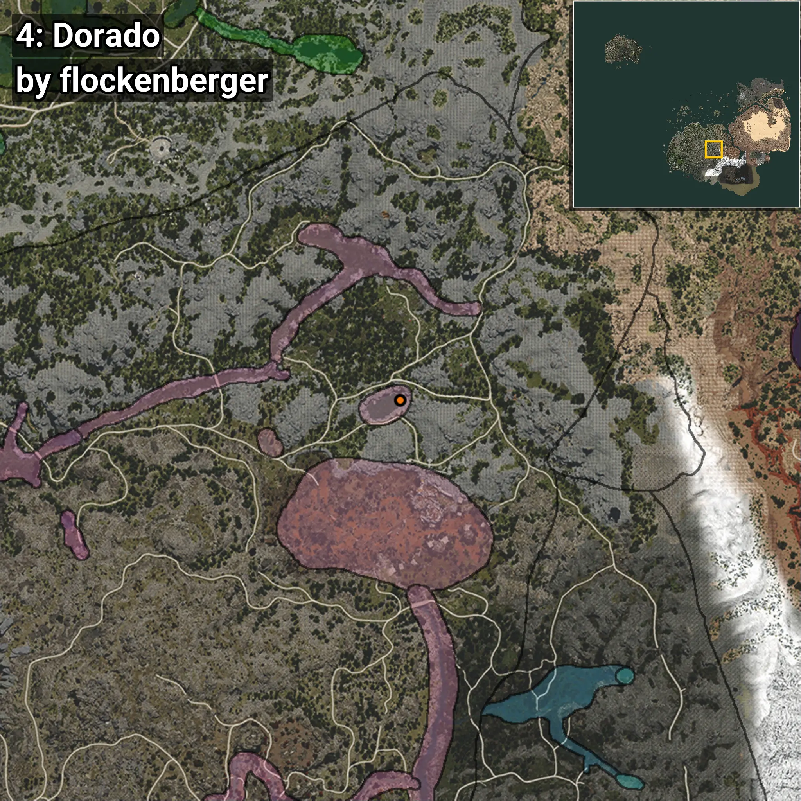
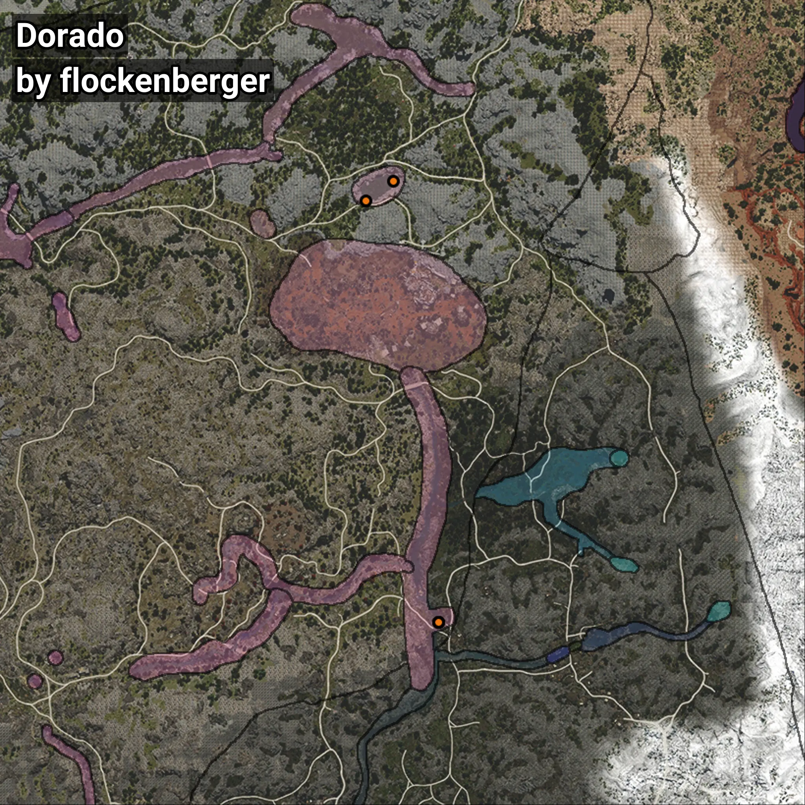

# Dorado
```xml
<!--
    Puntos de pesca para: Dorado
    Creado por: flockenberger
-->
<WorldmapBookMark>
    <BookMark BookMarkName="0: Dorado" PosX="127546.02" PosY="12475.655" PosZ="-377200.06" />
    <BookMark BookMarkName="1: Dorado" PosX="127546.0" PosY="12475.0" PosZ="-377200.0" />
    <BookMark BookMarkName="2: Dorado" PosX="105246.75" PosY="6272.8213" PosZ="-248015.66" />
    <BookMark BookMarkName="3: Dorado" PosX="127580.0" PosY="12475.0" PosZ="-377169.0" />
    <BookMark BookMarkName="4: Dorado" PosX="113785.98" PosY="6500.6157" PosZ="-242142.11" />
</WorldmapBookMark>
```

## ⚠️ Advertencia:
Los puntos de pesca se generan según la __**posición de tu personaje**__ — __no__ donde cae el flotador.  
En el océano especialmente, la dirección en la que lances la caña puede colocar tu flotador en una **zona de pesca diferente**, lo que puede resultar en capturar el pez incorrecto.  
Presta atención a las vistas previas que muestran la ubicación en relación a las zonas marcadas.

- Para verificar la posición de tu flotador puedes usar la guía [AQUÍ](https://flockenberger.github.io/bdo-fish-position/)
- O ver la guía [AQUÍ](https://youtu.be/t-VXcRoNojk)

## Vistas Previas
      