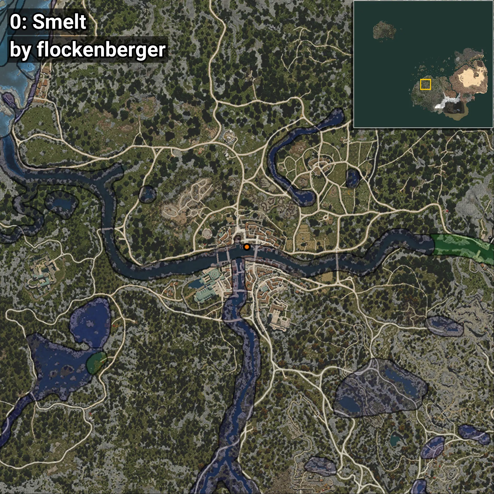
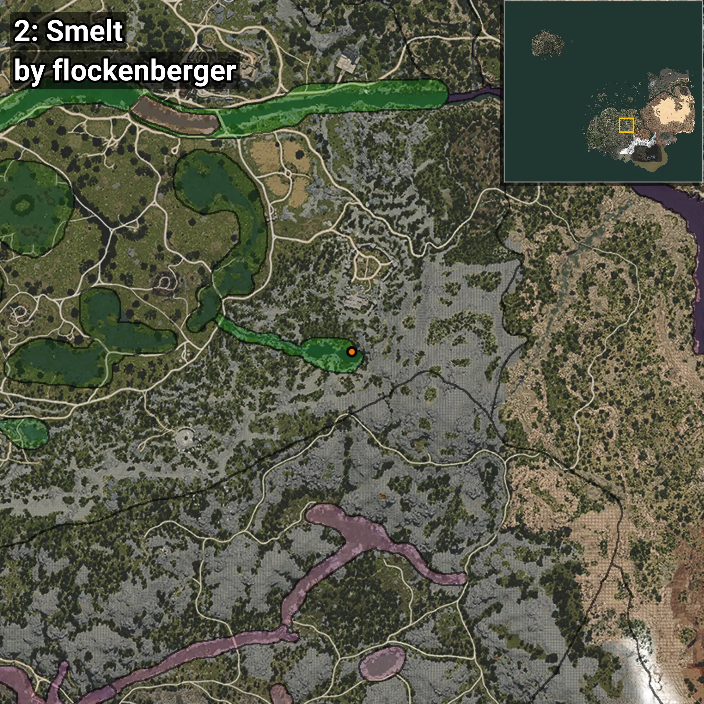
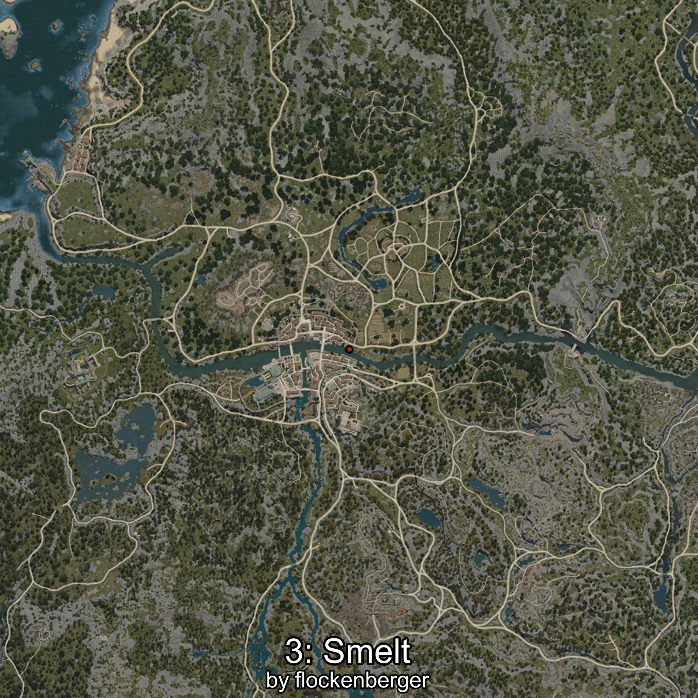
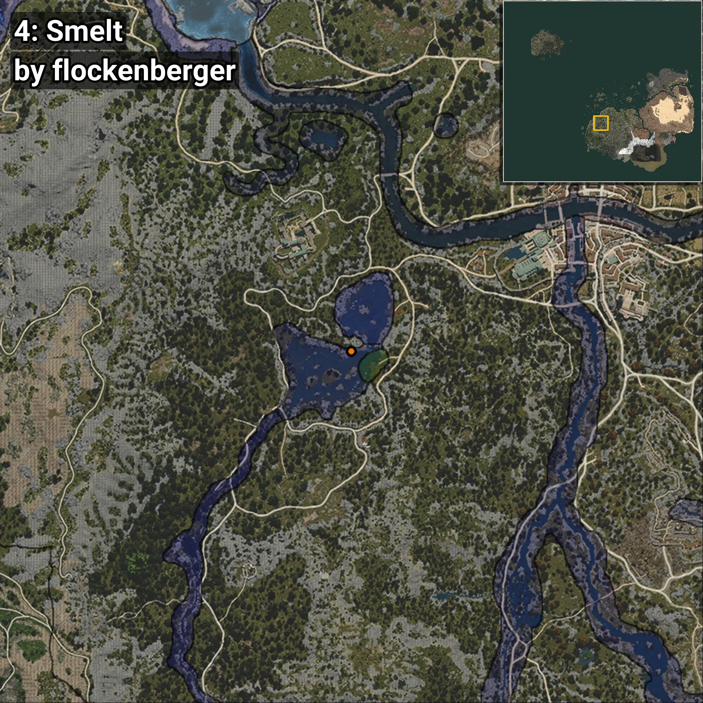

# Eperlano
Creado por **flockenberger**

## ⚠️ Advertencia:
Los puntos de pesca se generan según la __**posición de tu personaje**__ — __no__ donde cae el flotador.  
En el océano especialmente, la dirección en la que lances la caña puede colocar tu flotador en una **zona de pesca diferente**, lo que puede resultar en capturar el pez incorrecto.  
Esto solo ocurre en raros casos — cuando la posición está justo en el **borde de una zona** y lanzas hacia el lado “equivocado”.

- Para verificar la posición puedes usar la guía [AQUÍ](https://flockenberger.github.io/bdo-fish-position/)
- O ver la guía [AQUÍ](https://youtu.be/t-VXcRoNojk)

## Waypoints
```xml
<!--
    Puntos de pesca para: Eperlano
    Creado por: flockenberger
-->
<WorldmapBookMark>
    <BookMark BookMarkName="0: Eperlano" PosX="-249901.0" PosY="-4059.0" PosZ="-47106.0" />
    <BookMark BookMarkName="1: Eperlano" PosX="-244170.0" PosY="-4069.0" PosZ="-48887.0" />
    <BookMark BookMarkName="2: Eperlano" PosX="-249853.0" PosY="-4059.0" PosZ="-47102.0" />
    <BookMark BookMarkName="3: Eperlano" PosX="-233904.0" PosY="-3705.0" PosZ="-51280.0" />
    <BookMark BookMarkName="4: Eperlano" PosX="-198576.0" PosY="-3831.0" PosZ="-57514.0" />
</WorldmapBookMark>
```

     