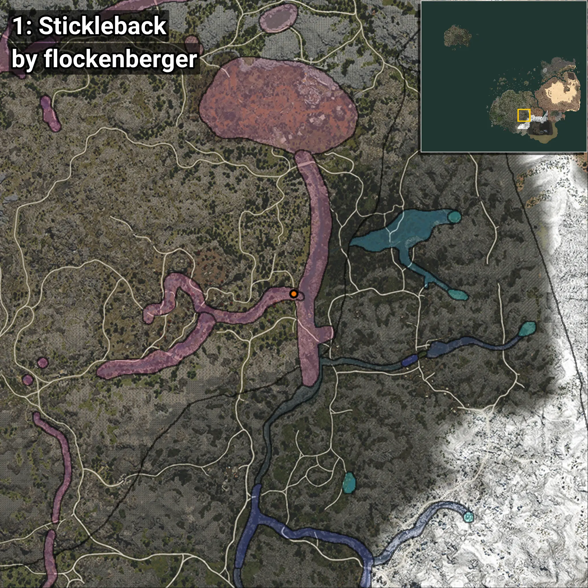
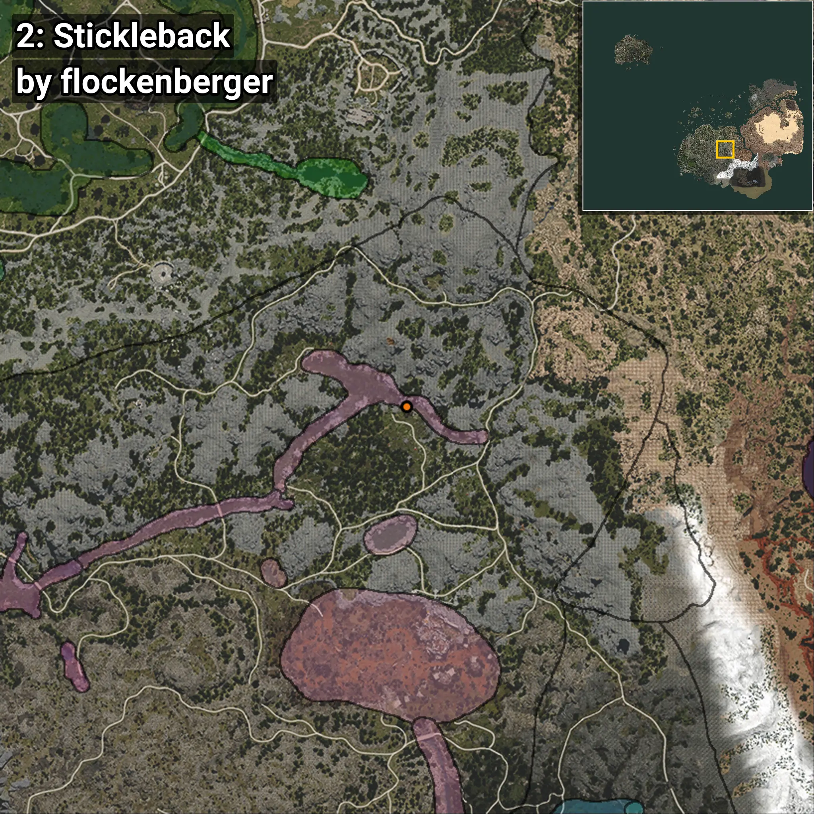
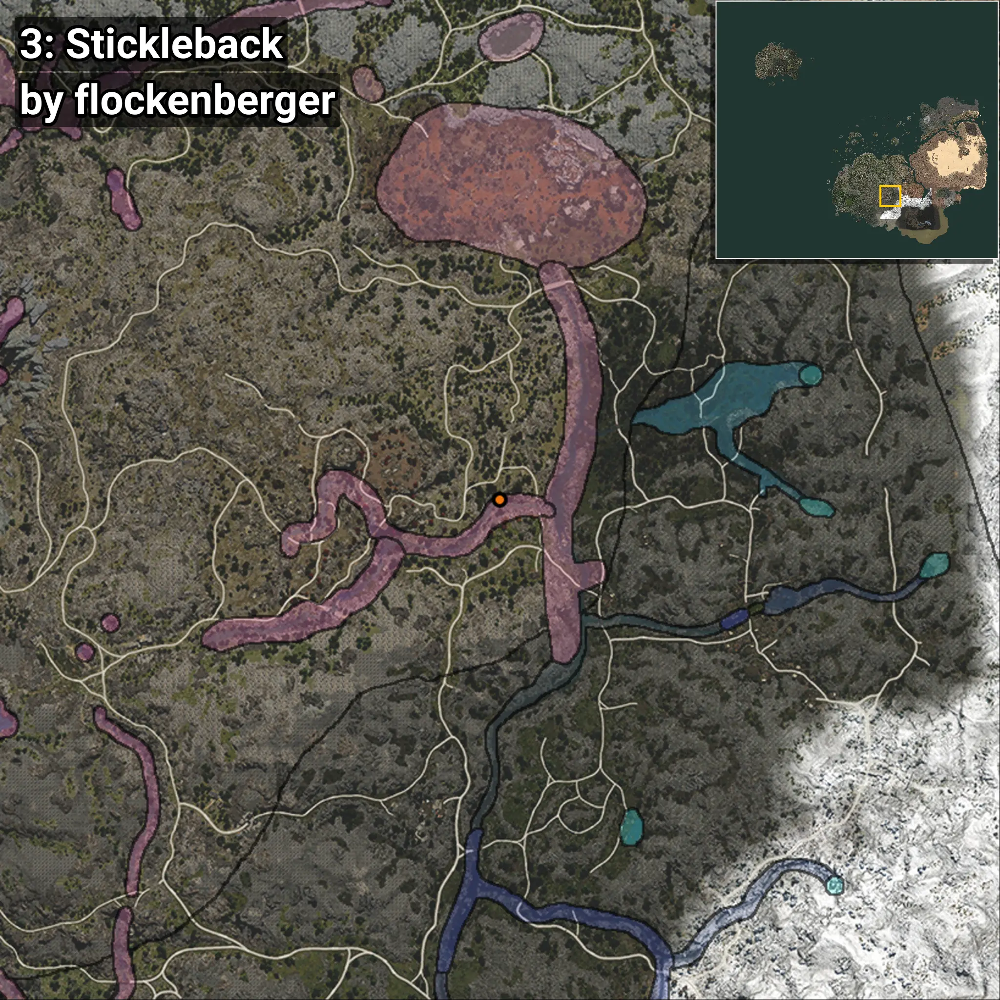
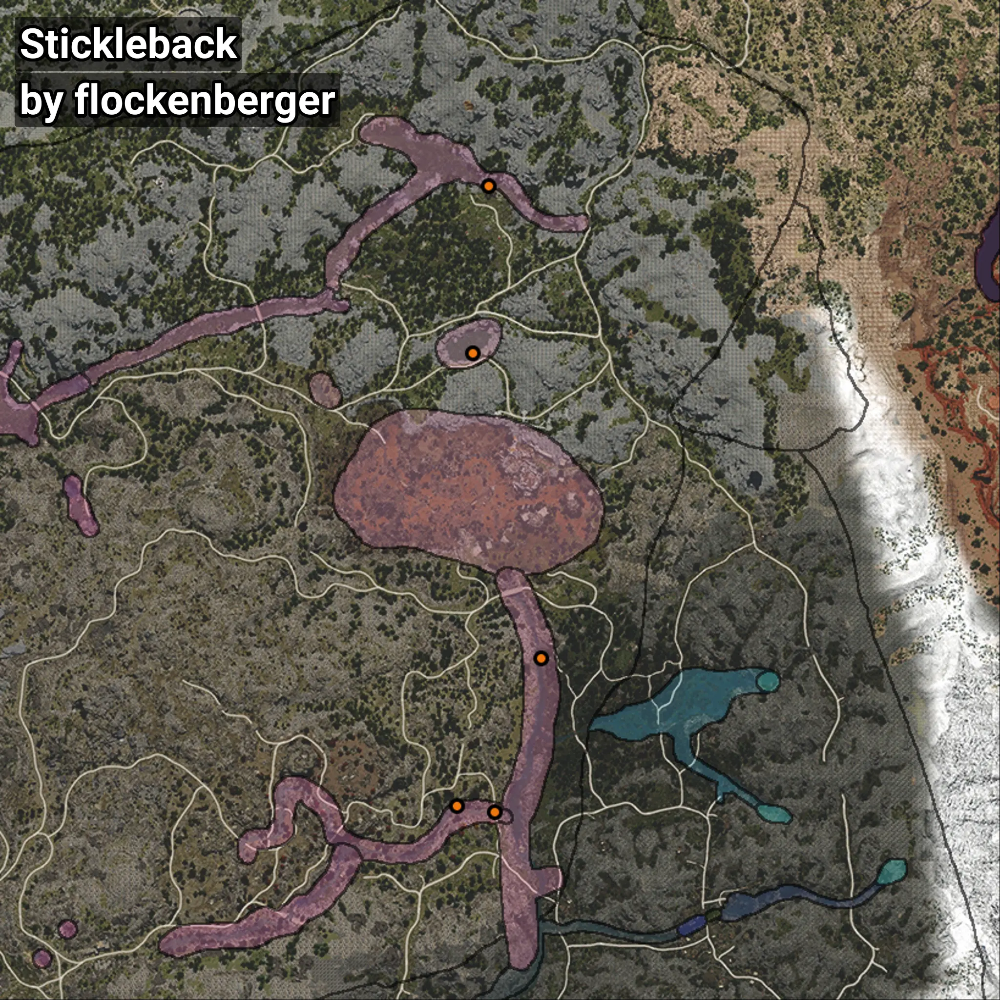

# Espinoso
```xml
<!--
    Puntos de pesca para: Espinoso
    Creado por: flockenberger
-->
<WorldmapBookMark>
    <BookMark BookMarkName="0: Espinoso" PosX="126826.0" PosY="9285.0" PosZ="-321238.0" />
    <BookMark BookMarkName="1: Espinoso" PosX="115611.02" PosY="14631.538" PosZ="-359190.62" />
    <BookMark BookMarkName="2: Espinoso" PosX="114137.0" PosY="10995.0" PosZ="-204761.0" />
    <BookMark BookMarkName="3: Espinoso" PosX="106230.0" PosY="14954.0" PosZ="-357626.0" />
    <BookMark BookMarkName="4: Espinoso" PosX="110046.484" PosY="7114.9224" PosZ="-245897.1" />
</WorldmapBookMark>
```

## ⚠️ Advertencia:
Los puntos de pesca se generan según la __**posición de tu personaje**__ — __no__ donde cae el flotador.  
En el océano especialmente, la dirección en la que lances la caña puede colocar tu flotador en una **zona de pesca diferente**, lo que puede resultar en capturar el pez incorrecto.  
Presta atención a las vistas previas que muestran la ubicación en relación a las zonas marcadas.

- Para verificar la posición de tu flotador puedes usar la guía [AQUÍ](https://flockenberger.github.io/bdo-fish-position/)
- O ver la guía [AQUÍ](https://youtu.be/t-VXcRoNojk)

## Vistas Previas
      