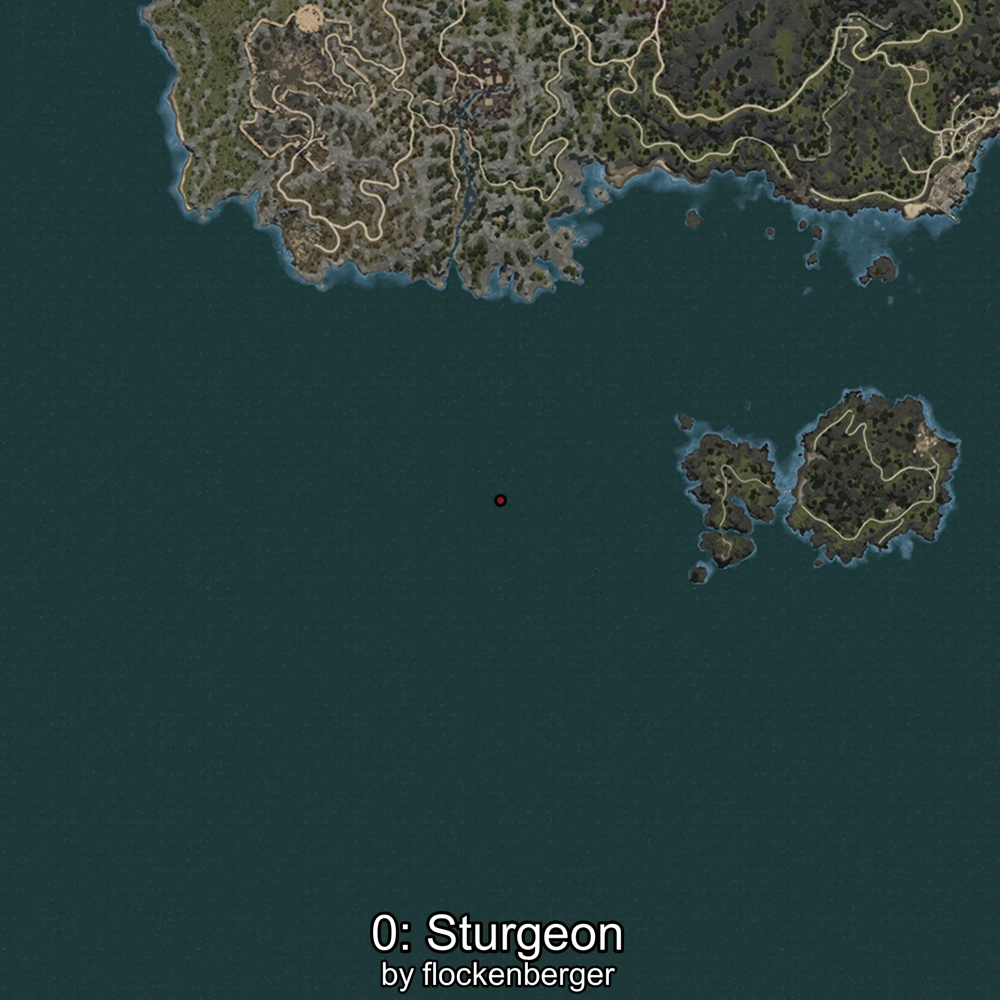
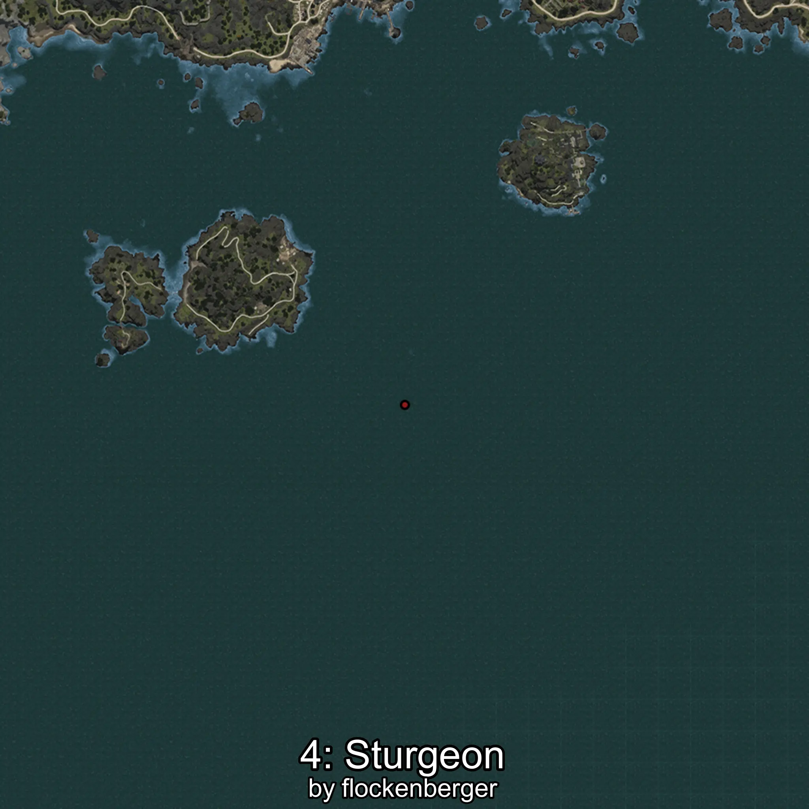

# Esturión
```xml
<!--
    Puntos de pesca para: Esturión
    Creado por: flockenberger
-->
<WorldmapBookMark>
    <BookMark BookMarkName="0: Esturión" PosX="-891736.44" PosY="-8128.6416" PosZ="1258594.9" />
    <BookMark BookMarkName="1: Esturión" PosX="-932668.0" PosY="-7991.0" PosZ="1295773.0" />
    <BookMark BookMarkName="2: Esturión" PosX="-1218442.0" PosY="-7798.0" PosZ="1022357.0" />
    <BookMark BookMarkName="3: Esturión" PosX="-1207541.0" PosY="-8124.0" PosZ="1024726.0" />
    <BookMark BookMarkName="4: Esturión" PosX="-1274300.0" PosY="-7884.0" PosZ="979107.0" />
</WorldmapBookMark>
```

## ⚠️ Advertencia:
Los puntos de pesca se generan según la __**posición de tu personaje**__ — __no__ donde cae el flotador.  
En el océano especialmente, la dirección en la que lances la caña puede colocar tu flotador en una **zona de pesca diferente**, lo que puede resultar en capturar el pez incorrecto.  
Presta atención a las vistas previas que muestran la ubicación en relación a las zonas marcadas.

- Para verificar la posición de tu flotador puedes usar la guía [AQUÍ](https://flockenberger.github.io/bdo-fish-position/)
- O ver la guía [AQUÍ](https://youtu.be/t-VXcRoNojk)

## Vistas Previas
      