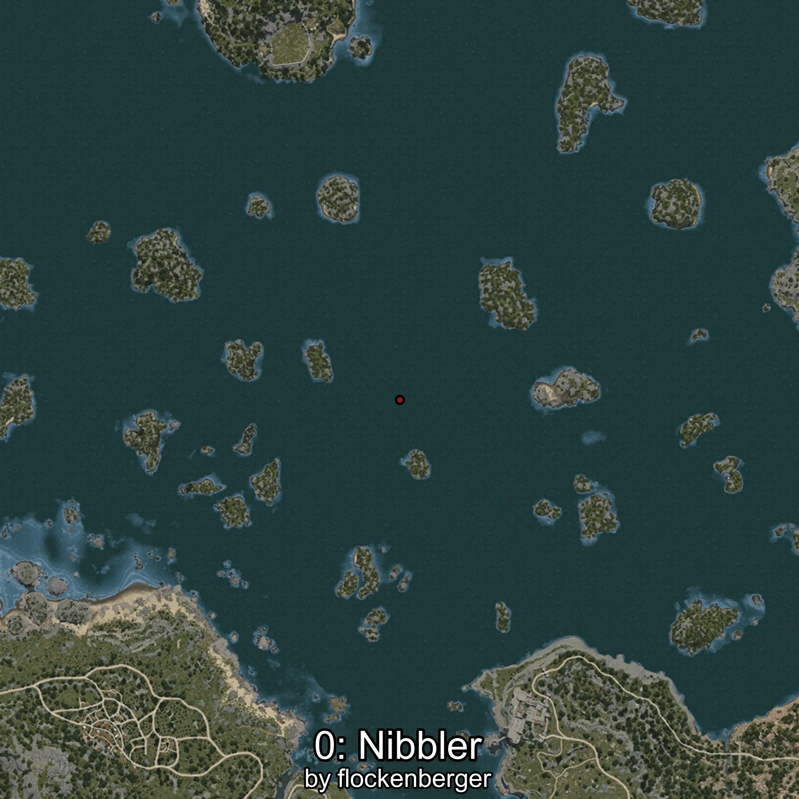
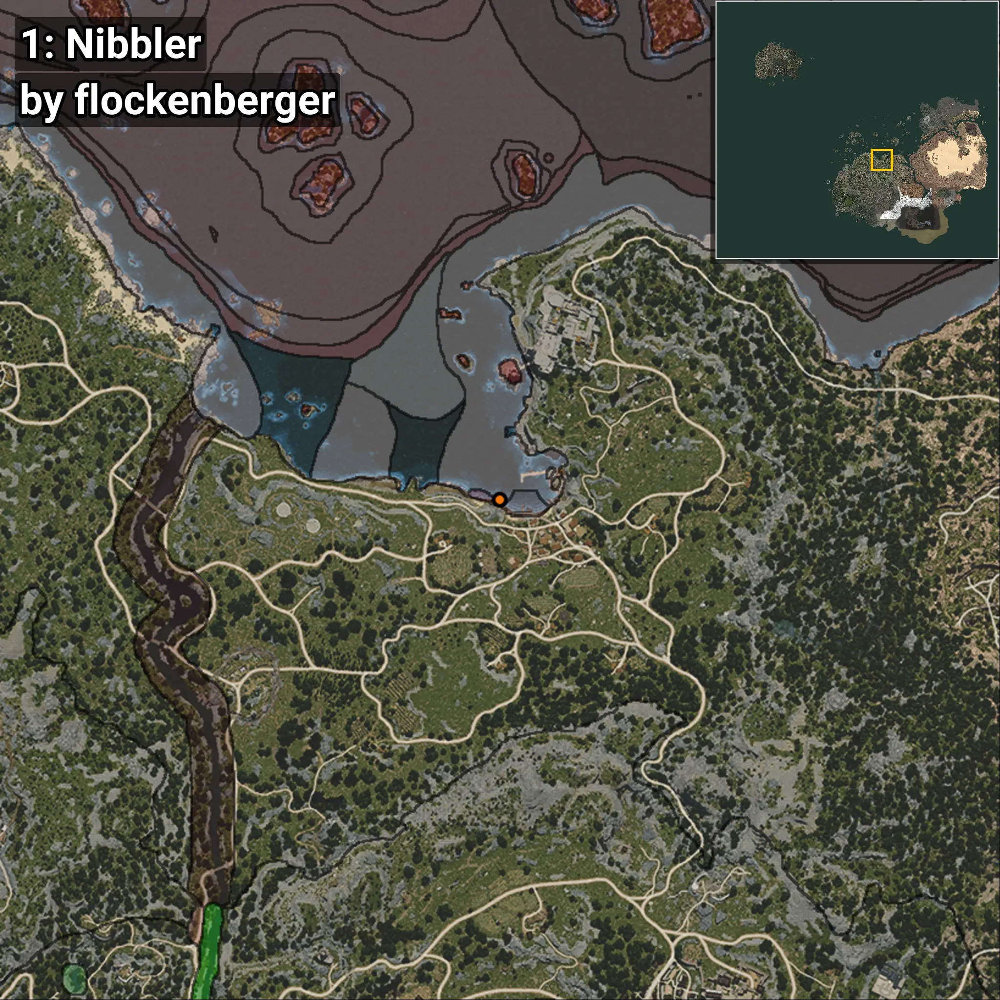
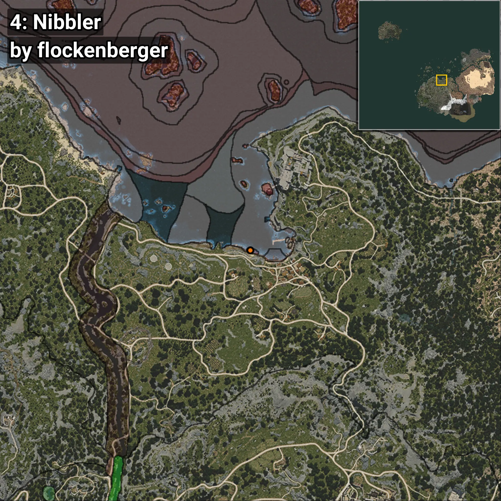
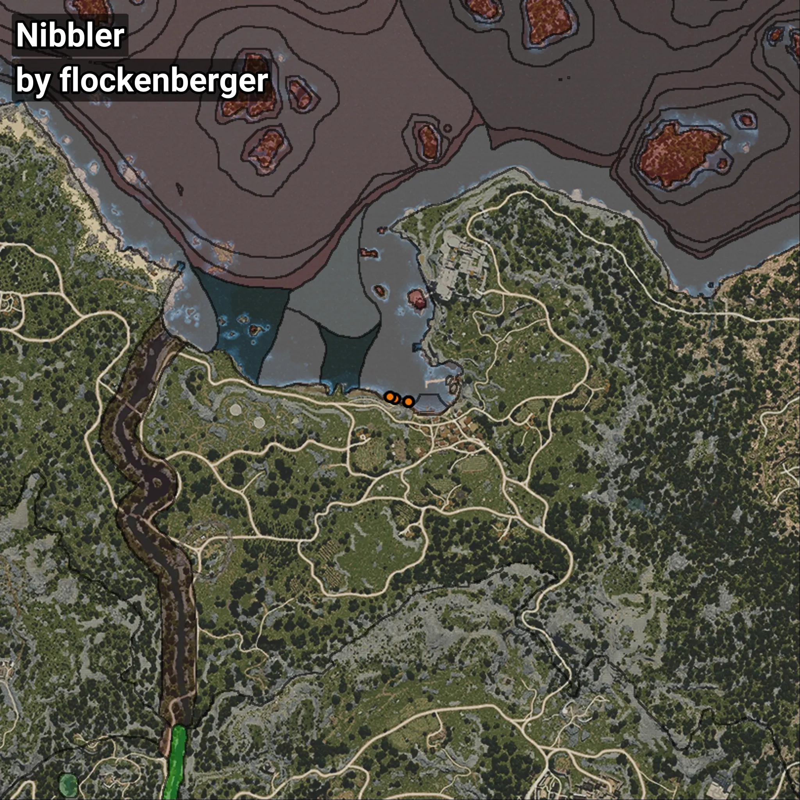

# Girella
```xml
<!--
    Puntos de pesca para: Girella
    Creado por: flockenberger
-->
<WorldmapBookMark>
    <BookMark BookMarkName="0: Girella" PosX="1020.94916" PosY="-8075.86" PosZ="87218.445" />
    <BookMark BookMarkName="1: Girella" PosX="1018.0" PosY="-8099.0" PosZ="87136.0" />
    <BookMark BookMarkName="2: Girella" PosX="-3086.0" PosY="-8234.0" PosZ="88153.0" />
    <BookMark BookMarkName="3: Girella" PosX="1009.0" PosY="-8104.0" PosZ="87128.0" />
    <BookMark BookMarkName="4: Girella" PosX="-4732.0" PosY="-8264.0" PosZ="88568.0" />
</WorldmapBookMark>
```

## ⚠️ Advertencia:
Los puntos de pesca se generan según la __**posición de tu personaje**__ — __no__ donde cae el flotador.  
En el océano especialmente, la dirección en la que lances la caña puede colocar tu flotador en una **zona de pesca diferente**, lo que puede resultar en capturar el pez incorrecto.  
Presta atención a las vistas previas que muestran la ubicación en relación a las zonas marcadas.

- Para verificar la posición de tu flotador puedes usar la guía [AQUÍ](https://flockenberger.github.io/bdo-fish-position/)
- O ver la guía [AQUÍ](https://youtu.be/t-VXcRoNojk)

## Vistas Previas
      