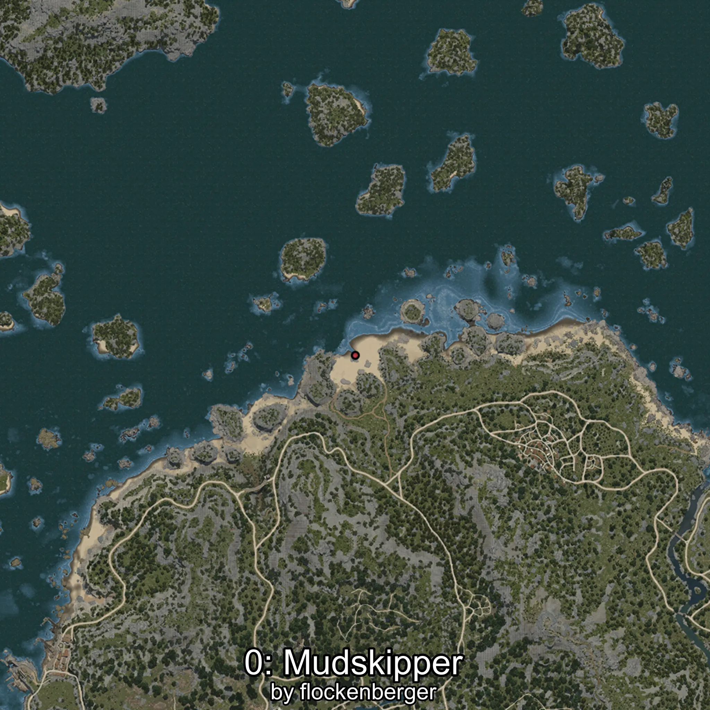
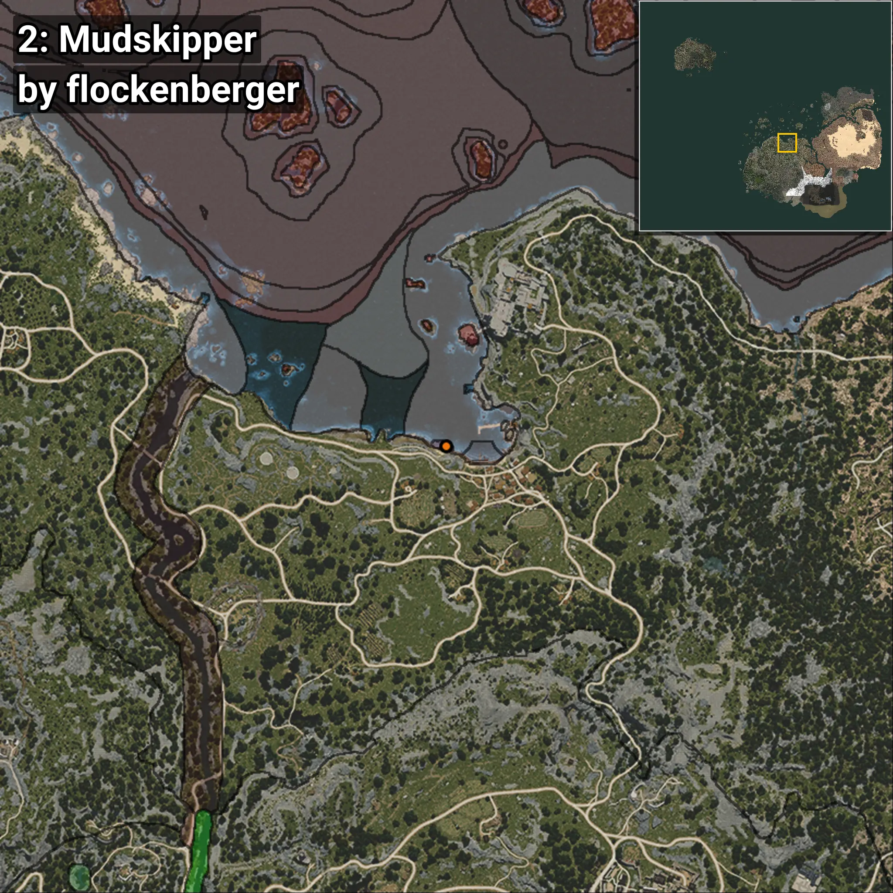

# Gobido
```xml
<!--
    Puntos de pesca para: Gobido
    Creado por: flockenberger
-->
<WorldmapBookMark>
    <BookMark BookMarkName="0: Gobido" PosX="-968.47906" PosY="-8204.966" PosZ="87560.586" />
    <BookMark BookMarkName="1: Gobido" PosX="-1011.4834" PosY="-8188.3423" PosZ="87518.82" />
    <BookMark BookMarkName="2: Gobido" PosX="-2515.0" PosY="-8231.0" PosZ="88128.0" />
    <BookMark BookMarkName="3: Gobido" PosX="-919.0" PosY="-8190.0" PosZ="87478.0" />
    <BookMark BookMarkName="4: Gobido" PosX="-106304.0" PosY="-7951.0" PosZ="626790.0" />
</WorldmapBookMark>
```

## ⚠️ Advertencia:
Los puntos de pesca se generan según la __**posición de tu personaje**__ — __no__ donde cae el flotador.  
En el océano especialmente, la dirección en la que lances la caña puede colocar tu flotador en una **zona de pesca diferente**, lo que puede resultar en capturar el pez incorrecto.  
Presta atención a las vistas previas que muestran la ubicación en relación a las zonas marcadas.

- Para verificar la posición de tu flotador puedes usar la guía [AQUÍ](https://flockenberger.github.io/bdo-fish-position/)
- O ver la guía [AQUÍ](https://youtu.be/t-VXcRoNojk)

## Vistas Previas
      