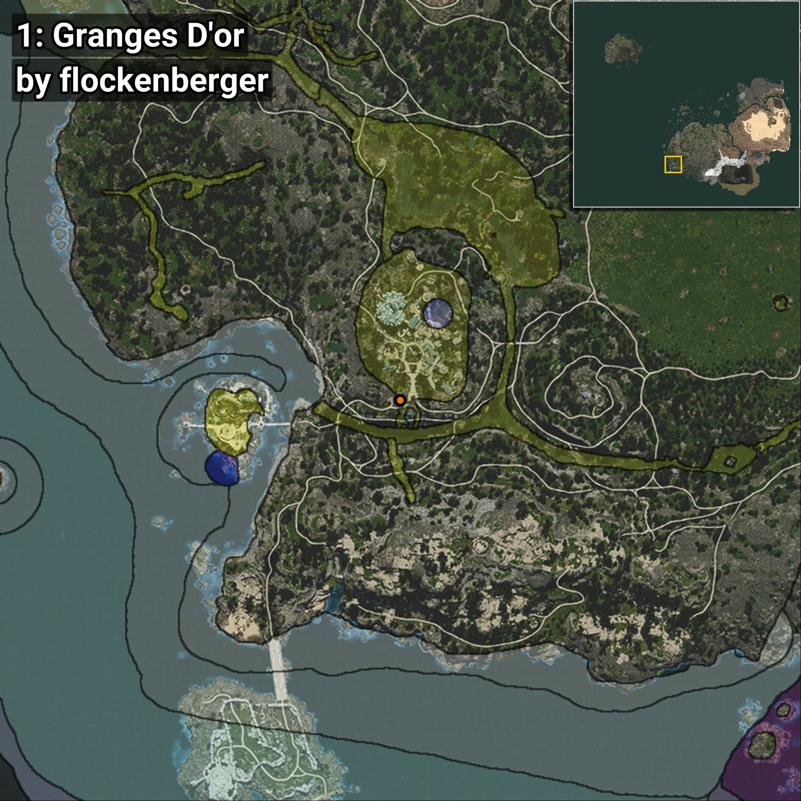
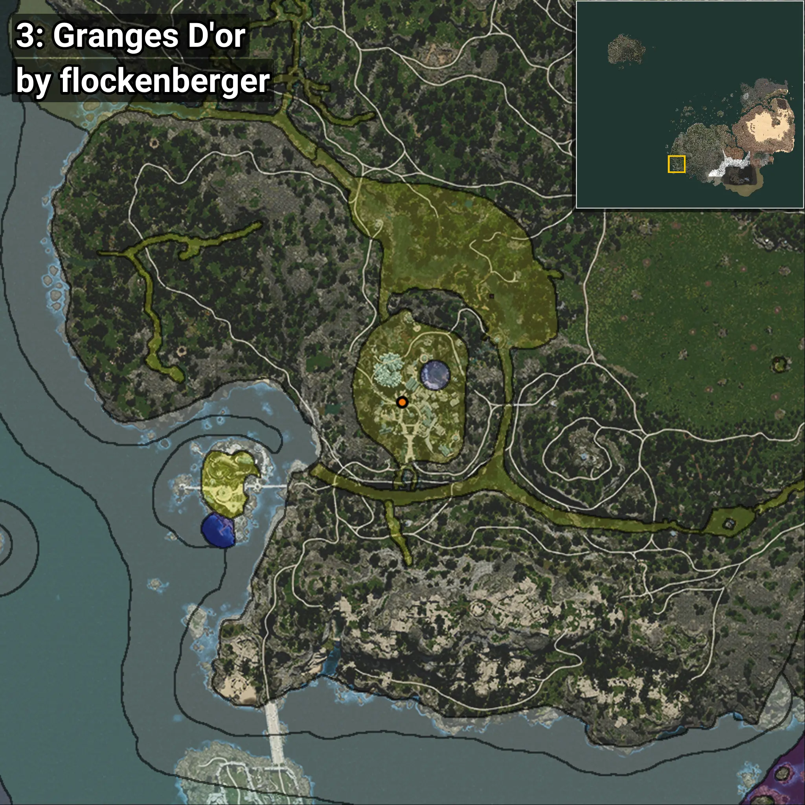
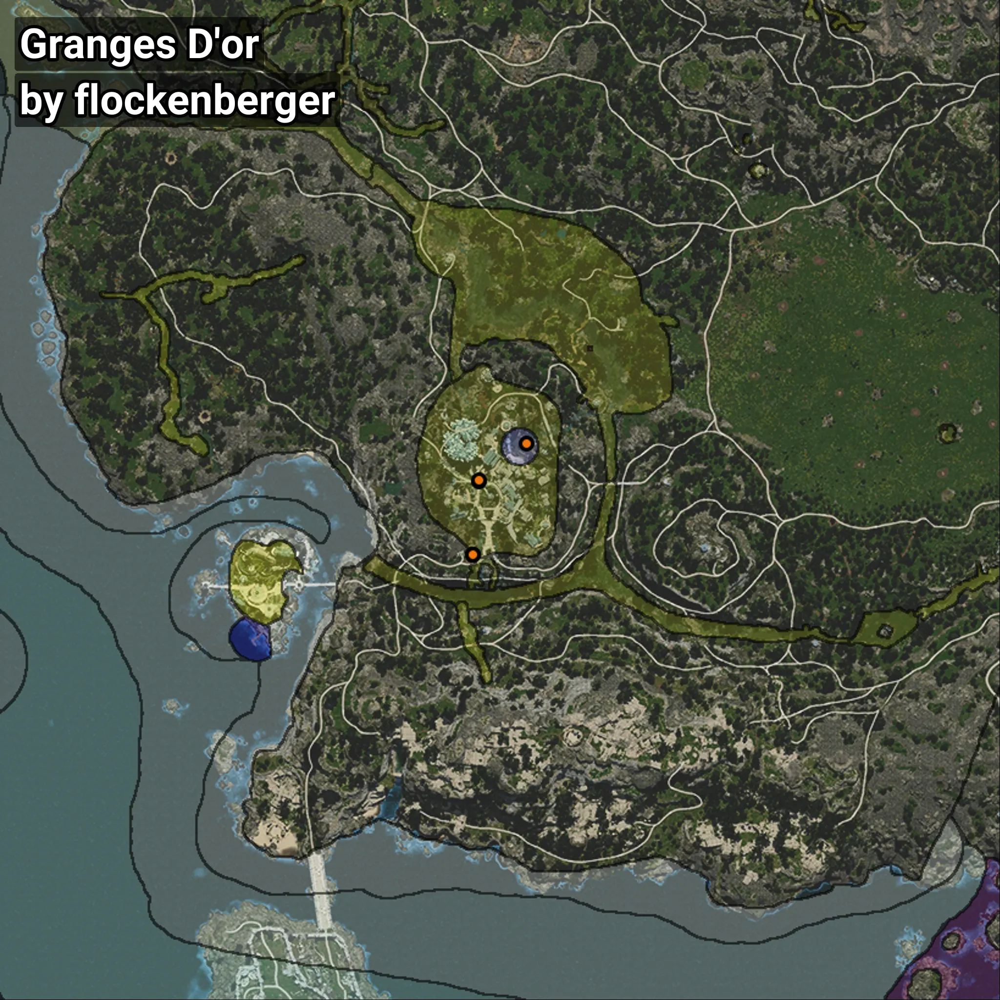

# Grandor
```xml
<!--
    Puntos de pesca para: Grandor
    Creado por: flockenberger
-->
<WorldmapBookMark>
    <BookMark BookMarkName="0: Grandor" PosX="-509059.9" PosY="5871.459" PosZ="-473400.97" />
    <BookMark BookMarkName="1: Grandor" PosX="-508994.0" PosY="5792.0" PosZ="-473207.0" />
    <BookMark BookMarkName="2: Grandor" PosX="-507647.12" PosY="8775.633" PosZ="-455095.9" />
    <BookMark BookMarkName="3: Grandor" PosX="-507660.78" PosY="8771.141" PosZ="-455006.53" />
    <BookMark BookMarkName="4: Grandor" PosX="-496035.0" PosY="1037.0" PosZ="-445792.0" />
</WorldmapBookMark>
```

## ⚠️ Advertencia:
Los puntos de pesca se generan según la __**posición de tu personaje**__ — __no__ donde cae el flotador.  
En el océano especialmente, la dirección en la que lances la caña puede colocar tu flotador en una **zona de pesca diferente**, lo que puede resultar en capturar el pez incorrecto.  
Presta atención a las vistas previas que muestran la ubicación en relación a las zonas marcadas.

- Para verificar la posición de tu flotador puedes usar la guía [AQUÍ](https://flockenberger.github.io/bdo-fish-position/)
- O ver la guía [AQUÍ](https://youtu.be/t-VXcRoNojk)

## Vistas Previas
      