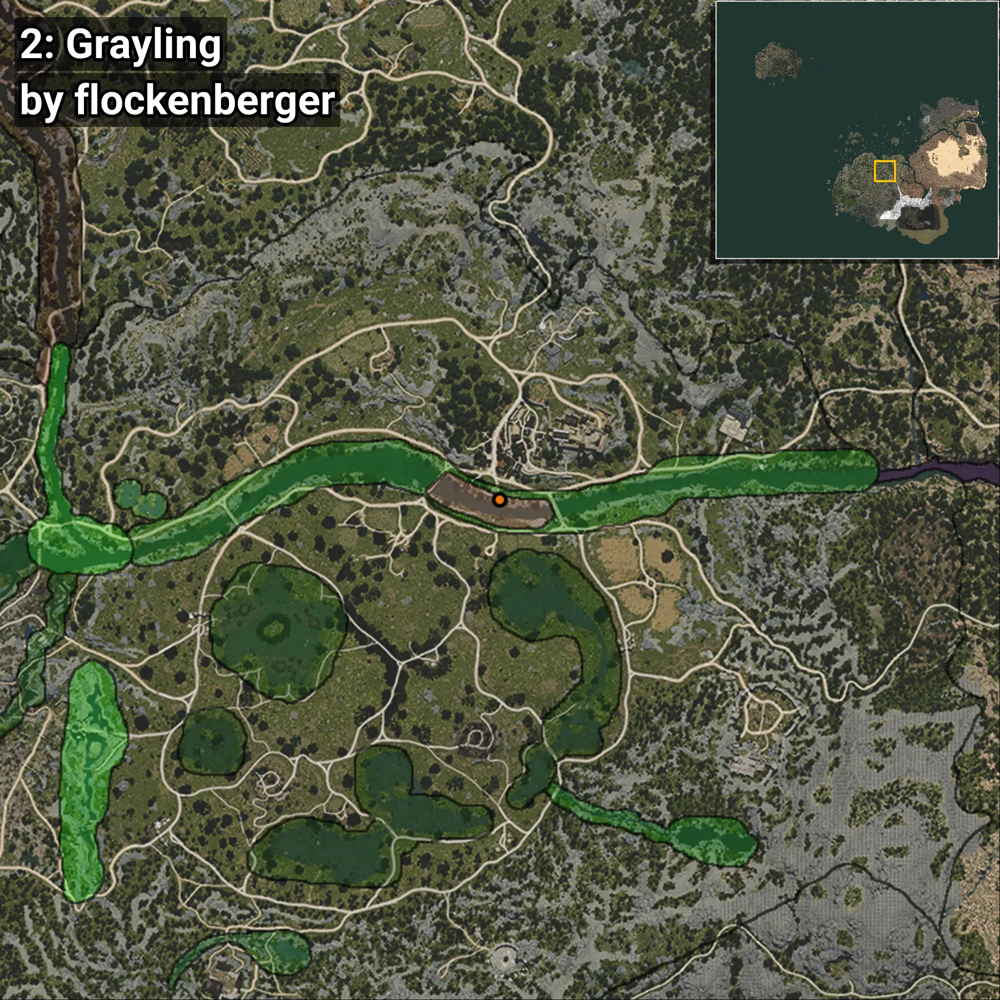
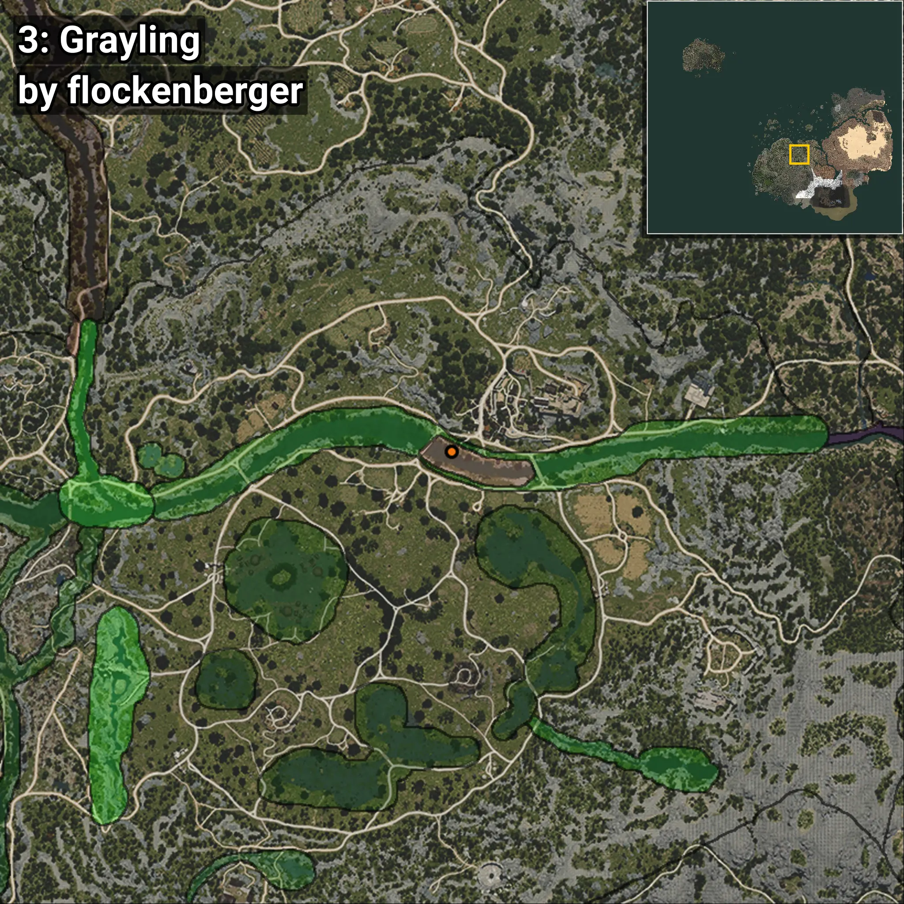
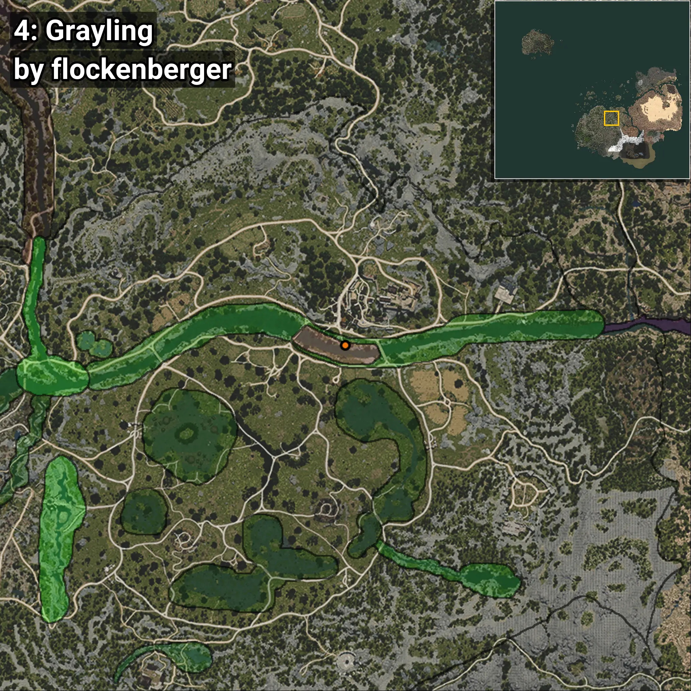
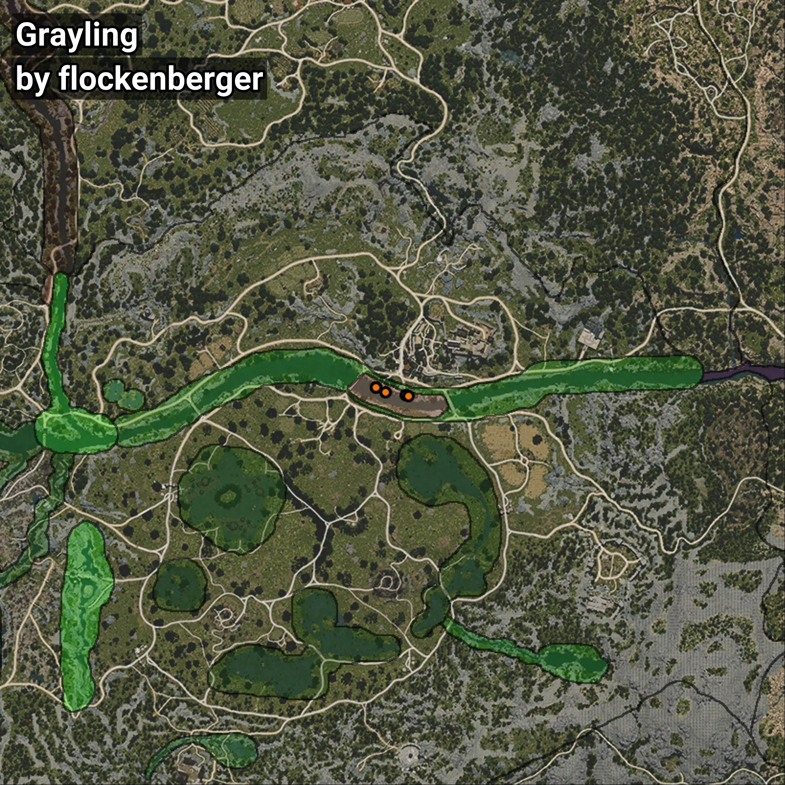

# Grayling
```xml
<!--
    Puntos de pesca para: Grayling
    Creado por: flockenberger
-->
<WorldmapBookMark>
    <BookMark BookMarkName="0: Grayling" PosX="32284.0" PosY="-3691.0" PosZ="-50169.0" />
    <BookMark BookMarkName="1: Grayling" PosX="29305.975" PosY="-3267.7295" PosZ="-48568.883" />
    <BookMark BookMarkName="2: Grayling" PosX="38666.0" PosY="-4040.0" PosZ="-50956.0" />
    <BookMark BookMarkName="3: Grayling" PosX="29289.0" PosY="-3265.0" PosZ="-48540.0" />
    <BookMark BookMarkName="4: Grayling" PosX="39644.0" PosY="-4018.0" PosZ="-51265.0" />
</WorldmapBookMark>
```

## ⚠️ Advertencia:
Los puntos de pesca se generan según la __**posición de tu personaje**__ — __no__ donde cae el flotador.  
En el océano especialmente, la dirección en la que lances la caña puede colocar tu flotador en una **zona de pesca diferente**, lo que puede resultar en capturar el pez incorrecto.  
Presta atención a las vistas previas que muestran la ubicación en relación a las zonas marcadas.

- Para verificar la posición de tu flotador puedes usar la guía [AQUÍ](https://flockenberger.github.io/bdo-fish-position/)
- O ver la guía [AQUÍ](https://youtu.be/t-VXcRoNojk)

## Vistas Previas
      