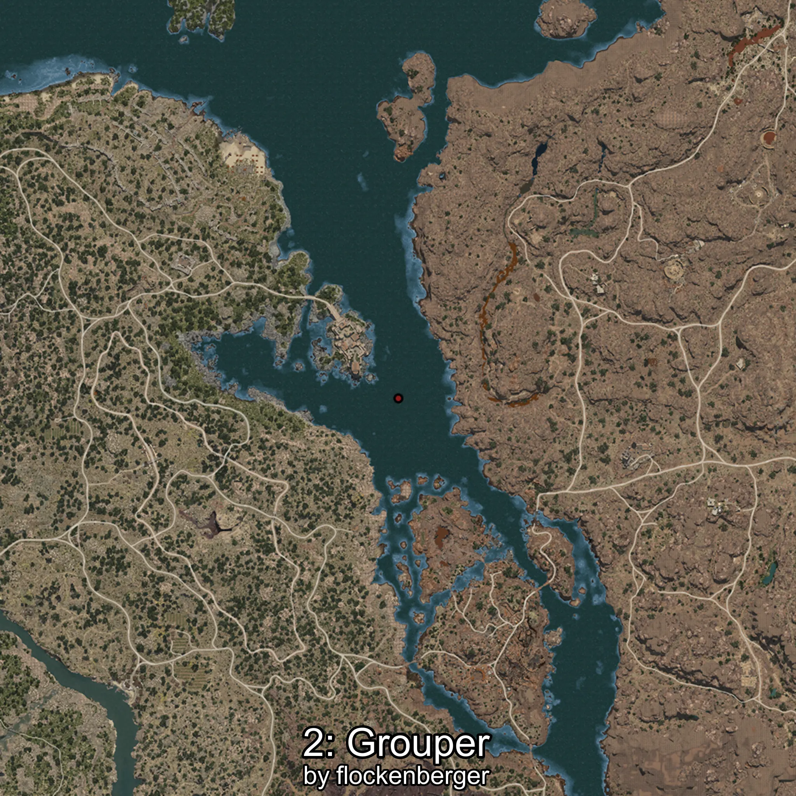
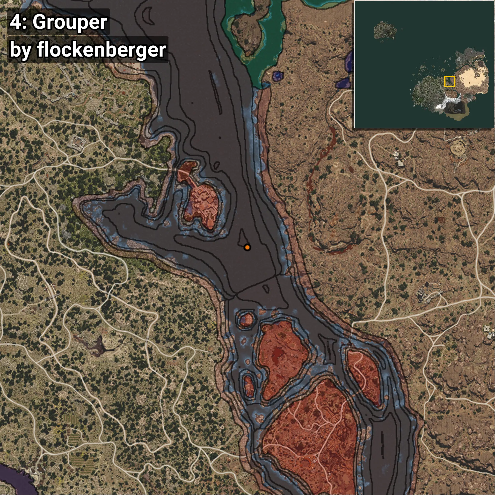

# Grouper
```xml
<!--
    Puntos de pesca para: Grouper
    Creado por: flockenberger
-->
<WorldmapBookMark>
    <BookMark BookMarkName="0: Grouper" PosX="331511.8" PosY="-7913.341" PosZ="37979.29" />
    <BookMark BookMarkName="1: Grouper" PosX="330465.0" PosY="-7932.0" PosZ="37384.0" />
    <BookMark BookMarkName="2: Grouper" PosX="326550.0" PosY="-7741.0" PosZ="30215.0" />
    <BookMark BookMarkName="3: Grouper" PosX="326219.0" PosY="-7736.0" PosZ="30025.0" />
    <BookMark BookMarkName="4: Grouper" PosX="331269.0" PosY="-7915.0" PosZ="32306.0" />
</WorldmapBookMark>
```

## ⚠️ Advertencia:
Los puntos de pesca se generan según la __**posición de tu personaje**__ — __no__ donde cae el flotador.  
En el océano especialmente, la dirección en la que lances la caña puede colocar tu flotador en una **zona de pesca diferente**, lo que puede resultar en capturar el pez incorrecto.  
Presta atención a las vistas previas que muestran la ubicación en relación a las zonas marcadas.

- Para verificar la posición de tu flotador puedes usar la guía [AQUÍ](https://flockenberger.github.io/bdo-fish-position/)
- O ver la guía [AQUÍ](https://youtu.be/t-VXcRoNojk)

## Vistas Previas
      