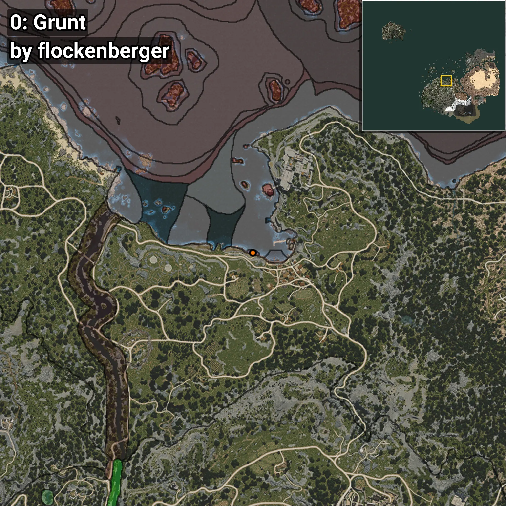
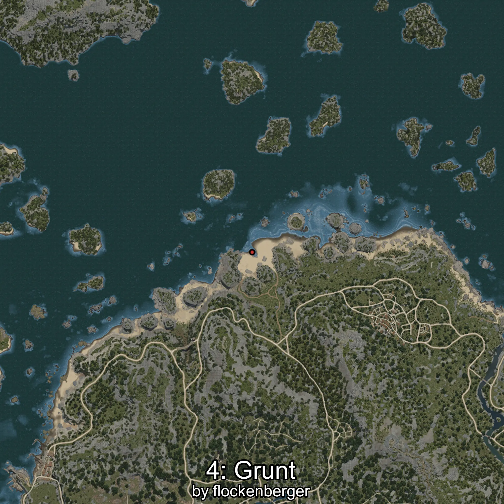
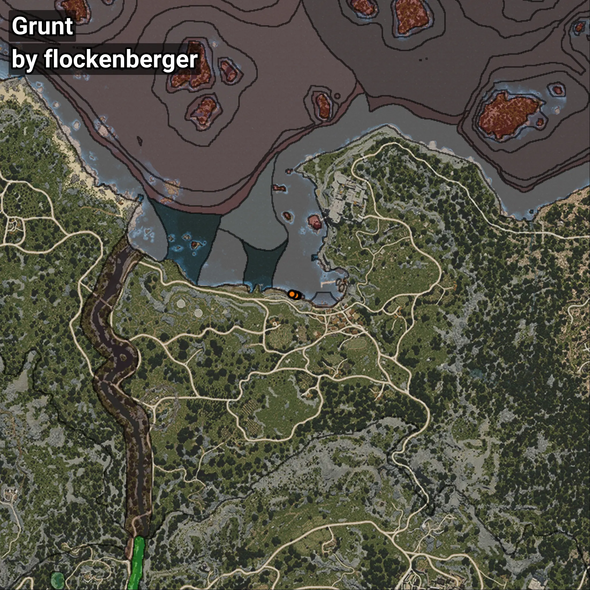

# Grunt
```xml
<!--
    Puntos de pesca para: Grunt
    Creado por: flockenberger
-->
<WorldmapBookMark>
    <BookMark BookMarkName="0: Grunt" PosX="-3850.4067" PosY="-8191.3027" PosZ="88050.29" />
    <BookMark BookMarkName="1: Grunt" PosX="-3765.0" PosY="-8217.0" PosZ="88162.0" />
    <BookMark BookMarkName="2: Grunt" PosX="-4558.0" PosY="-8225.0" PosZ="88323.0" />
    <BookMark BookMarkName="3: Grunt" PosX="-4515.0" PosY="-8202.0" PosZ="88194.0" />
    <BookMark BookMarkName="4: Grunt" PosX="-5925.0" PosY="-8232.0" PosZ="88686.0" />
</WorldmapBookMark>
```

## ⚠️ Advertencia:
Los puntos de pesca se generan según la __**posición de tu personaje**__ — __no__ donde cae el flotador.  
En el océano especialmente, la dirección en la que lances la caña puede colocar tu flotador en una **zona de pesca diferente**, lo que puede resultar en capturar el pez incorrecto.  
Presta atención a las vistas previas que muestran la ubicación en relación a las zonas marcadas.

- Para verificar la posición de tu flotador puedes usar la guía [AQUÍ](https://flockenberger.github.io/bdo-fish-position/)
- O ver la guía [AQUÍ](https://youtu.be/t-VXcRoNojk)

## Vistas Previas
      