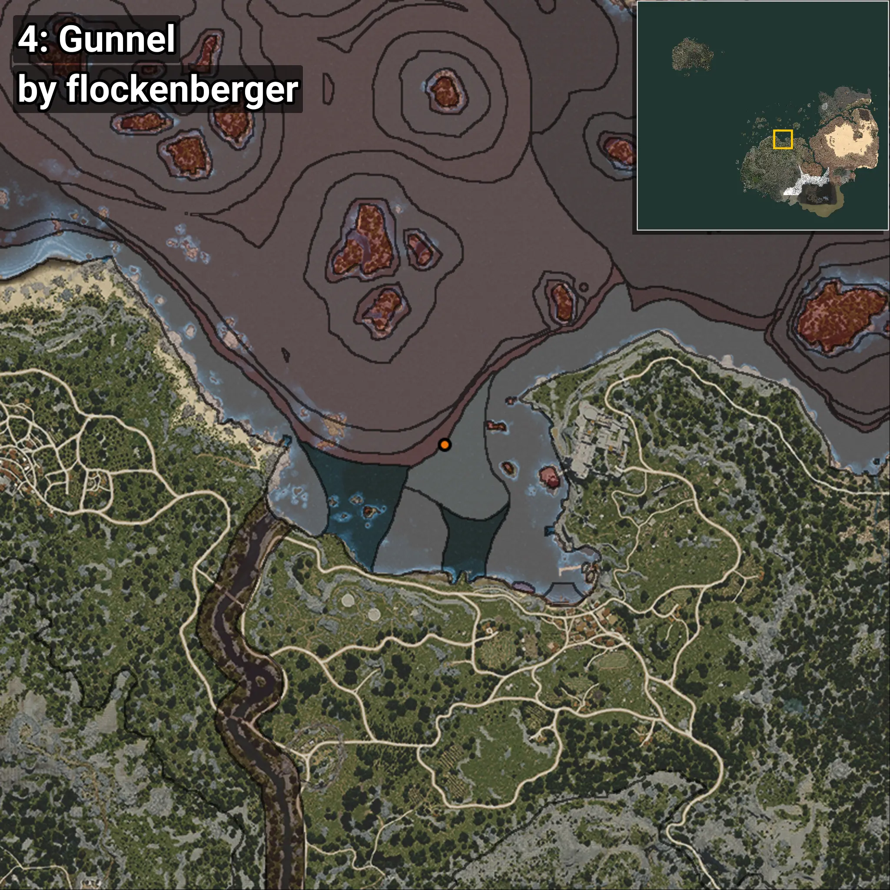
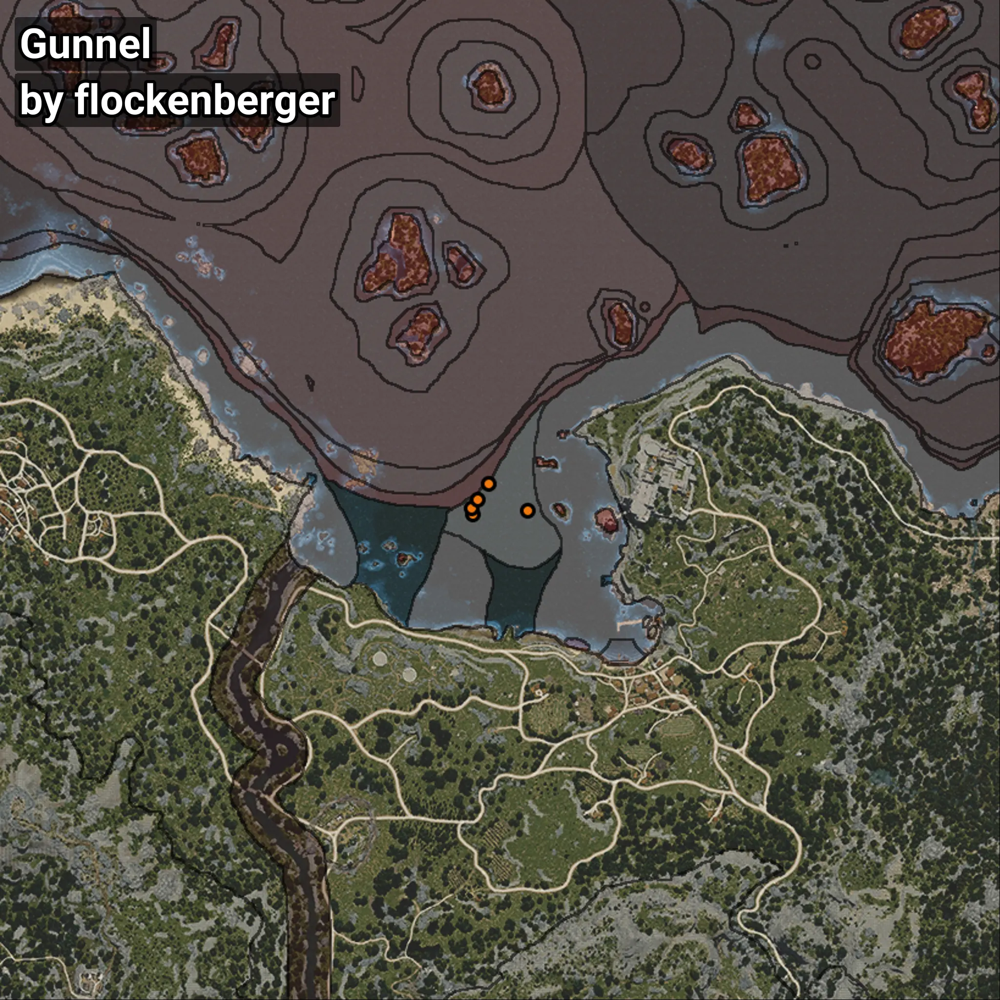

# Gunnel
```xml
<!--
    Puntos de pesca para: Gunnel
    Creado por: flockenberger
-->
<WorldmapBookMark>
    <BookMark BookMarkName="0: Gunnel" PosX="-29317.0" PosY="-7904.0" PosZ="120324.0" />
    <BookMark BookMarkName="1: Gunnel" PosX="-29578.0" PosY="-7750.0" PosZ="121885.0" />
    <BookMark BookMarkName="2: Gunnel" PosX="-15856.0" PosY="-7731.0" PosZ="121124.0" />
    <BookMark BookMarkName="3: Gunnel" PosX="-28091.4" PosY="-7887.7153" PosZ="123859.914" />
    <BookMark BookMarkName="4: Gunnel" PosX="-25460.0" PosY="-7754.0" PosZ="127718.0" />
</WorldmapBookMark>
```

## ⚠️ Advertencia:
Los puntos de pesca se generan según la __**posición de tu personaje**__ — __no__ donde cae el flotador.  
En el océano especialmente, la dirección en la que lances la caña puede colocar tu flotador en una **zona de pesca diferente**, lo que puede resultar en capturar el pez incorrecto.  
Presta atención a las vistas previas que muestran la ubicación en relación a las zonas marcadas.

- Para verificar la posición de tu flotador puedes usar la guía [AQUÍ](https://flockenberger.github.io/bdo-fish-position/)
- O ver la guía [AQUÍ](https://youtu.be/t-VXcRoNojk)

## Vistas Previas
      