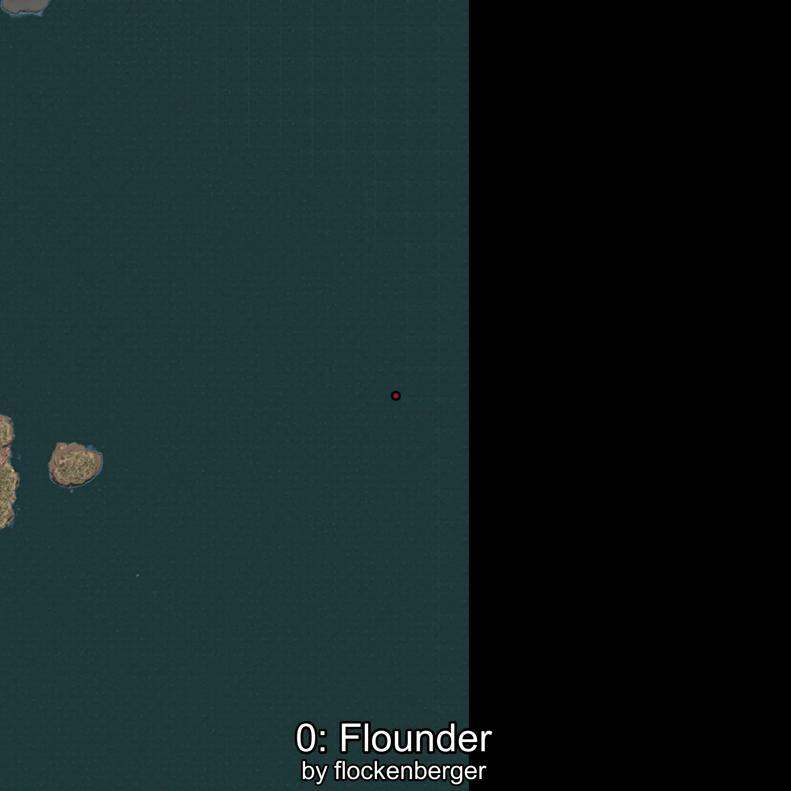
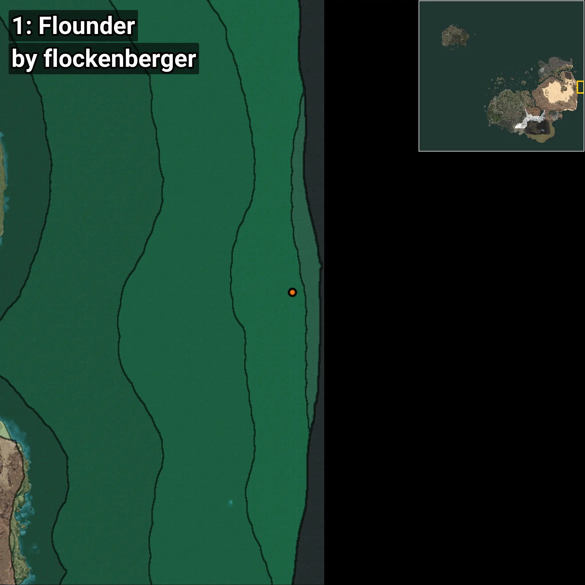
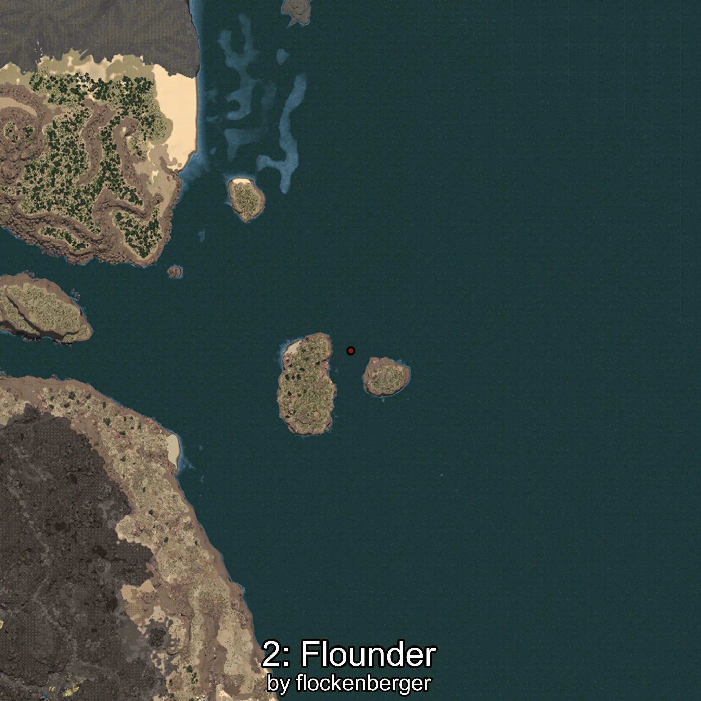
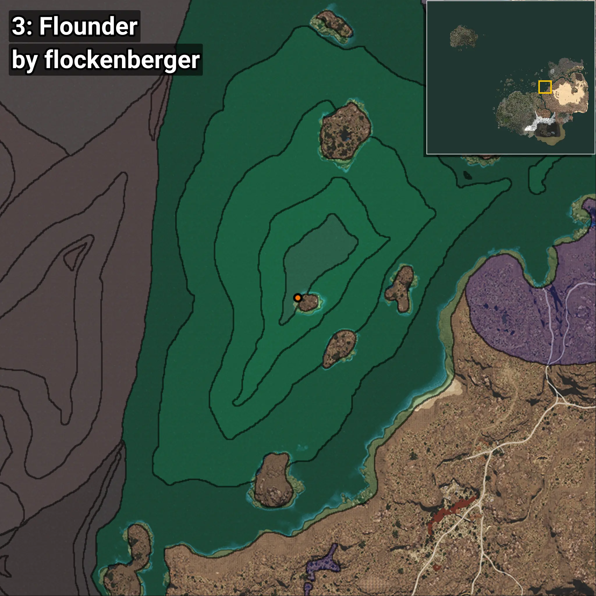
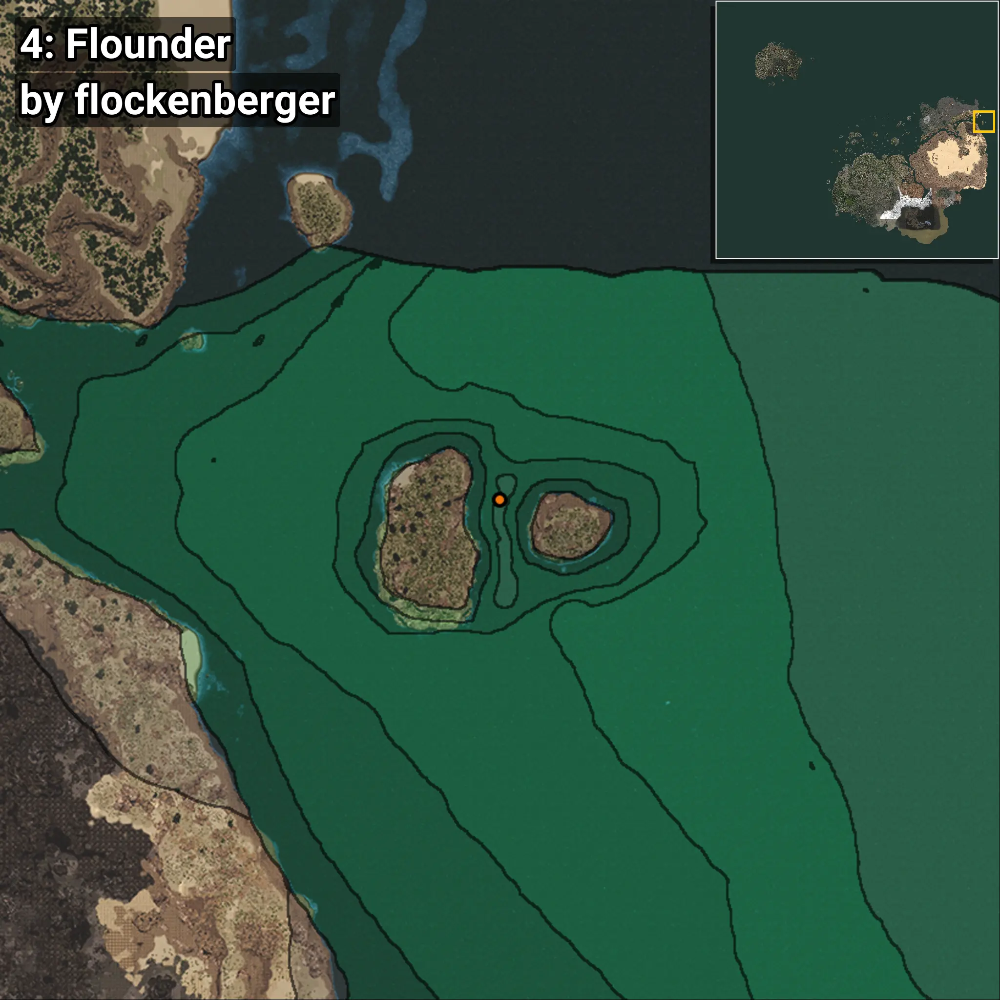

# Halibut
```xml
<!--
    Puntos de pesca para: Halibut
    Creado por: flockenberger
-->
<WorldmapBookMark>
    <BookMark BookMarkName="0: Halibut" PosX="1418938.1" PosY="-7858.4253" PosZ="220261.77" />
    <BookMark BookMarkName="1: Halibut" PosX="1420196.0" PosY="-7857.0" PosZ="223137.0" />
    <BookMark BookMarkName="2: Halibut" PosX="403303.0" PosY="-7919.0" PosZ="258872.0" />
    <BookMark BookMarkName="3: Halibut" PosX="403315.0" PosY="-7906.0" PosZ="258857.0" />
    <BookMark BookMarkName="4: Halibut" PosX="1262843.0" PosY="-7752.0" PosZ="558995.0" />
</WorldmapBookMark>
```

## ⚠️ Advertencia:
Los puntos de pesca se generan según la __**posición de tu personaje**__ — __no__ donde cae el flotador.  
En el océano especialmente, la dirección en la que lances la caña puede colocar tu flotador en una **zona de pesca diferente**, lo que puede resultar en capturar el pez incorrecto.  
Presta atención a las vistas previas que muestran la ubicación en relación a las zonas marcadas.

- Para verificar la posición de tu flotador puedes usar la guía [AQUÍ](https://flockenberger.github.io/bdo-fish-position/)
- O ver la guía [AQUÍ](https://youtu.be/t-VXcRoNojk)

## Vistas Previas
      