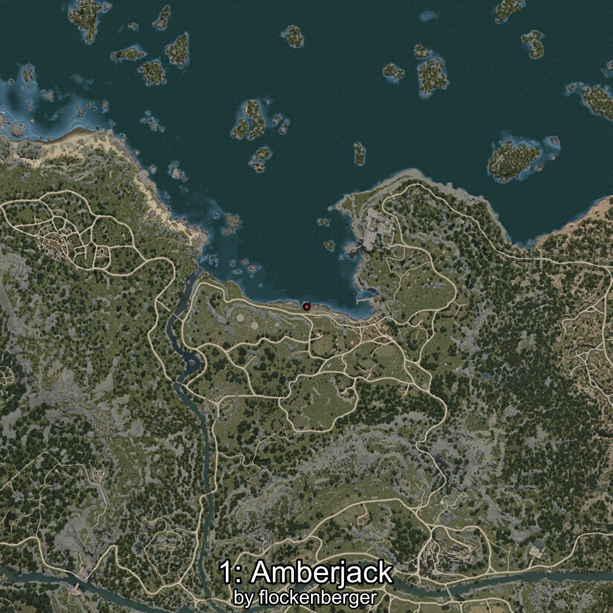
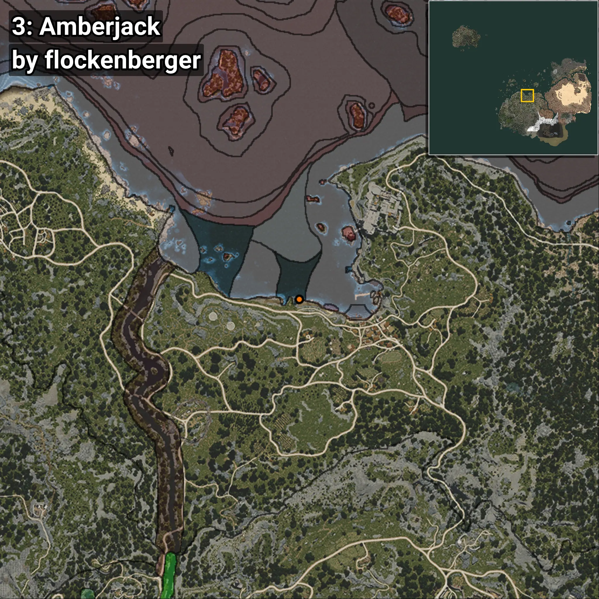
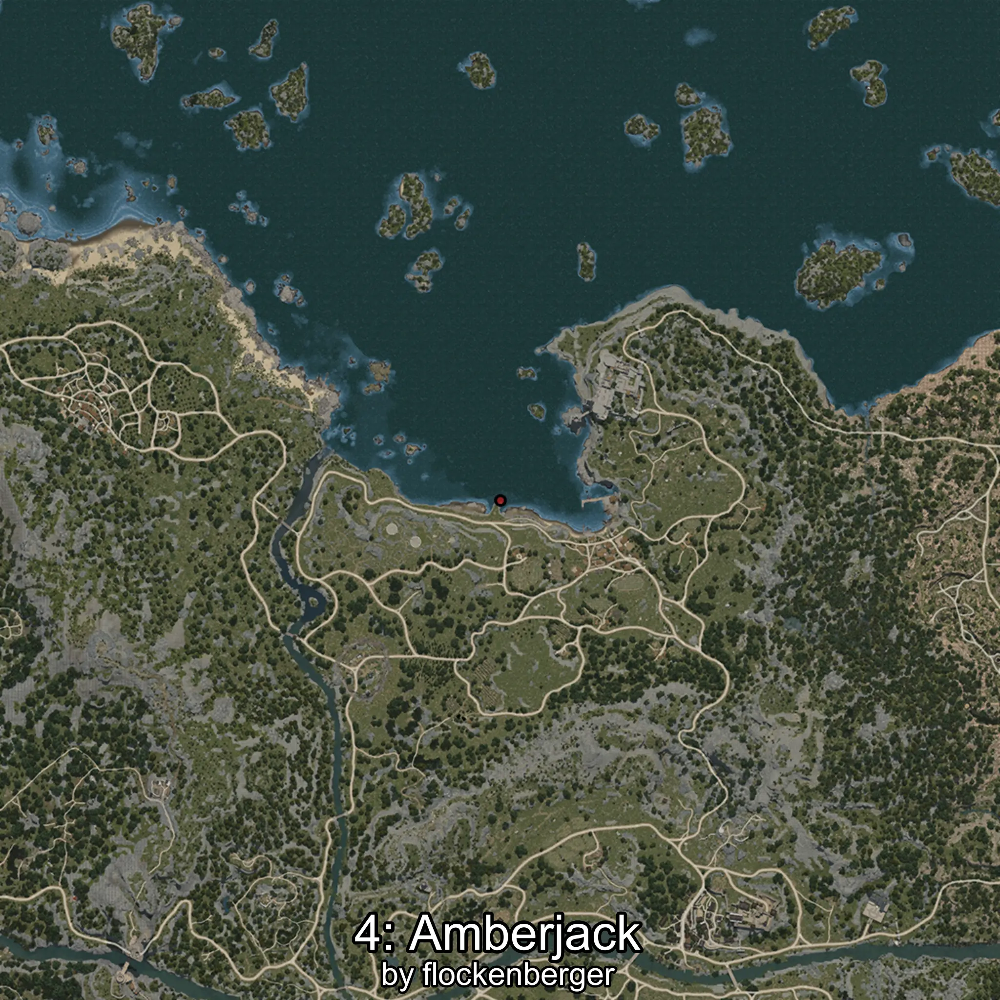

# Hamachi
```xml
<!--
    Puntos de pesca para: Hamachi
    Creado por: flockenberger
-->
<WorldmapBookMark>
    <BookMark BookMarkName="0: Hamachi" PosX="-16984.0" PosY="-8005.0" PosZ="91877.0" />
    <BookMark BookMarkName="1: Hamachi" PosX="-16965.0" PosY="-8005.0" PosZ="91905.0" />
    <BookMark BookMarkName="2: Hamachi" PosX="-17019.0" PosY="-8007.0" PosZ="91884.0" />
    <BookMark BookMarkName="3: Hamachi" PosX="-16853.0" PosY="-7998.6006" PosZ="91843.0" />
    <BookMark BookMarkName="4: Hamachi" PosX="-18740.0" PosY="-8099.0" PosZ="93465.0" />
</WorldmapBookMark>
```

## ⚠️ Advertencia:
Los puntos de pesca se generan según la __**posición de tu personaje**__ — __no__ donde cae el flotador.  
En el océano especialmente, la dirección en la que lances la caña puede colocar tu flotador en una **zona de pesca diferente**, lo que puede resultar en capturar el pez incorrecto.  
Presta atención a las vistas previas que muestran la ubicación en relación a las zonas marcadas.

- Para verificar la posición de tu flotador puedes usar la guía [AQUÍ](https://flockenberger.github.io/bdo-fish-position/)
- O ver la guía [AQUÍ](https://youtu.be/t-VXcRoNojk)

## Vistas Previas
      