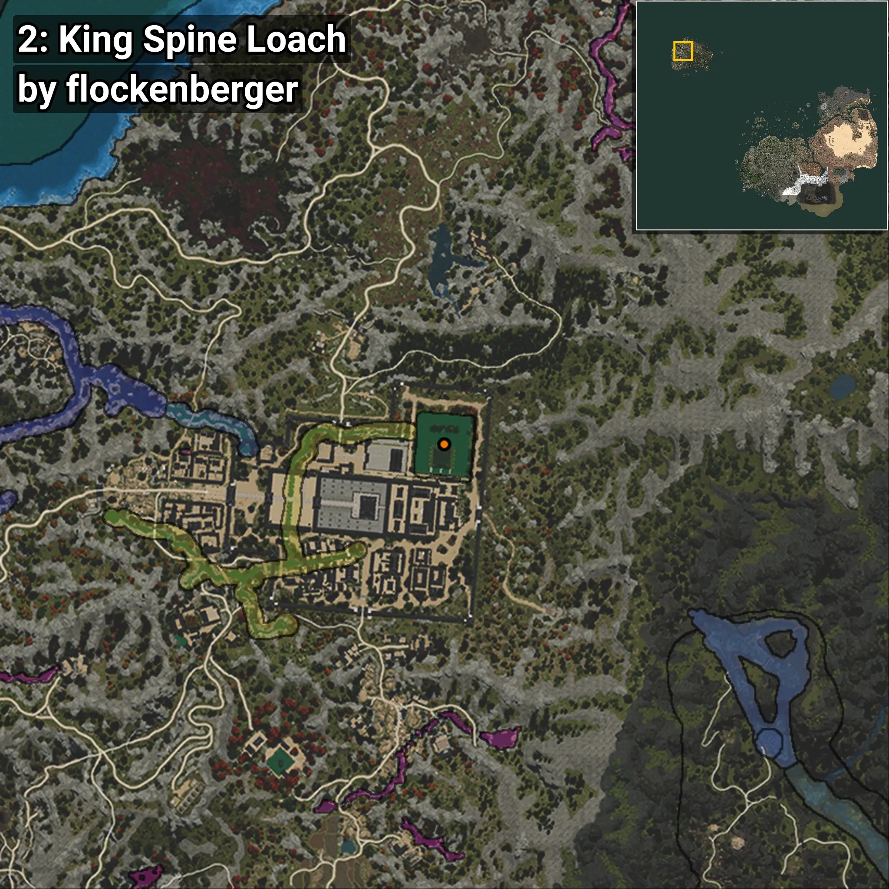
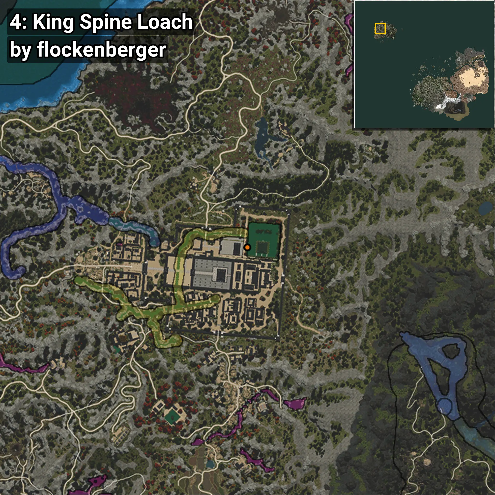

# Iksookimia
```xml
<!--
    Puntos de pesca para: Iksookimia
    Creado por: flockenberger
-->
<WorldmapBookMark>
    <BookMark BookMarkName="0: Iksookimia" PosX="-1396219.0" PosY="12955.0" PosZ="1350568.0" />
    <BookMark BookMarkName="1: Iksookimia" PosX="-1396213.0" PosY="12954.0" PosZ="1350579.0" />
    <BookMark BookMarkName="2: Iksookimia" PosX="-1396277.0" PosY="12991.0" PosZ="1350526.0" />
    <BookMark BookMarkName="3: Iksookimia" PosX="-1396260.0" PosY="12991.0" PosZ="1350521.0" />
    <BookMark BookMarkName="4: Iksookimia" PosX="-1404614.0" PosY="13159.0" PosZ="1347128.0" />
</WorldmapBookMark>
```

## ⚠️ Advertencia:
Los puntos de pesca se generan según la __**posición de tu personaje**__ — __no__ donde cae el flotador.  
En el océano especialmente, la dirección en la que lances la caña puede colocar tu flotador en una **zona de pesca diferente**, lo que puede resultar en capturar el pez incorrecto.  
Presta atención a las vistas previas que muestran la ubicación en relación a las zonas marcadas.

- Para verificar la posición de tu flotador puedes usar la guía [AQUÍ](https://flockenberger.github.io/bdo-fish-position/)
- O ver la guía [AQUÍ](https://youtu.be/t-VXcRoNojk)

## Vistas Previas
      