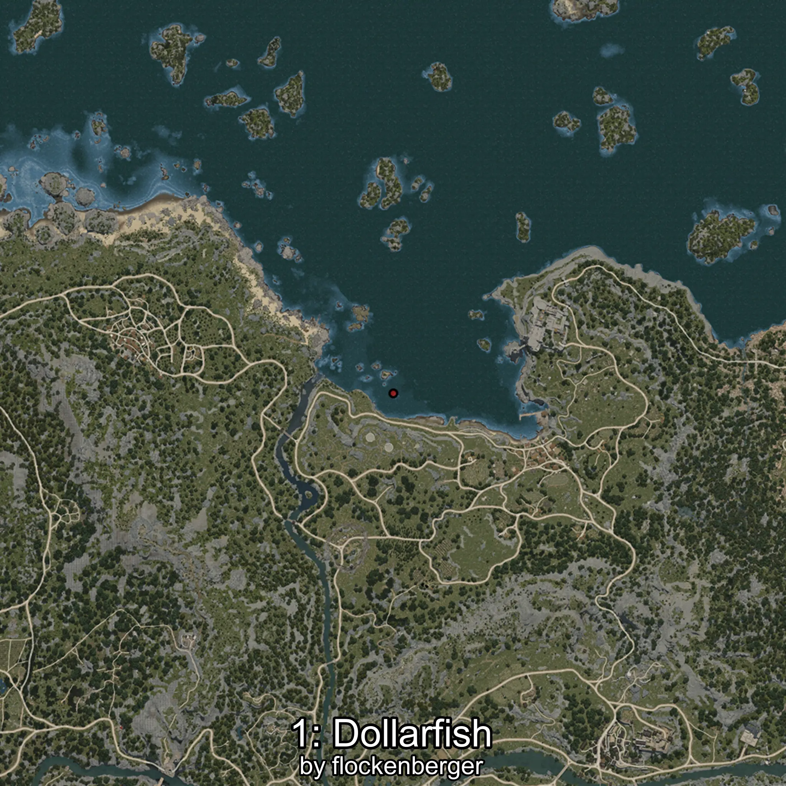
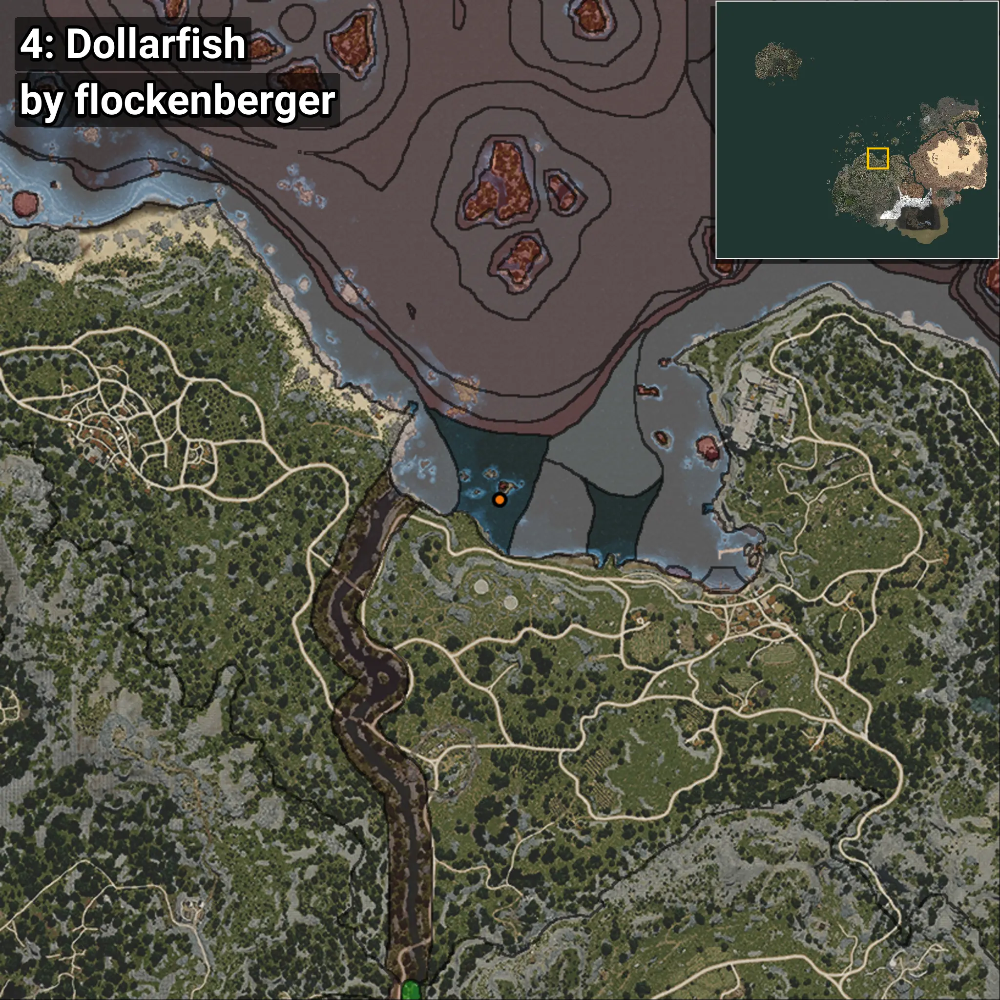

# Japuta
```xml
<!--
    Puntos de pesca para: Japuta
    Creado por: flockenberger
-->
<WorldmapBookMark>
    <BookMark BookMarkName="0: Japuta" PosX="-47528.0" PosY="-7994.0" PosZ="111093.0" />
    <BookMark BookMarkName="1: Japuta" PosX="-47454.0" PosY="-7992.0" PosZ="111006.0" />
    <BookMark BookMarkName="2: Japuta" PosX="-45054.19" PosY="-8205.76" PosZ="109421.01" />
    <BookMark BookMarkName="3: Japuta" PosX="-47220.305" PosY="-8042.707" PosZ="111175.48" />
    <BookMark BookMarkName="4: Japuta" PosX="-47838.0" PosY="-7948.0" PosZ="106015.0" />
</WorldmapBookMark>
```

## ⚠️ Advertencia:
Los puntos de pesca se generan según la __**posición de tu personaje**__ — __no__ donde cae el flotador.  
En el océano especialmente, la dirección en la que lances la caña puede colocar tu flotador en una **zona de pesca diferente**, lo que puede resultar en capturar el pez incorrecto.  
Presta atención a las vistas previas que muestran la ubicación en relación a las zonas marcadas.

- Para verificar la posición de tu flotador puedes usar la guía [AQUÍ](https://flockenberger.github.io/bdo-fish-position/)
- O ver la guía [AQUÍ](https://youtu.be/t-VXcRoNojk)

## Vistas Previas
      