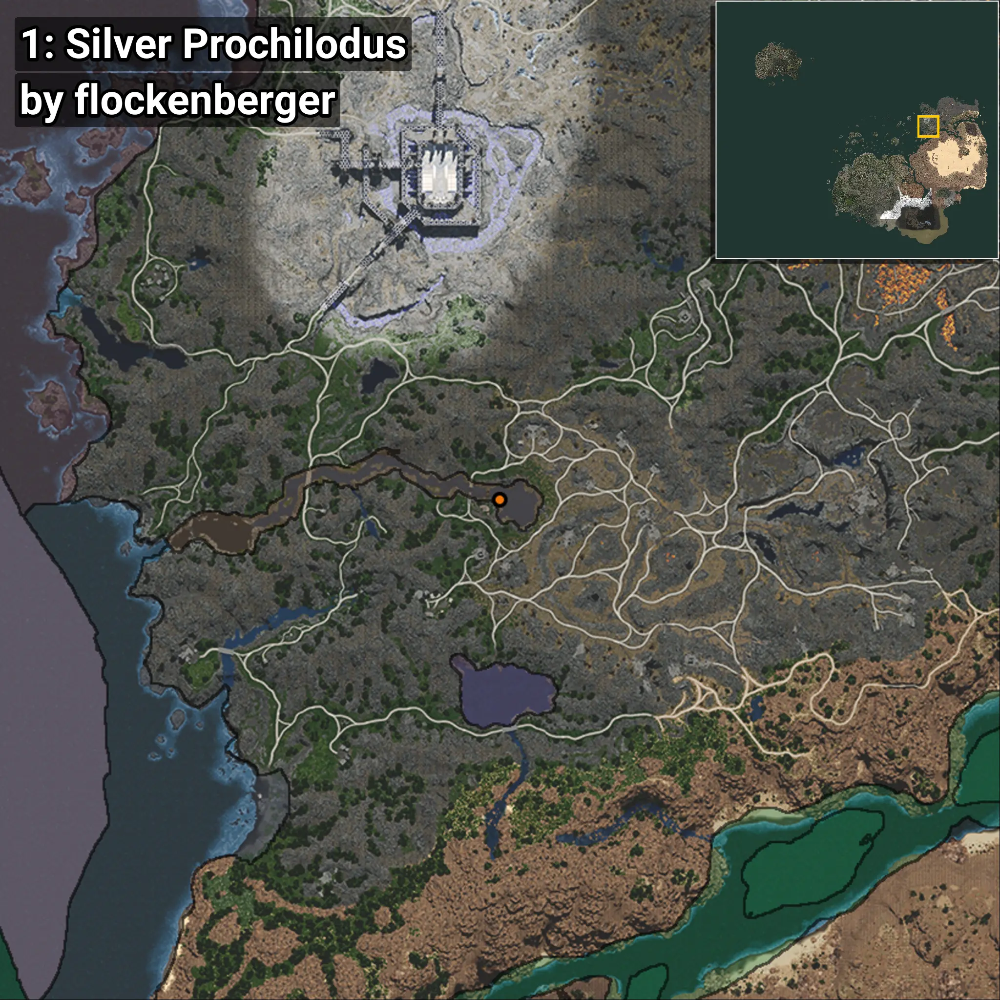
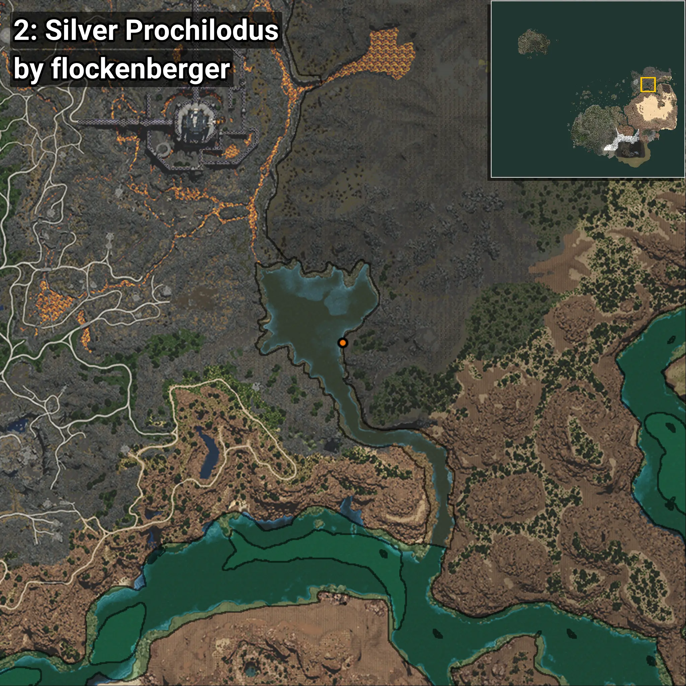
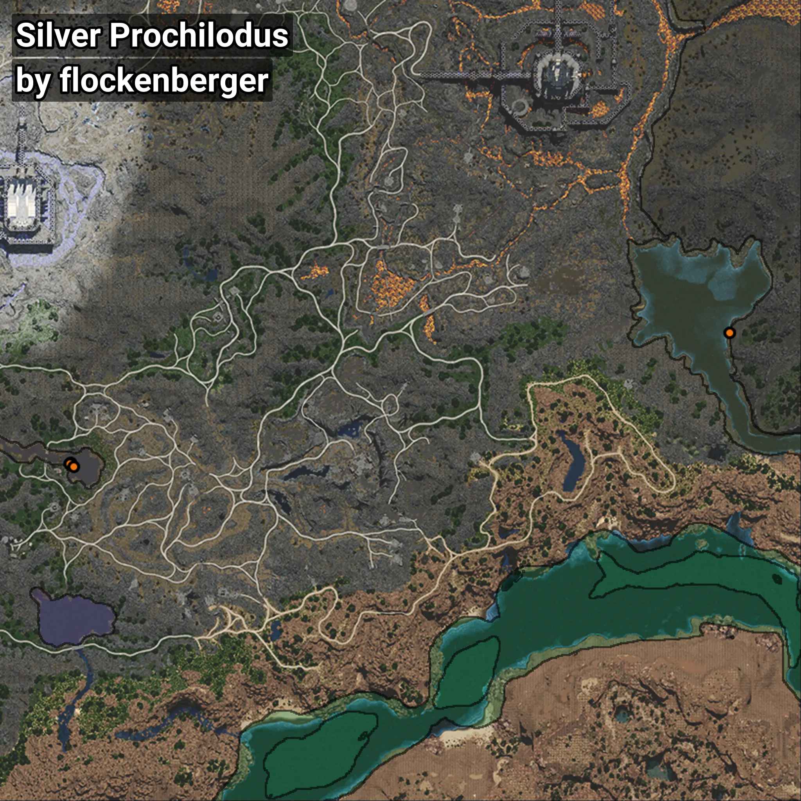

# Jaraqui
```xml
<!--
    Puntos de pesca para: Jaraqui
    Creado por: flockenberger
-->
<WorldmapBookMark>
    <BookMark BookMarkName="0: Jaraqui" PosX="573749.44" PosY="956.93286" PosZ="499466.94" />
    <BookMark BookMarkName="1: Jaraqui" PosX="573688.2" PosY="1049.6356" PosZ="499286.56" />
    <BookMark BookMarkName="2: Jaraqui" PosX="776828.0" PosY="-7356.0" PosZ="539597.0" />
    <BookMark BookMarkName="3: Jaraqui" PosX="573688.2" PosY="1049.6356" PosZ="499286.56" />
    <BookMark BookMarkName="4: Jaraqui" PosX="574761.0" PosY="890.0" PosZ="498179.0" />
</WorldmapBookMark>
```

## ⚠️ Advertencia:
Los puntos de pesca se generan según la __**posición de tu personaje**__ — __no__ donde cae el flotador.  
En el océano especialmente, la dirección en la que lances la caña puede colocar tu flotador en una **zona de pesca diferente**, lo que puede resultar en capturar el pez incorrecto.  
Presta atención a las vistas previas que muestran la ubicación en relación a las zonas marcadas.

- Para verificar la posición de tu flotador puedes usar la guía [AQUÍ](https://flockenberger.github.io/bdo-fish-position/)
- O ver la guía [AQUÍ](https://youtu.be/t-VXcRoNojk)

## Vistas Previas
      