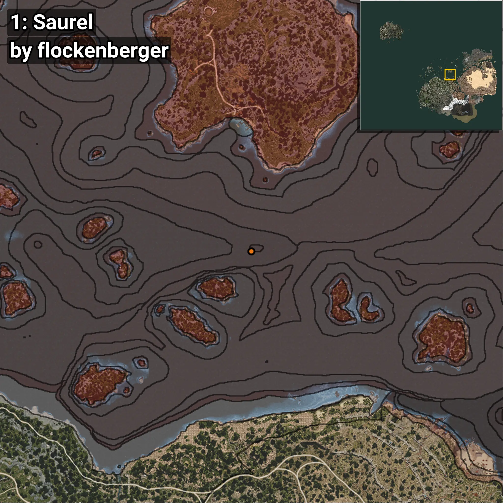
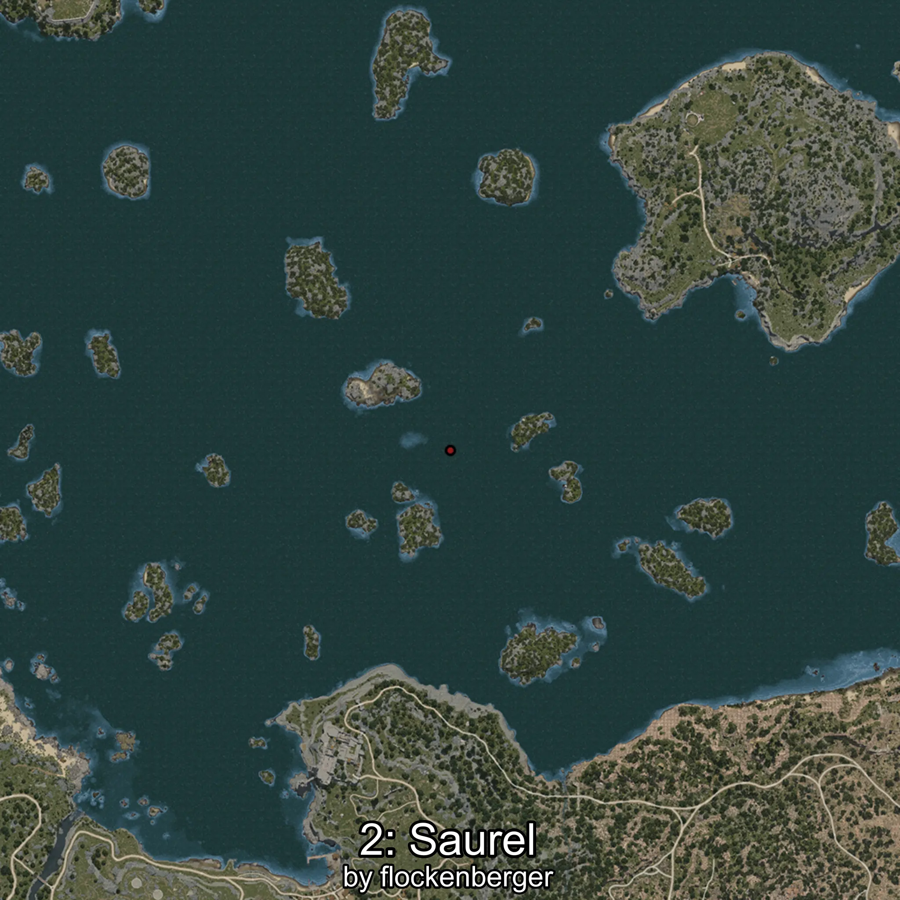
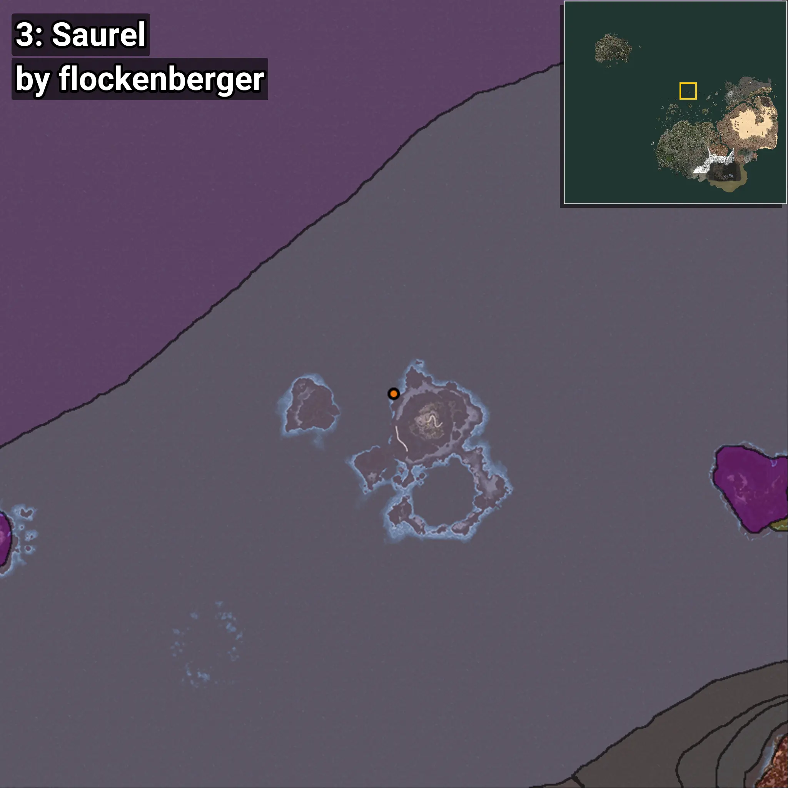
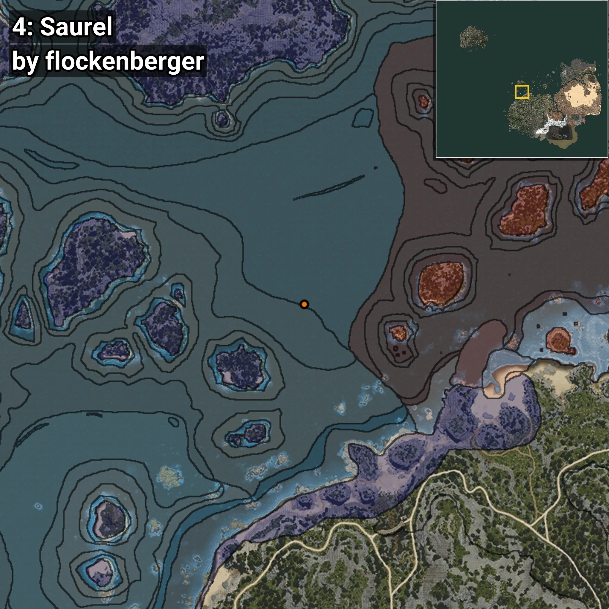

# Jurel
```xml
<!--
    Puntos de pesca para: Jurel
    Creado por: flockenberger
-->
<WorldmapBookMark>
    <BookMark BookMarkName="0: Jurel" PosX="154840.0" PosY="-7895.0" PosZ="230229.0" />
    <BookMark BookMarkName="1: Jurel" PosX="159113.0" PosY="-7652.0" PosZ="228810.0" />
    <BookMark BookMarkName="2: Jurel" PosX="-104772.0" PosY="-7965.0" PosZ="634711.0" />
    <BookMark BookMarkName="3: Jurel" PosX="-105291.0" PosY="-7974.0" PosZ="634253.0" />
    <BookMark BookMarkName="4: Jurel" PosX="-303780.0" PosY="-7686.0" PosZ="198049.0" />
</WorldmapBookMark>
```

## ⚠️ Advertencia:
Los puntos de pesca se generan según la __**posición de tu personaje**__ — __no__ donde cae el flotador.  
En el océano especialmente, la dirección en la que lances la caña puede colocar tu flotador en una **zona de pesca diferente**, lo que puede resultar en capturar el pez incorrecto.  
Presta atención a las vistas previas que muestran la ubicación en relación a las zonas marcadas.

- Para verificar la posición de tu flotador puedes usar la guía [AQUÍ](https://flockenberger.github.io/bdo-fish-position/)
- O ver la guía [AQUÍ](https://youtu.be/t-VXcRoNojk)

## Vistas Previas
      