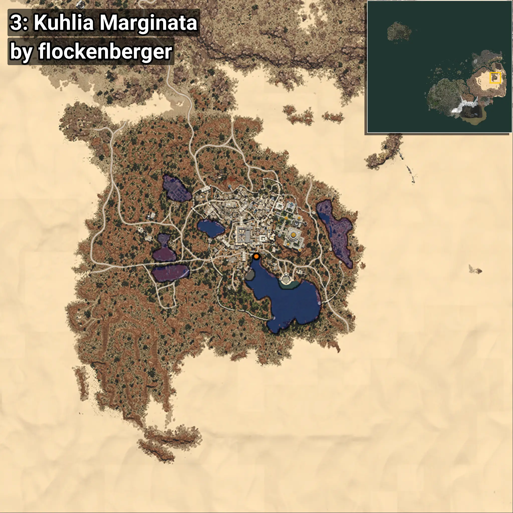
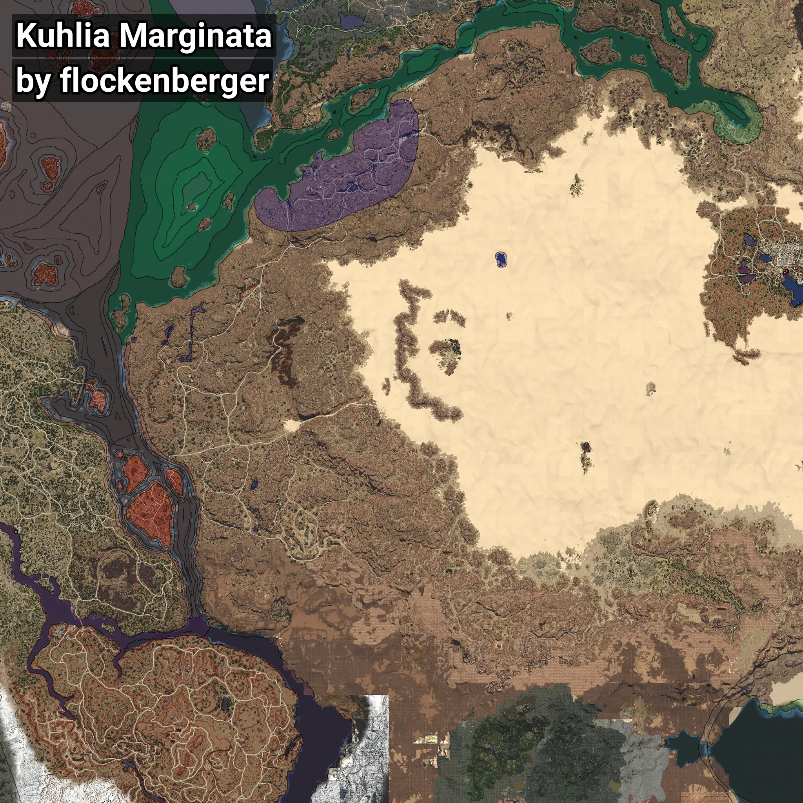

# Kuhlia
```xml
<!--
    Puntos de pesca para: Kuhlia
    Creado por: flockenberger
-->
<WorldmapBookMark>
    <BookMark BookMarkName="0: Kuhlia" PosX="1033288.0" PosY="10746.0" PosZ="189302.0" />
    <BookMark BookMarkName="1: Kuhlia" PosX="1032825.9" PosY="10563.832" PosZ="189545.78" />
    <BookMark BookMarkName="2: Kuhlia" PosX="222278.0" PosY="-5258.0" PosZ="-84637.0" />
    <BookMark BookMarkName="3: Kuhlia" PosX="1032635.75" PosY="10602.507" PosZ="189235.16" />
    <BookMark BookMarkName="4: Kuhlia" PosX="1030647.0" PosY="10501.064" PosZ="187722.52" />
</WorldmapBookMark>
```

## ⚠️ Advertencia:
Los puntos de pesca se generan según la __**posición de tu personaje**__ — __no__ donde cae el flotador.  
En el océano especialmente, la dirección en la que lances la caña puede colocar tu flotador en una **zona de pesca diferente**, lo que puede resultar en capturar el pez incorrecto.  
Presta atención a las vistas previas que muestran la ubicación en relación a las zonas marcadas.

- Para verificar la posición de tu flotador puedes usar la guía [AQUÍ](https://flockenberger.github.io/bdo-fish-position/)
- O ver la guía [AQUÍ](https://youtu.be/t-VXcRoNojk)

## Vistas Previas
      