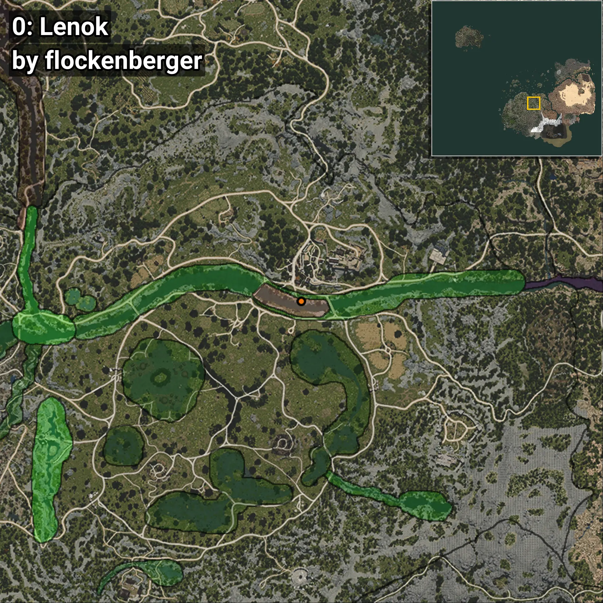
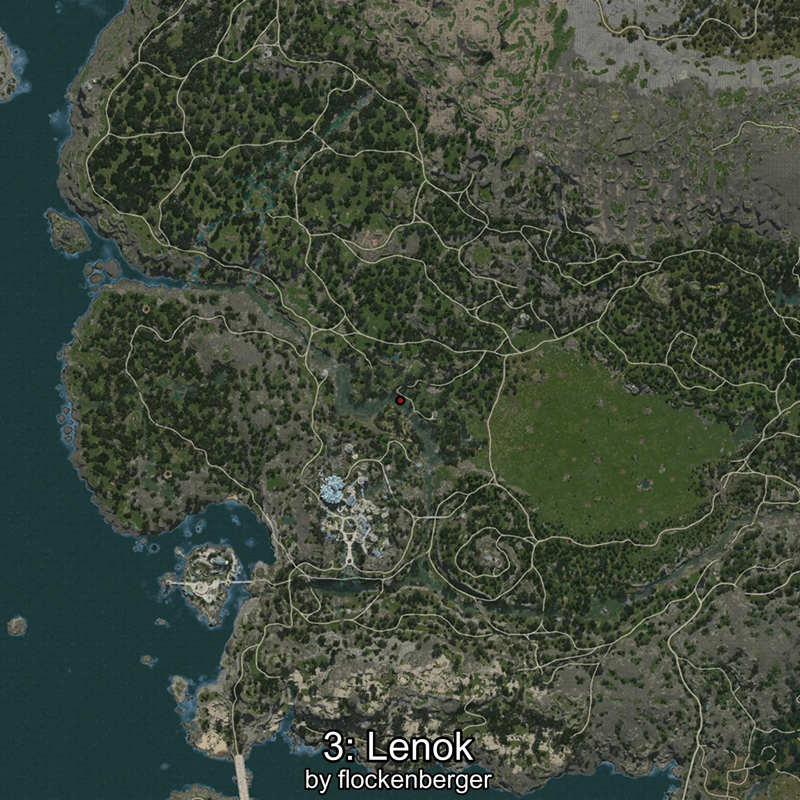
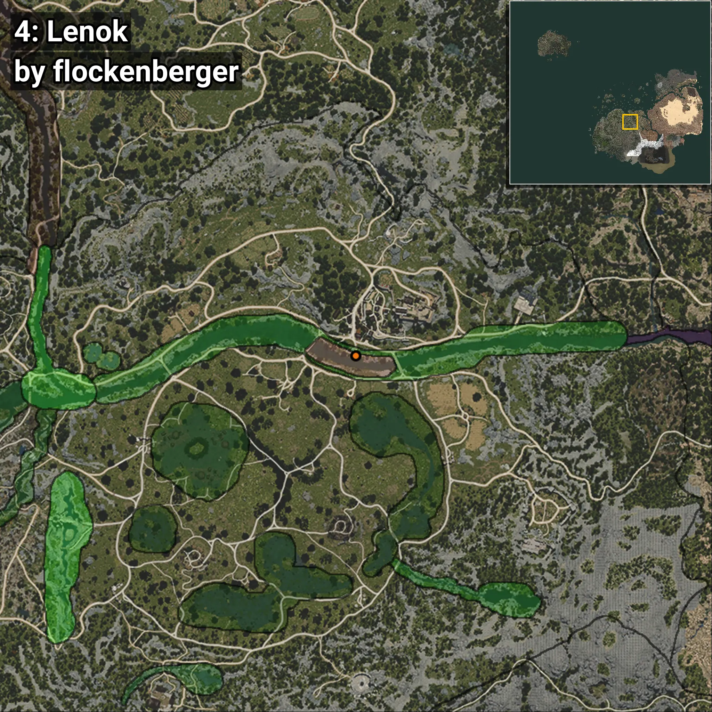

# Lenok
```xml
<!--
    Puntos de pesca para: Lenok
    Creado por: flockenberger
-->
<WorldmapBookMark>
    <BookMark BookMarkName="0: Lenok" PosX="40530.0" PosY="-3458.0" PosZ="-51770.0" />
    <BookMark BookMarkName="1: Lenok" PosX="40150.0" PosY="-3900.0" PosZ="-51452.0" />
    <BookMark BookMarkName="2: Lenok" PosX="-506628.8" PosY="5863.095" PosZ="-474296.88" />
    <BookMark BookMarkName="3: Lenok" PosX="-506612.0" PosY="5865.0" PosZ="-474323.0" />
    <BookMark BookMarkName="4: Lenok" PosX="38087.0" PosY="-3993.0" PosZ="-50602.0" />
</WorldmapBookMark>
```

## ⚠️ Advertencia:
Los puntos de pesca se generan según la __**posición de tu personaje**__ — __no__ donde cae el flotador.  
En el océano especialmente, la dirección en la que lances la caña puede colocar tu flotador en una **zona de pesca diferente**, lo que puede resultar en capturar el pez incorrecto.  
Presta atención a las vistas previas que muestran la ubicación en relación a las zonas marcadas.

- Para verificar la posición de tu flotador puedes usar la guía [AQUÍ](https://flockenberger.github.io/bdo-fish-position/)
- O ver la guía [AQUÍ](https://youtu.be/t-VXcRoNojk)

## Vistas Previas
      