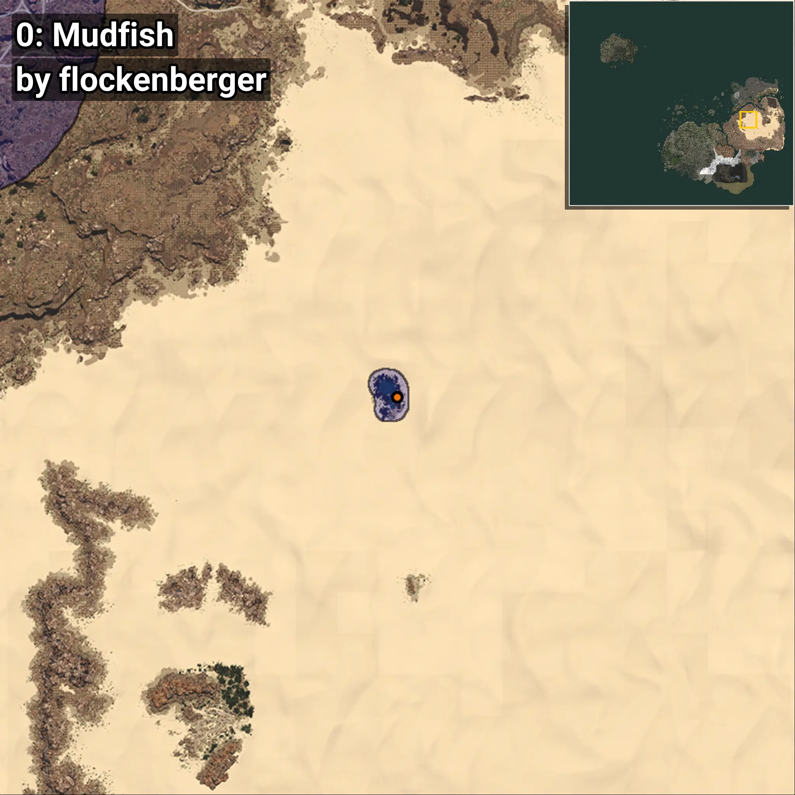
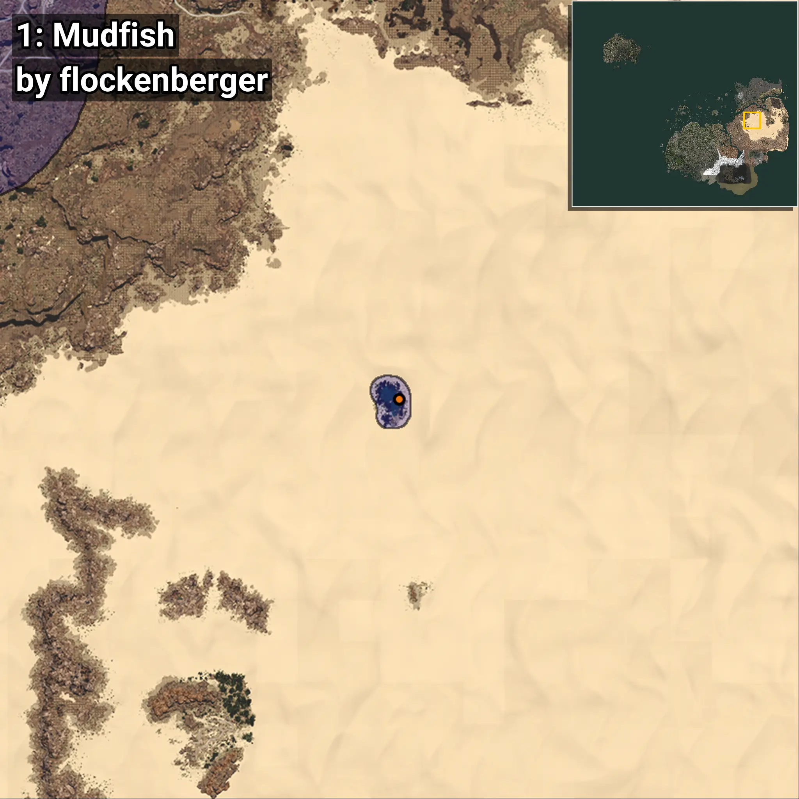
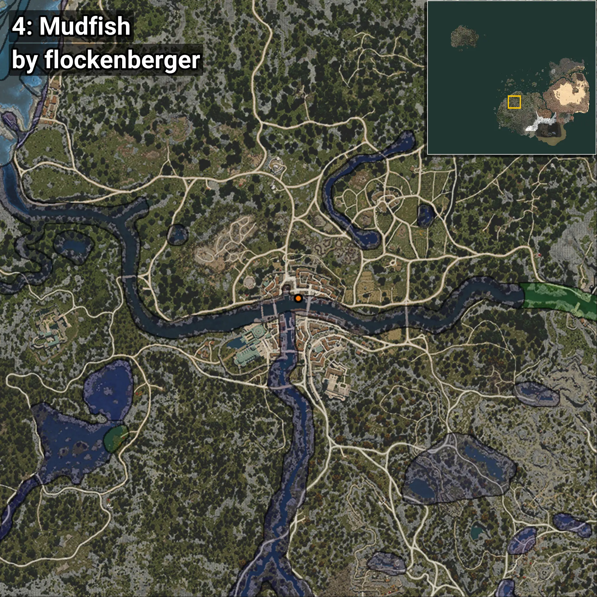
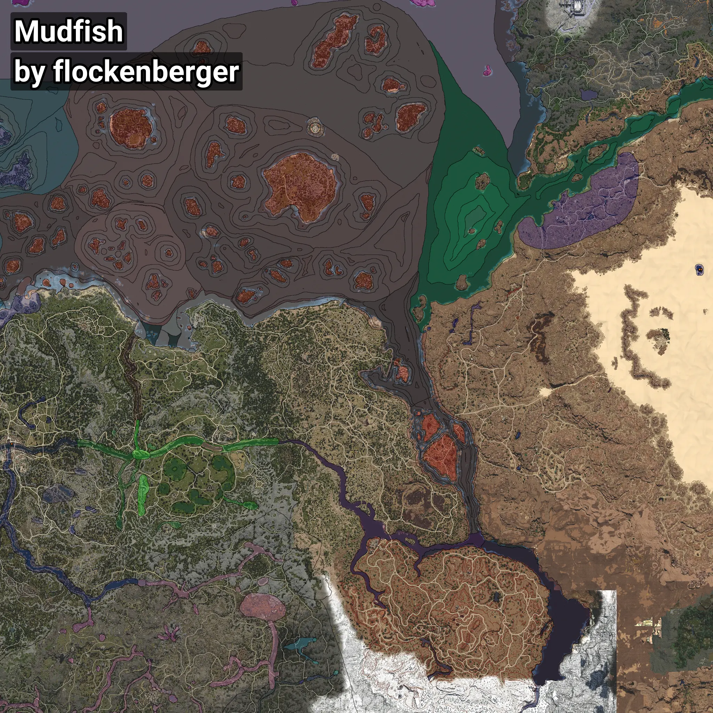

# Locha
```xml
<!--
    Puntos de pesca para: Locha
    Creado por: flockenberger
-->
<WorldmapBookMark>
    <BookMark BookMarkName="0: Locha" PosX="735258.0" PosY="3306.0" PosZ="200656.0" />
    <BookMark BookMarkName="1: Locha" PosX="735217.5" PosY="3281.8477" PosZ="202141.16" />
    <BookMark BookMarkName="2: Locha" PosX="733045.06" PosY="3234.0876" PosZ="201096.7" />
    <BookMark BookMarkName="3: Locha" PosX="732916.0" PosY="3404.0" PosZ="202284.0" />
    <BookMark BookMarkName="4: Locha" PosX="-249973.0" PosY="-4059.0" PosZ="-47166.0" />
</WorldmapBookMark>
```

## ⚠️ Advertencia:
Los puntos de pesca se generan según la __**posición de tu personaje**__ — __no__ donde cae el flotador.  
En el océano especialmente, la dirección en la que lances la caña puede colocar tu flotador en una **zona de pesca diferente**, lo que puede resultar en capturar el pez incorrecto.  
Presta atención a las vistas previas que muestran la ubicación en relación a las zonas marcadas.

- Para verificar la posición de tu flotador puedes usar la guía [AQUÍ](https://flockenberger.github.io/bdo-fish-position/)
- O ver la guía [AQUÍ](https://youtu.be/t-VXcRoNojk)

## Vistas Previas
      