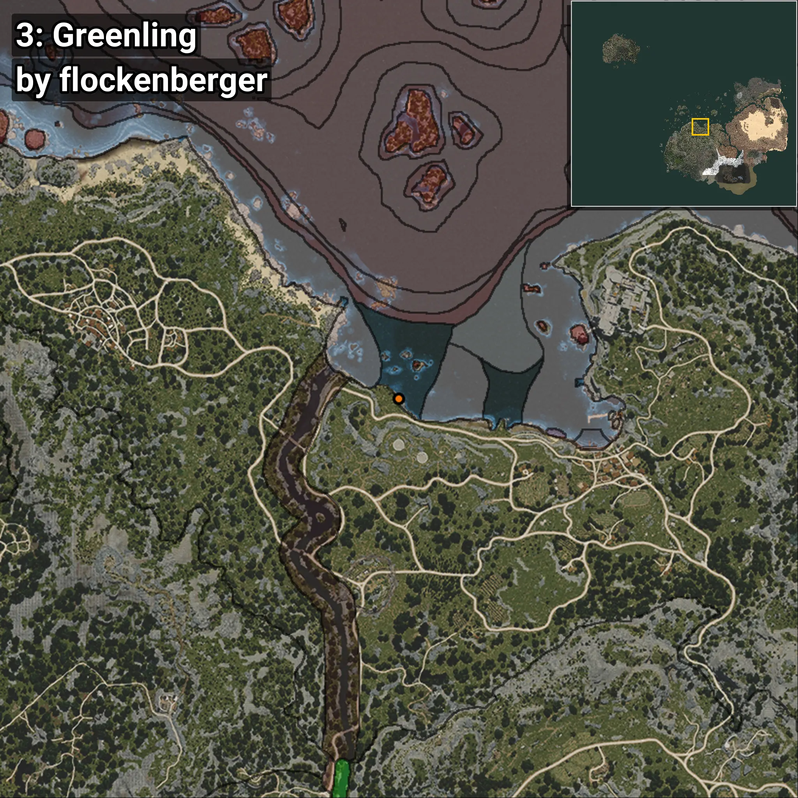
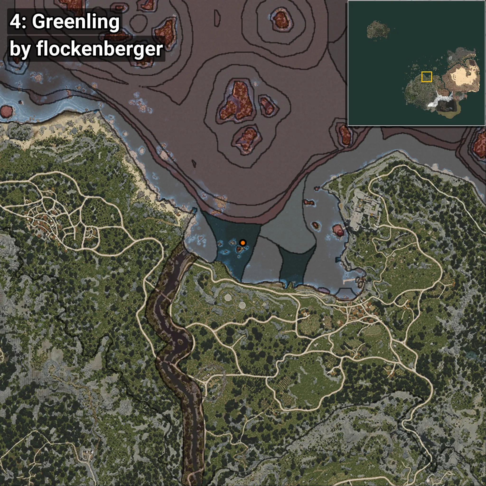
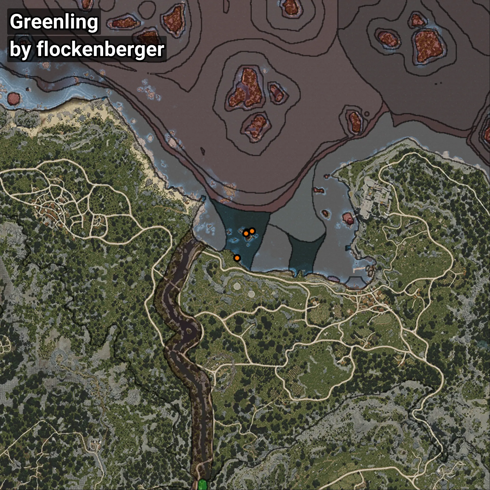

# Lorcha
```xml
<!--
    Puntos de pesca para: Lorcha
    Creado por: flockenberger
-->
<WorldmapBookMark>
    <BookMark BookMarkName="0: Lorcha" PosX="-47571.22" PosY="-8186.3467" PosZ="111900.48" />
    <BookMark BookMarkName="1: Lorcha" PosX="-47615.0" PosY="-8006.0" PosZ="111223.0" />
    <BookMark BookMarkName="2: Lorcha" PosX="-52249.0" PosY="-7995.0" PosZ="98940.0" />
    <BookMark BookMarkName="3: Lorcha" PosX="-52308.0" PosY="-7984.0" PosZ="98894.0" />
    <BookMark BookMarkName="4: Lorcha" PosX="-44859.812" PosY="-7510.079" PosZ="112533.22" />
</WorldmapBookMark>
```

## ⚠️ Advertencia:
Los puntos de pesca se generan según la __**posición de tu personaje**__ — __no__ donde cae el flotador.  
En el océano especialmente, la dirección en la que lances la caña puede colocar tu flotador en una **zona de pesca diferente**, lo que puede resultar en capturar el pez incorrecto.  
Presta atención a las vistas previas que muestran la ubicación en relación a las zonas marcadas.

- Para verificar la posición de tu flotador puedes usar la guía [AQUÍ](https://flockenberger.github.io/bdo-fish-position/)
- O ver la guía [AQUÍ](https://youtu.be/t-VXcRoNojk)

## Vistas Previas
      